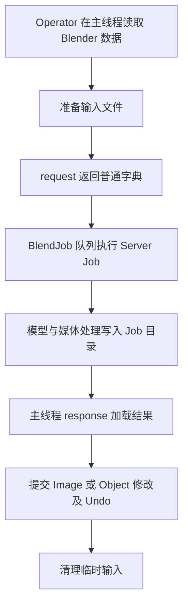

# 程序架构

| 模块 | 职责 |
| --- | --- |
| `__init__.py` | 注册类型、工具、菜单、快捷键与 Runtime |
| `menu.py`、`panel.py` | Image Empty 与 Shader Image Texture 上下文菜单与 Job Server 面板 |
| `preferences.py` | 扩展设置及读取入口 |
| `properties.py` | Scene 手势状态、模型状态查询、枚举与 Operator 属性构造 |
| `tools.py` | 3D View WorkspaceTool 声明、顺序与注册 |
| `keymaps.py` | 扩展快捷键的注册与清理 |
| `common/` | Blender 侧公共能力 |
| `operators/` | 交互、任务参数、结果导入和 Undo |
| `server/` | 独立环境内的媒体处理、推理和产物写出 |

## 注册与配置

顶层入口注册类型后，通过 `tools.py` 统一注册 WorkspaceTool，通过 `keymaps.py` 统一注册快捷键。注销按相反生命周期关闭 Runtime、快捷键与工具，再移除菜单和 Scene 属性，按 `CLASSES` 逆序注销类型。设备、存储目录、模型、材质显示适配和功能上限统一通过 `preferences.py` 读取。

**Maximum AI Input Size** 限制模型分析输入和 Upscale 可提交源图的长边；**Maximum Frame Resolution** 限制 Frame 输出长边；**Minimum Relative Edge Length** 与 **Boundary Padding** 控制 Cutout 的网格密度和轮廓边界采样。

## 执行边界

Plane、Frame、Mask、Rectify 和无需 AI 的 Cutout 在 Blender 内执行。Server 的 `jobs/` 编排任务，`models/` 负责模型适配，`geometry/` 处理深度与法线产物。Server 模块通过内部相对导入共享能力，Blender 侧通过 `common/` 复用。

MoGe-2 与 MoGe-3 输出统一为 `GeometryFrame`：包含 Depth、Validity、Intrinsics，以及按需提供的 Normal 和 Points。产物写入器消费同一个 Frame，保持深度、法线和相机数据一致。参见 [Runtime](runtime.md) 与 [产物协议](outputs.md)。
