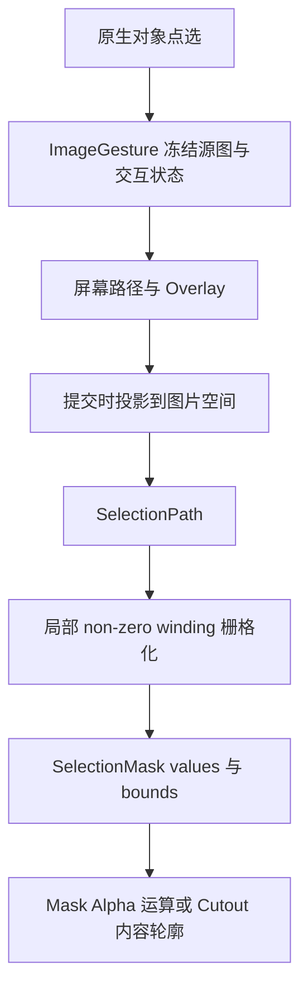

# Blender 公共能力

`src/anyimage/common/` 按业务职责提供公共函数，调用方从对应模块直接导入。

| 模块 | 职责与主要入口 |
| --- | --- |
| `ai.py` | 环境和模型就绪检查、输入路径校验、`production_device()`、`moge2_parameters()` 与安装 UI |
| `image.py` | `image_rgba()`、Image User 帧设置读取、Job 输入准备、像素采样、结果 Image 和 `replace_empty_image()` |
| `color_image.py` | 材质颜色与 AI 分析输入的准备和清理 |
| `hdr_image.py` | HDR 去背景分析输入及浮点颜色保留 |
| `image_target.py` | Image Empty 与 Shader Image Texture 编辑目标 |
| `selection.py` | `SelectionPath`、`SelectionMask`、non-zero winding 栅格化与 Alpha 修整 |
| `viewport.py` | 原生点选、屏幕投影、`ImageGesture`、Lasso / Brush / Polyline 与 Overlay |
| `depth.py` | 深度图片和元数据加载、相机坐标与显示范围的尺度换算 |
| `material.py` | Image Layer、Normal、Alpha、Shadeless 与 Depth 材质 |
| `object.py` | Modifier 输入设置与结果对象激活、源对象替换 |
| `node.py` | `node_asset_path()` 与 `load_node_group()` |

## 图像生命周期

业务像素采用 Top-down RGBA，`image_pixels()` 使用 Blender 像素顺序。预乘采样用于投影插值；文件或 Packed 图像的业务读取保留隐藏 RGB。`ImageEditTarget` 校验目标身份后经 `replace_empty_image()` 或 `replace_texture_image()` 提交：未共享的 Image 原地替换内容，共享时改用新的 Image 数据块，失败时回滚源数据。

`prepare_image_input()` 返回路径及临时标记；`cleanup_image_input()` 与创建方配对。`color_image.py` 的 `prepare_material_color_input()` 准备材质颜色，`material_analysis_input()` 提供分析输入；Cutout 按几何 bounds 裁切。

## 手势与 Selection

Brush 的圆形印记和连接条由 `brush_footprint_polygons()` 生成，供预览与提交共用。拖动时维护屏幕路径与局部 Overlay，提交时生成覆盖值。Mask、Rectify 与 Cutout 的空命中保留 active Image Empty；点中另一对象时完成原生选择。

## 材质、节点与对象

`create_image_material()` 按 Shadeless、Normal 和 Depth 组合节点、连接颜色与 Alpha；材质显示适配读取当前 Preferences。`set_modifier_input()` 按实际 RNA 输入形式设置值，`finalize_object_result()` 完成结果对象激活和源对象处理。Image 替换路径保留 Empty 的矩阵、显示尺寸、偏移和 Image User 帧设置。

Geometry Nodes 从 `src/anyimage/assets/O_AnyImage.blend` 按公开名称加载。构建与布局职责见[节点资产](node-assets.md)，深度字段见[Job 产物](outputs.md)。
