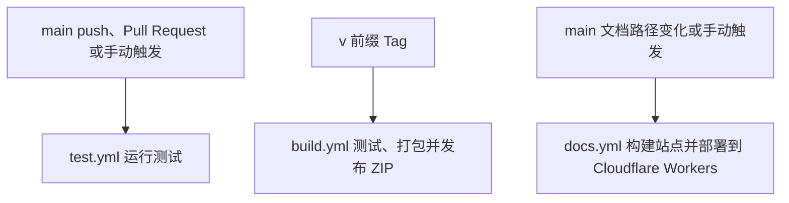

# 开发与发布

仓库使用 CPython 3.11 与 `bpy==4.5.3` 测试 Blender 代码；AI Server 使用 `runtime.py` 声明的独立 Python 3.12 Environment。

```bash
uv sync
uv run pytest
```

## 测试组织

| 测试范围 | 文件 |
| --- | --- |
| 扩展注册、设置、安装和 Job 交互 | `test_addon_registration.py`、`test_preferences.py`、`test_ai_setup.py`、`test_job_operator.py` |
| Frame、Mask、Rectify、Plane、Cutout | 对应 `test_*_tool.py`、`test_*_operators.py` 与对象、投影、网格测试 |
| 图像身份、Alpha、材质与 Undo | 图像编辑集成、共享替换、材质适配与 Undo 测试 |
| Server | `test_job_server.py`、`test_server_jobs.py`、`test_input_validation.py`、`test_geometry_artifacts.py` |
| 模型 | `test_model_manager.py`、下载、推理与各 ONNX 模型测试 |
| 节点资产 | 布局与接口等价、几何求值、Cutout 与临时属性清理 |
| 工具与包协议 | 扩展 Manifest、打包、模型同步与节点启动器 |

Blender Stub 共用 `tests/support/blender.py`；Server 和实际 Blender 几何 fixture 按使用范围存放在对应 support 模块。测试命名描述功能、触发条件与可观察结果。

## 发布命令

| 命令 | 职责 |
| --- | --- |
| `uv run pack` | 生成 Windows、macOS arm64、Linux 扩展包 |
| `uv run pack --prepare` | 为本机同步扩展 wheel 与 Manifest |
| `uv run --group blender node-group build` | 构建、验证节点资产并运行节点测试 |
| `uv run model sync` | 准备、校验并上传模型声明的文件 |
| `uv run docs -dev` | 本地预览文档 |
| `uv run docs` | 通过 Mike 发布项目版本并更新 latest |

`tools/pack.py` 从 `pyproject.toml` 读取依赖，按平台与 Blender Python 版本解析 wheel，使用 Blender 提供的 NumPy。产物命名为 `AnyImage.v<version>.<platform>.zip`，写入 `dist/`。本地 BlendJob wheel 内容变化后运行 `uv lock --refresh`，并核对锁文件、Manifest 与打包测试。

`tools/models/cli.py` 根据模型目录选择上游 ONNX 或本地导出流程；`tools/models/exports.py` 处理对应 PyTorch 权重导出。文件校验依据声明大小和 SHA-256，上传使用逐文件复制。`uv run model prepare` 用于本地准备。

## CI 与文档导航



站点导航由 `mkdocs.yml` 显式维护，页面移动时同步导航和相对链接。节点资产的脚本职责及检查入口见[节点资产](node-assets.md)。
