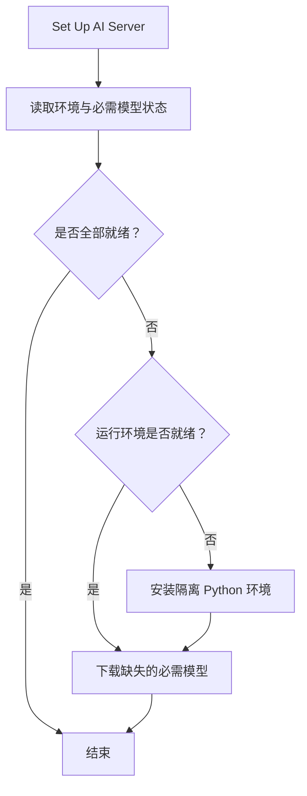

# AI 环境管理

AI 环境管理从当前安装状态出发，补齐独立运行环境和必需模型，并提供设置入口与模型缓存释放操作。

## 执行过程

`SetupAIEnvironment` 是统一入口。首次使用时先安装运行环境，再下载默认模型；环境已经存在时，只补齐缺失模型。环境安装由 Blender Operator 启动，模型下载通过 Job Server 执行。

## 节点说明

### 读取状态，选择下一步

入口位于 `src/anyimage/operators/ai_setup.py`。`SetupAIEnvironment` 通过 `properties.py` 中的 `ai_status()` 读取环境和模型状态，并根据结果结束、安装环境或调用 `DownloadRequiredModels`。对话框同时显示预计下载量和缺失模型名称。

`runtime.py` 提供当前 Environment 与 Server 状态；Server 正忙时不会启动新的安装流程。`OpenAIEnvironmentSettings` 打开 AnyImage 的扩展首选项。

### 安装独立环境

环境尚未就绪时，`SetupAIEnvironment` 调用 Runtime 注册的安装 Operator。`use_mirror` 决定 uv、Python 和安装包的下载源，模型使用模型目录中声明的来源。

安装完成后通过 `post_install()` 下载默认模型，模型依赖加载于独立 Server 环境。

### 下载模型

`ai_setup.py` 中的 `DownloadModel` 处理单个模型，`DownloadRequiredModels` 处理默认必需模型集合。两者先检查 Environment、Blender Online Access 和模型记录，再提交 `download-model` 或 `download-required-models` Job。

Job 在 `server/app.py` 注册；`server/model_catalog.py` 保存模型名称、文件和来源，`server/model_download.py` 下载并校验文件，`server/model_manager.py` 管理模型目录与已加载 Session。下载进度和错误通过同一套 BlendJob Runtime 返回 Blender。

### 释放模型缓存

`ai_setup.py` 中的 `ClearModels` 调用 `runtime.clear_resource("model_manager")`，释放 Server 中已加载的模型 Session。下次推理从模型目录重新加载 Session。
