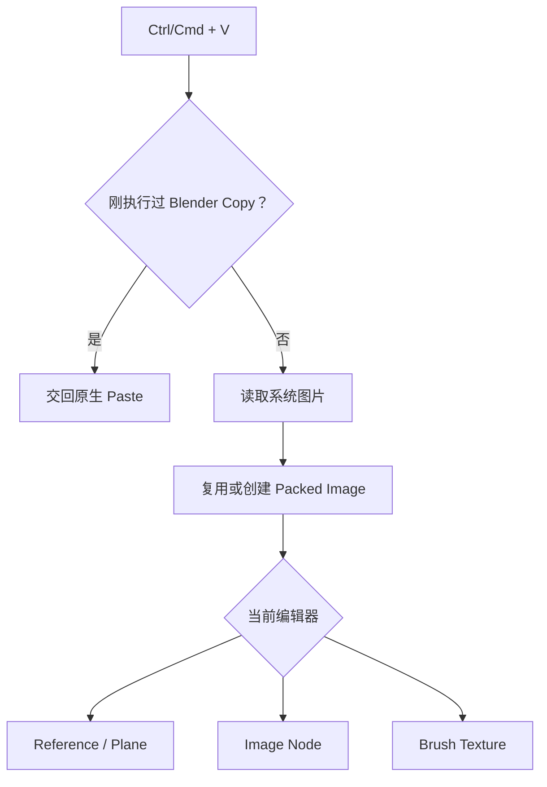

# 剪贴板图片

剪贴板图片从 `Ctrl/Cmd + V` 开始，把操作系统中的图片变成 Packed Blender Image，并放到当前编辑器支持的位置。

## 执行过程

Windows 快捷键优先处理 Blender 自己的 Copy/Paste，系统剪贴板出现新的图片内容时 AnyImage 接管粘贴；macOS 和 Linux 没有系统剪贴板序列号，始终由 AnyImage 处理粘贴。

## 节点说明

### 判断是否交给 Blender

`operators/clipboard_image/operators.py` 定义 `TrackNativeCopy`、`PasteClipboardImage` 和 3D View、Node Editor 快捷键。`TrackNativeCopy` 记录 Blender Copy 时的系统剪贴板序列号；粘贴时若序列号没有变化，`PasteClipboardImage` 返回 `PASS_THROUGH`，让 Blender 继续处理对象或节点粘贴。

同一文件随后调用 `actions.target_for_context()` 判断当前编辑器是否支持图片落点。

### 读取系统图片

`clipboard.py` 负责平台差异。Windows 依次尝试 PNG、DIBV5 和 DIB，DIB 补成 BMP；macOS 通过 `osascript` 导出 PNG；Linux 依次尝试 `wl-paste` 和 `xclip` 提供的图片格式。各平台输出统一为图片字节和扩展名，再交给后续步骤。

### 创建或复用 Packed Image

`actions.py` 对图片内容计算 SHA-256。相同内容已经粘贴过时会复用现有 Packed Image，否则创建新 Image 并 Pack 到当前 `.blend`，避免依赖临时剪贴板文件。

### 放到当前编辑器

落点仍在 `actions.py` 中完成：3D View 创建 Reference 或 Plane，Node Editor 创建与当前节点树匹配的 Image 节点，绘制模式把 Image 配置为当前画笔的 Texture。鼠标位置和视图位置也在这里换算。

Plane 路径调用 `convert_to_plane/image_plane.py` 创建中心原点基础网格，并从节点资产加载 `O Image Plane`。`actions.py` 创建图像材质并放入 Mesh 第 `0` 个材质槽，节点组只生成几何。
