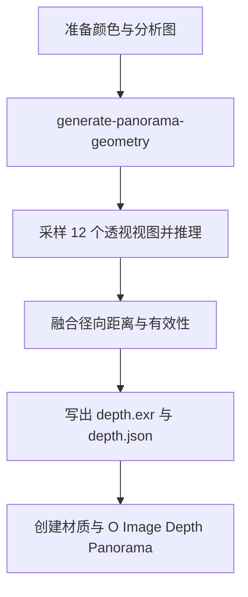

# Panorama 转换

`operators/convert_to_panorama/` 将静态等距柱状 Image Empty 转换为径向深度表面，提交前裁剪出最大居中 2:1 区域。`operators.py` 提交任务，`object.py` 导入对象，`__init__.py` 汇总导出与注册清单。

任务使用 Preferences 选择的几何模型。源颜色由 Blender 侧保存，Server 的 `geometry/panorama.py` 负责视图采样与距离融合，`jobs/panorama.py` 编排推理和产物写入。
