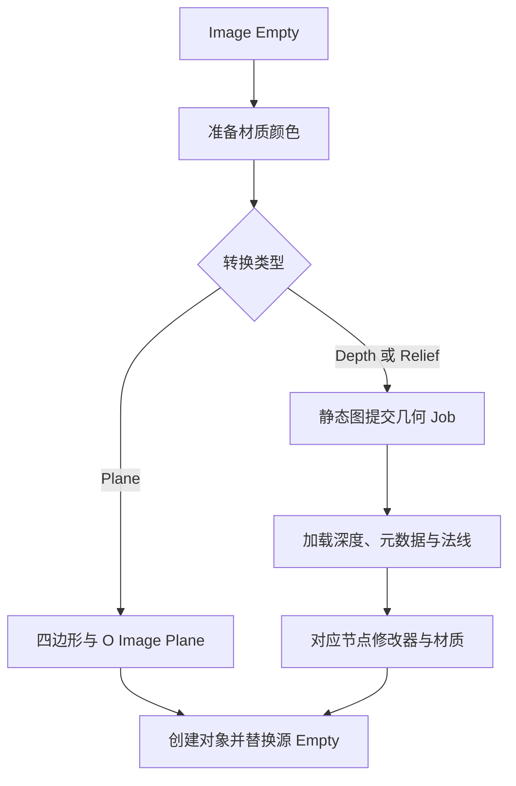

# Plane 转换

`operators/convert_to_plane/operators.py` 提供 `ConvertToPlane`、`ConvertToDepthPlane`、`ConvertToReliefPlane` 与 `GenerateDepthPlane`。`object.py` 导入对象和材质，`image_plane.py` 构建基础矩形网格，`__init__.py` 汇总导出与注册清单。

三种转换都只接受静态图片。基础网格以局部中心为原点，对象矩阵补偿源 Empty 的显示范围。

Depth 与 Relief 从 Preferences 读取几何模型、分辨率级别和 AI 输入上限。`create_depth_plane_from_result()` 导入产物并创建修改器。`O Image Depth Plane` 使用相机 XYZ 与对象空间法线构建深度表面；`O Image Relief Plane` 使用深度 Z 与切线空间法线构建浮雕。

节点构建见[节点资产](../node-assets.md)，文件协议见[Job 产物](../outputs.md)。
