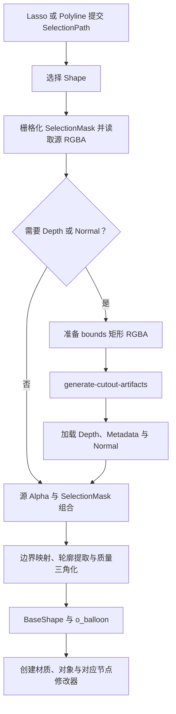

# Cutout

Cutout 在静态 Image Empty 上圈定 Selection，按轮廓创建 Flat、Solid、Depth Symmetry 或 Depth Solid。Operator 入口位于 `operators/cutout_tool/operators.py`，WorkspaceTool 声明位于 `tools.py`，Shape 菜单位于 `interaction.py`，预设标识与节点组对应关系位于 `shape.py`。

| 预设 | 节点组 | AI 产物 |
| --- | --- | --- |
| Flat | `O Image Cutout`，Thickness 0 | 可选切线空间法线 |
| Solid | `O Image Cutout`，Thickness 1 | 可选切线空间法线 |
| Depth Symmetry | `O Image Depth Cutout` 与 `O Image Cutout Symmetry` | 深度与对象空间法线 |
| Depth Solid | `O Image Depth Cutout` | 深度与对象空间法线 |

Flat 与 Solid 可以不带 AI 产物生成；Depth 预设和 Normal Map 需要就绪的几何模型，Shape 菜单按该状态提供选项。

## 轮廓与网格

`geometry.py` 从内容 Alpha 提取连通轮廓与孔洞，按 Edge Length 生成 `BaseShape`。Edge Length 是世界空间的网格目标边长，Minimum Relative Edge Length 会按内容范围提高其下界。

`mesh.py` 负责轮廓分离、孔洞处理、质量三角化和边界支撑，`polygon.py` 提供轮廓简化，`tangle.py` 是随包分发的 Delaunay 三角化核心。Fine Outline 展开时保留小孔与细节轮廓，关闭时填洞并简化。

`balloon.py` 负责 Balloon Profile，按 Preferences 选择 Poisson 或 Teddy，生成所有预设共用的 POINT 属性 `o_balloon`。`boundary_padding.py` 按 Boundary Padding 沿结构内法线重采样轮廓附近的颜色与深度。

## AI 与对象创建

Server 接收 Selection bounds 内保留源 Alpha 的 RGBA，一次 MoGe 推理按 `generate_depth` 与 `normal_mode` 返回产物。深度参考区域使用所选 Alpha Threshold，Normal 使用原预测；Maximum AI Input Size 只影响分析分辨率。

`object.py` 的 `create_shape_object()` 消费 BaseShape、Color、Depth 和 Normal，加载对应节点组。基础网格位于局部 XZ 平面，厚度沿 Y 展开；对象矩阵把网格放入 Image Empty 的图片平面，Depth Symmetry 额外叠加对称节点组与方向参数。Object Normal 随方向同步转换。

材质使用 IOR 1.2，颜色与法线接入 Image Layer，法线按切线或对象空间解释。节点计算见[节点资产](../node-assets.md)。
