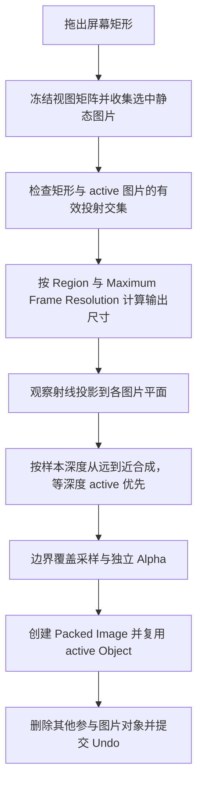

# Frame 多图合成

`operators/frame_tool/operators.py` 定义 `FrameImages` 和 `FrameTool`。`projection.py` 负责视图投影、交叠和结果平面定位，`compositing.py` 负责像素深度排序与边界覆盖采样，`__init__.py` 导出类型及注册清单。Frame 将选中的静态 Image Empty 按当前视图合成为一张图片。

正交视图接受有限深度，透视视图采样观察方向前方的交点。交叠检查采用连续投影范围；输出尺寸受 Region、最长边上限和总像素上限约束。

RGB 与 Alpha 分别累计，保留被 Mask 隐藏的有效颜色。边界使用覆盖采样，内部复用直接采样，避免黑边和不必要的模糊。结果平面朝向观察者，位置由 active 图片的有效深度确定。

Frame 保留 active 对象身份、名称和 Collection；图像替换复用 [Common](../common.md) 的共享数据与失败恢复逻辑。
