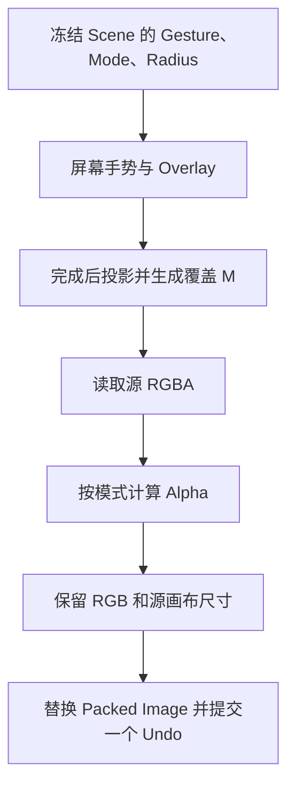

# Mask Alpha 编辑

`operators/mask_tool.py` 定义 `EditImageAlpha`，使用 `common/viewport.py` 的 `ImageGesture` 管理 Lasso、Brush 与 Polyline；`tools.py` 定义对应的 `MaskTool`。

| 模式 | 源 Alpha A 与覆盖 M 的结果 |
| --- | --- |
| Set | `A × M` |
| Extend | `max(A, M)` |
| Subtract | `A × (1 − M)` |

Brush 拖动时维护简化屏幕路径、圆形印记与连接条的并集预览；释放时一次生成图片覆盖。Polyline 使用逐点路径，至少三个点后通过闭合圈、双击或 Enter 完成，Backspace 删除末点。

结果保留 Empty 的身份、矩阵、显示尺寸和偏移。全透明结果有效，取消或切换工具清理未提交的 Overlay；共享 Image 通过统一替换入口分流。
