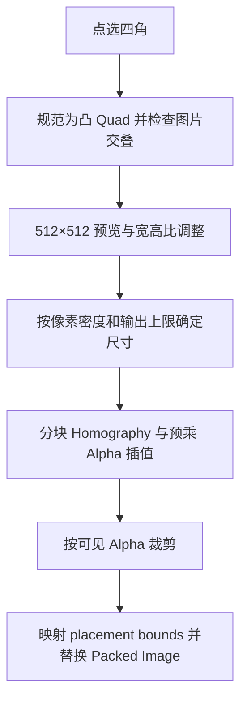

# Rectify 透视校正

`operators/rectify_tool/operators.py` 定义 `RectifyImagePerspective`，将图片内的四角区域校正为矩形。`geometry.py` 负责四角验证与像素校正，`preview.py` 负责预览图、Overlay 和宽高比控制，`__init__.py` 导出 Operator 及注册清单；`tools.py` 定义对应的 `RectifyTool`。

四角允许任意点击顺序，退化或非凸输入在提交前校验。预览根据源颜色空间配置显示，像素重采样复用 `common/image.py`。输出最长边上限 8192，总像素上限 16,777,216。

`replace_empty_image()` 根据校正区域的 placement bounds 调整画框，保留源 Image 名称、对象身份和共享引用语义。
