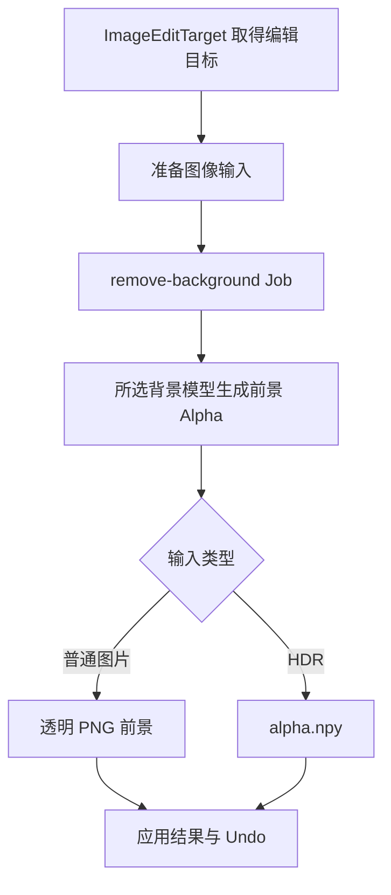

# Remove Background

`operators/remove_background.py` 从 Image Empty 或当前 Shader Image Texture 准备输入。`RemoveImageBackground` 协调设置与输入，`RunBackgroundRemoval` 提交 Job 并应用结果。

`server/jobs/remove_background.py` 读取单张输入并调用 `server/models/background.py`，支持 BiRefNet 和 BEN2。模型前景 Alpha 与源 Alpha 合成。

普通结果通过 `ImageEditTarget` 保留共享图像引用与帧设置。HDR 使用 `common/hdr_image.py` 的 `HdrBackgroundInput` 准备分析输入，并将返回 Alpha 应用于原浮点 RGB。Operator 负责临时输入清理。
