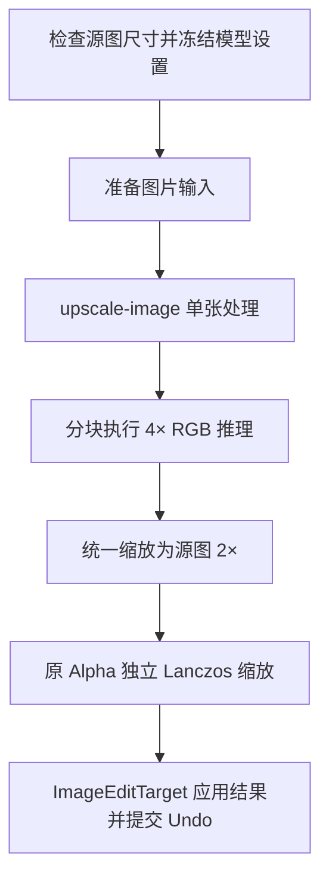

# Upscale

`operators/upscale.py` 从 Image Empty 或当前 Shader Image Texture 生成 2× 结果，源图长边必须小于 Maximum AI Input Size。

`server/models/upscale.py` 处理输入上限和最终尺寸，`onnx_upscale.py` 执行 Real-ESRGAN 与 HAT 模型。ModelManager 管理 Session；Provider 资源错误会释放当前 Session 并返回处理建议。
