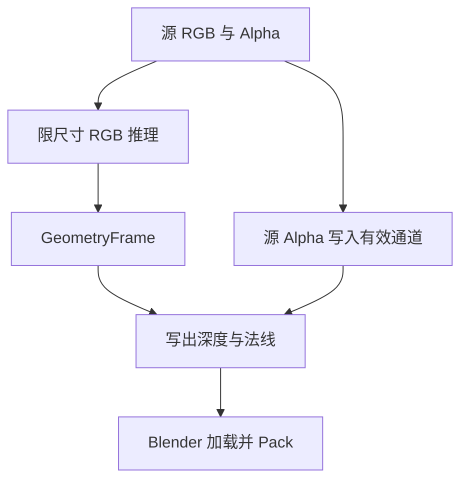

# Job 产物

Server 将结果写入 Job 目录，返回以相对文件名为值的字典。Blender 主线程通过 JobResult 读取文件，创建或更新 Image、Mesh、Material 和 Object。

| Job | 文件 | 消费方 |
| --- | --- | --- |
| `remove-background` | `foreground.png` 或 `alpha.npy` | ImageEditTarget 或 HDR Alpha 编辑 |
| `upscale-image` | `upscale.png` | 图像替换 |
| `generate-depth-plane-geometry` | `depth.exr`、`depth.json` 和法线 | Depth / Relief Plane |
| `generate-cutout-artifacts` | 按请求提供深度、元数据和法线 | Cutout |
| `generate-panorama-geometry` | `depth.exr`、`depth.json` | Panorama |

## 深度与法线协议

| 返回字段 | 内容 |
| --- | --- |
| `depth` | float32 EXR，透视产物 RGB 保存相机空间 XYZ，Alpha 保存源 Alpha × 模型有效性 |
| `depth_metadata` | JSON，包含 `image_size` 与 3×3 `intrinsics` |
| `tangent_normal` | `tangent-normal.png`，切线空间法线 |
| `object_normal` | `object-normal.png`，对象空间法线 |

参考深度由 `common/depth.py` 从产物计算：先按 Alpha 阈值和有限正深度筛选样本，剔除超过样本中位数 1.1 倍的远处背景，再取 95 分位数；无可用样本时返回基准值。加载后设置 Non-Color 和 CHANNEL_PACKED。Depth Plane 使用对象空间法线，Relief Plane 使用切线空间法线。

Panorama 的 EXR RGB 保存径向距离，Alpha 保存源 Alpha 与融合有效性；元数据包含 `projection: equirectangular` 和 `image_size`。

## 颜色与图像编辑

`common/color_image.py` 为 Plane、Panorama 和 Cutout 准备独立的材质颜色与 AI 分析输入。Cutout 使用 Selection bounds 内的源图；网格创建时组合源 Alpha 与 SelectionMask。颜色分辨率与分析尺寸分别处理。

`ImageEditTarget` 统一 Image Empty 和 Shader Image Texture 的编辑目标及共享引用。HDR 去背景通过 `HdrBackgroundInput` 保留 Blender 浮点 RGB，并应用 Server 返回的连续 Alpha。
