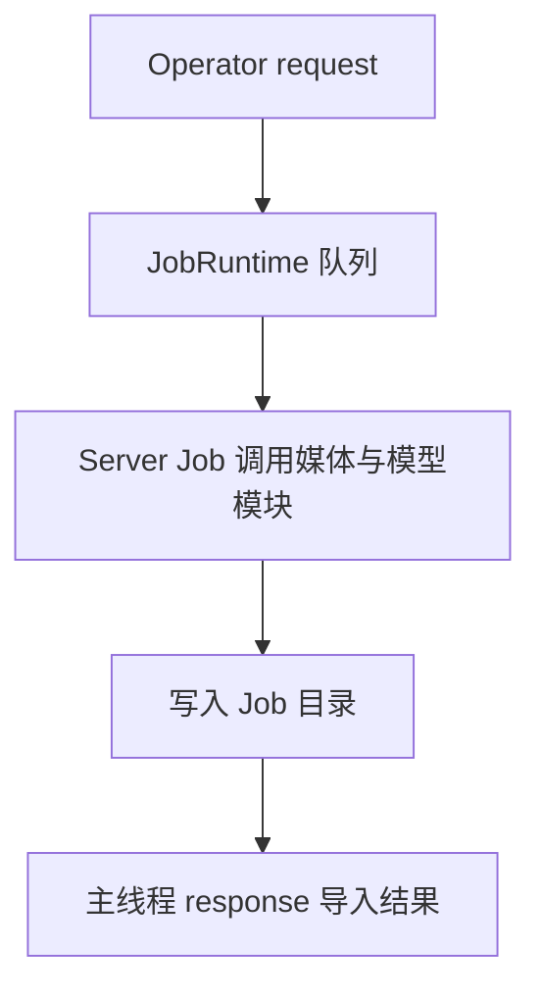

# Job Runtime 与 Server

`runtime.py` 配置 BlendJob `JobRuntime` 和独立 Python 3.12 Environment。`server/app.py` 注册 Job，`model_manager.py` 管理模型文件与缓存 Session。

| Job | 实现与用途 |
| --- | --- |
| `download-model`、`download-required-models` | `app.py` 下载单个或缺失模型 |
| `remove-background` | `jobs/remove_background.py` 生成透明前景或连续 Alpha |
| `upscale-image` | `jobs/upscale.py` 生成 2× 图像 |
| `generate-depth-plane-geometry` | `jobs/depth_plane.py` 生成深度、元数据和法线 |
| `generate-cutout-artifacts` | `jobs/cutout.py` 按请求生成深度和法线 |
| `generate-panorama-geometry` | `jobs/panorama.py` 生成全景径向深度 |

`media/` 校验输入图片并限制分析尺寸，Server 只处理静态图片。Job 在阶段边界检查取消，通过 `context.progress()` 返回进度，Operator 清理 Blender 导出的临时输入。

`geometry/prediction_artifacts.py` 缩放源 RGB 后运行一次 MoGe，将同一预测交给深度、法线和元数据写入器；源 Alpha 写入深度与法线产物的有效通道。参考深度由 Blender 侧按产物 Alpha 计算，文件协议见 [Job 产物](outputs.md)。

## 模型与缓存

| 用途 | 模型 | Session 分类 |
| --- | --- | --- |
| Depth 与 Normal | MoGe-2 ViT-S / ViT-B Normal、MoGe-3 ViT-L | geometry |
| Remove Background | BiRefNet Lite、BEN2、BiRefNet HR Matting | background |
| Upscale | Real-ESRGAN WDN、Real-ESRGAN x4plus、HAT Sharper | upscale |

`model_catalog.py` 声明文件来源、许可、大小和 SHA-256；`model_download.py` 下载并校验。ModelManager 按模型路径和设备缓存 Session，切换模型或设备时释放对应类别。Clear Models 或关闭 Server 时释放已加载资源。

首次安装通过 `post_install()` 下载默认 MoGe-2 ViT-S Normal、BiRefNet Lite 与 Real-ESRGAN General WDN x4v3。Storage Root 默认 `~/.anyimage`，保存环境、模型、Job 产物和日志。设置入口见 [AI 环境管理](operators/ai-setup.md)。
