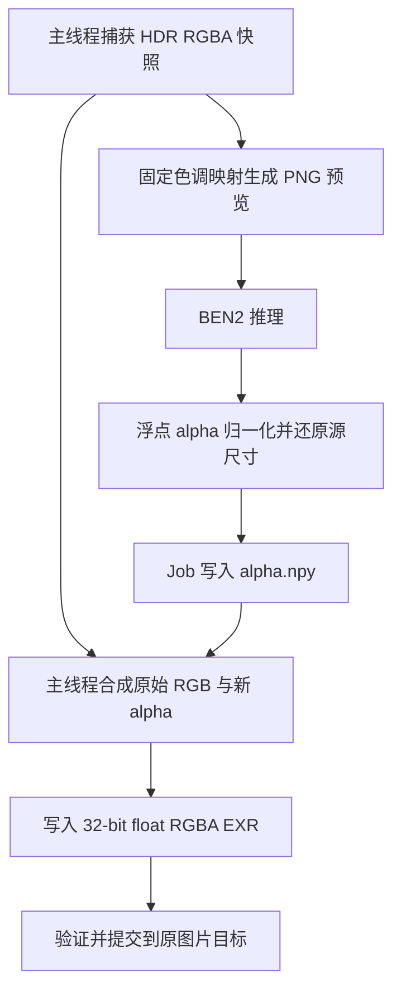

## Context

Remove Background 通过 ImageEditTarget 准备输入并提交结果。普通文件按路径校验，packed 图片导出 PNG；后端 BEN2 接收 Pillow RGB，预测 mask 后转换成 8-bit RGBA，Job 写入 PNG。源像素、结果载入和图片替换都涉及 HDR 精度边界。

BEN2 网络输出是 alpha，识别本身可复用既有模型。HDR 支持的关键是分离识别预览与原始 RGB，并让浮点信息贯穿主线程合成、EXR 编码和结果替换。

## Goals / Non-Goals

本次交付为 HDR 静态图去背景：保留源图的场景线性色彩、有效动态范围和尺寸，以模型预测更新透明度。支持 Image Empty 和材质 Image Texture 两种已有入口，以及 Blender 可读取的外部、packed、generated 浮点静态图片。普通媒体沿用既有处理方式；HDR 动画在提交前明确提示首版支持范围。Upscale 的 HDR 适配作为独立能力评估。

## Decisions

### 1. 在 Blender 侧捕获源图和准备预览

以 `Image.is_float` 及真实图片来源判断 HDR 路径，扩展名仅用于来源识别与提示。所有可读浮点静态图片走该路径，包括数值暂时处于 0–1 内的图片。准备时读取当前像素，包含尚未保存的编辑；为本次任务保存独立的 RGBA 数值快照、尺寸、色彩空间和 alpha 解释信息。

Blender 数据仅在主线程准备与提交阶段访问，Job 参数只包含普通字典中的路径、字符串和数值。后端始终读取 PNG 识别预览，因此公共媒体格式校验仍校验实际提交文件。源图与临时文件的所有权由准备阶段和 Job cleanup 明确交接。

### 2. 用固定映射生成可识别的普通 RGB

识别预览从场景线性、非预乘 RGB 生成。Blender 的浮点缓冲已经采用场景线性颜色与预乘 alpha；预览先解关联，再采用按亮度的 Reinhard 映射，以非负亮度 Y 计算 `RGB / (1 + Y)`，执行线性 Rec.709 到 sRGB 编码并限制到可编码范围。负值只在预览中处理；源浮点数值保持原样。全黑图保持有限值。预览按源 alpha 合成到黑底，符合现有 BEN2 输入语义。

映射固定且不读取用户当前 View Transform、Look、Exposure，避免切换显示设置导致 mask 变化。源颜色解码由 Blender 完成。数据图片与 CHANNEL_PACKED 输入在准备时给出明确错误。

该映射是首版确定性基线。用实际高动态范围图片验证高光边缘、暗部与半透明物体；若识别不足，在本变更内调整并固定预览算法和对应行为测试。

### 3. 让 BEN2 推理核心返回数值 alpha

将现有推理核心重构为返回原尺寸 float32 alpha 数组。保留既有 mask 归一化语义，缩放过程使用浮点数据并在最后限制到 0–1，检查尺寸与有限值。普通 RGBA 消费者在自身产物边界完成量化与合成，清理旧核心入口并更新真实调用者。

Remove Background Job 增加明确的产物模式，例如 `output_kind: "alpha"`，HDR 静态图产出 `alpha.npy` 并通过结果字段声明。读取使用 `allow_pickle=False`，验证形状、范围和有限值。现有普通图片与动画消费者继续取得对应的 RGBA 结果。

### 4. 主线程合成和 EXR 持久化

在非预乘语义下计算 `A_out = A_source × A_predicted`，保留原始 RGB。Blender 原生浮点缓冲使用预乘 RGB，因此实现直接将 RGBA 乘以预测 alpha，保持解关联后的颜色；解码 STRAIGHT EXR 后同样采用该缓冲语义。零 alpha 像素的不可恢复颜色置零，NONE 模式按不透明源处理。测试分别比较 straight RGB 或重新合成后的可见颜色。

创建 `float_buffer=True` 的结果图片，使用独立临时场景指定 32-bit float RGBA EXR、ZIP 压缩，通过 `save_render` 写出场景线性值。结果采用 Linear Rec.709 与 PREMUL，保存后载入并核对数值，再打包和提交；临时场景及文件在对应阶段结束后释放。

复用 ImageEditTarget 和 common 内的提交、共享引用隔离、图片内容备份与恢复。HDR 的 Empty 提交同时保护材质节点等其他实际使用者。独占源图包含未保存像素或为生成图时，将其当前浮点内容转为内嵌 EXR 并建立撤销基线，保留 Image 身份；一次撤销恢复原始内容，重做恢复处理结果。提交失败时恢复操作前的源状态。先验证候选结果再提交，其他共享使用者保持原状。

### 5. 保持异步编辑事务完整

使用提交时的源快照进行合成，完成前复核原目标及图片绑定。纹理节点保存独立的 `anyimage_identity`，提交时与捕获值核对，避免 Blender 删除重建节点后复用 RNA 地址造成误认。增加对捕获后源像素或色彩解释被修改的冲突检查，发现冲突则提示重新执行并保留当前编辑。

临时预览由输入 cleanup 释放，alpha 由 Job 目录管理，候选 EXR 完成载入和打包后释放临时副本。取消、推理失败、合成失败、提交失败均释放快照与本次临时数据。成功结果支持一次撤销、重做以及保存重开。

## Risks / Trade-offs

- 固定预览映射可能压低极暗部的可辨识度：用代表性 HDR 图片进行真实 BEN2 验收。
- Blender 像素、alpha 模式与 EXR 编码之间存在转换：以已知数值的真实 Blender 保存重开测试约束实现。
- 源快照增加内存占用：仅保留合成和冲突检测所需的数据，所有终止路径释放；大型输入准备失败时提供可读错误。
- 工作区相关公共入口正在修改：实施前核对现有变更，复用最新公共校验和事务接口。

## Migration Plan

先完成数值 alpha 核心与现有消费者回归，再实现 HDR 准备、合成和事务提交。验证普通媒体行为及 HDR round-trip 后完成能力交付。Job 协议由同版本插件与后端一起更新。

## Open Questions

无需要用户决策的前置问题。Blender 像素空间、PREMUL round-trip 与固定预览的识别质量已通过数值测试及实际 BEN2 推理确认。
