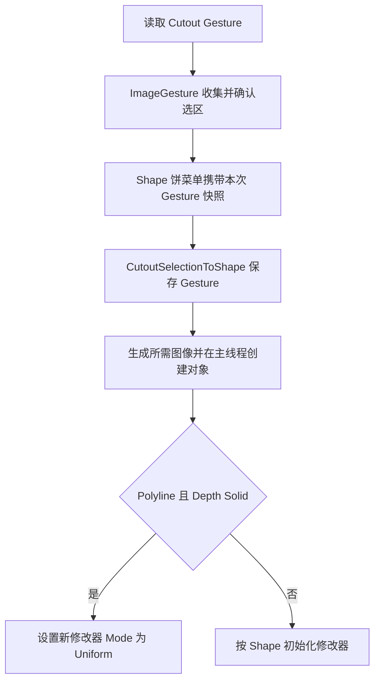

## Context

Cutout 的 `SelectCutoutSelection` 已继承 `common.viewport.ImageGesture`，目前固定为 Lasso 并通过拖动键位启动。Mask 的 Polyline 已由该共用类实现。Cutout 完成选区后打开 Shape 饼菜单，Depth Solid 经异步生成后使用 `O Image Depth Cutout` 创建对象。

节点构建内部的 Uniform Thickness 输入在保存前显示名改为 Thickness；节点组同时存在 Balloon 使用的 Thickness 输入，初始化必须区分 socket 标识。

## Goals

支持 Cutout 逐点剪出及 Uniform 初始化；统一 Mask 的 Extend 命名和 Set 默认值。

## Decisions

### 共用手势与独立设置

在 `properties.py` 定义 Cutout 的 Lasso / Polyline 属性，由 Scene 保存，默认 Lasso。Cutout 在启动时读取手势，沿用 `ImageGesture` 的逐点输入、实时预览、闭合提示和取消清理。使用共用按下启动键位支持首点输入，并验证 Lasso 拖动完成以及空白处源对象保持行为。共用逻辑留在 `common`，Cutout 负责自己的状态文本和选区提交。

### 创建时应用 Uniform

手势作为普通字符串从选择 Operator 显式传到饼菜单、转换 Operator 和对象创建链路，异步响应使用该快照，避免用户中途切换 Scene 设置影响结果。服务器生成协议继续处理深度和法线产物；修改器初始化由主线程完成。Uniform 自动设置针对本次新建的 Depth Solid 对象，之后用户可手动修改 Mode。

### 节点厚度默认值

将构建内部 Uniform Thickness 默认值设为 0.5，并验证最终资产对应 socket 的默认值和新修改器实际值。检查现有通用 Thickness 赋值只初始化其目标输入，避免同名 socket 覆盖 Uniform 默认值。按现有资产修订机制更新 Depth Solid 版本并运行 `uv run node-group build`。

### Mask 模式

统一为 `SET` / Set、`EXTEND` / Extend、`SUBTRACT` / Subtract，保留枚举数值 0、1、2。Scene 和 Operator 均通过共用属性默认 Set。Extend 保持 `max(alpha, mask)`，Set 保持 `alpha * mask`，Subtract 保持 `alpha * (1-mask)`；状态文本和测试同步命名。

## Risks / Trade-offs

- 按下启动可能改变 Cutout 的源对象选择时机 → 覆盖 Lasso、Polyline、空白点击和取消行为。
- 异步生成期间手势被切换 → 在提交时保存本次手势，并覆盖设置改变后的响应。
- 同名 Thickness socket 容易导致写入错误 → 验证具体 socket identifier、资产默认值及实际修改器值。
- 旧脚本传入 `ADD` 将失效 → 调用方统一使用 `EXTEND`，保持原枚举数值且不增加别名。

## Migration Plan

实现代码与测试后重建节点资产，执行相关测试及全量测试。回退时将本次代码、测试和资产作为同一变更回退。
