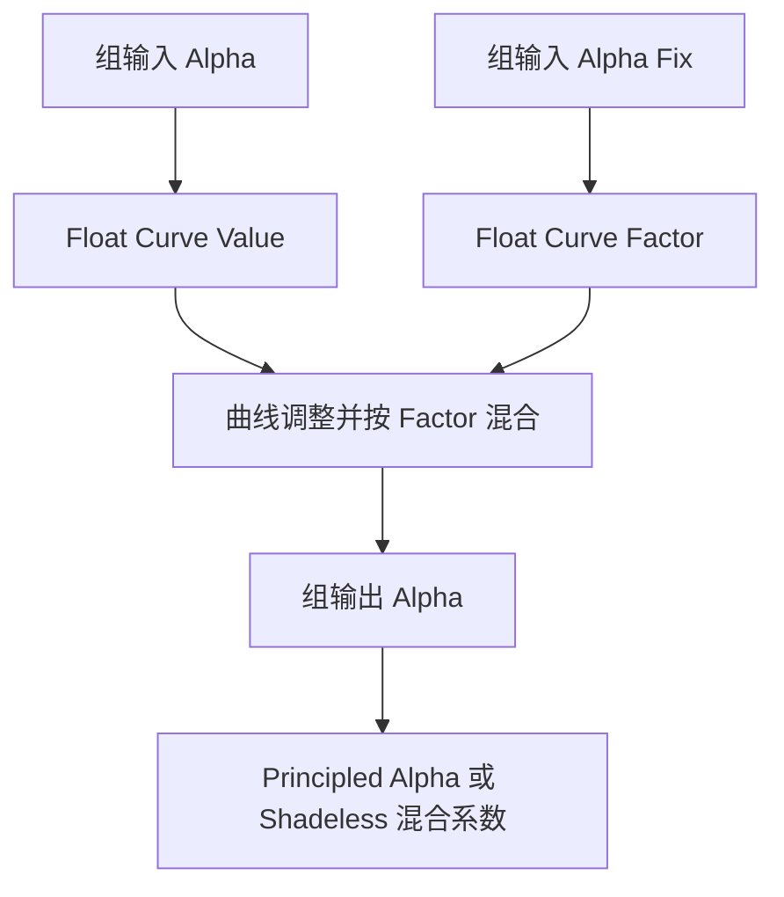

## Context

`build_material_layer_group()` 共用构建 O Image Layer 和 O Image Depth Layer。普通层直接传出输入 Alpha，深度层使用前景阈值。`create_image_material()` 已集中创建材质，并通过 `configured_material_view_adaptation()` 配置颜色图片。

## Goals / Non-Goals

目标是将参考图的 Alpha 调整内置到 O Image Layer，支持连续强度调节，并在创建时读取现有偏好。变更范围为普通图像材质层；深度层继续使用其前景阈值协议。

## Decisions

### 曲线与接口

O Image Layer 的默认折叠面板 `Options` 依次包含 `Alpha Fix`、`Normal Scale`、`Object Space`。Alpha Fix 类型为 NodeSocketFloat，subtype 为 FACTOR，范围 0–1，默认 0。直接连接 ShaderNodeFloatCurve 的 Factor，复用节点自身的混合语义：`output = (1 - factor) * alpha + factor * curve(alpha)`。

曲线使用四个点：起点 `(0, 0)`、低端控制点 `(0.8, 0)`、上方控制点 `(0.925, 0.925)` 和终点 `(1, 1)`。上方控制点为参考图估计值。采用自动钳制手柄、水平延伸及 0–1 的裁剪与采样区间。低端控制点之后快速上升，完整调整时输入 0.85 输出约 0.1593、输入 0.9 输出约 0.774；低端附近存在 Blender 曲线查表插值误差，测试容差为 0.0003。

Alpha 曲线放在独立且就近的支线，保持曲线可见、默认节点标题和未使用输出隐藏；Color、Roughness 与 Normal 保持各自连接。

### 创建时应用偏好

`create_image_material()` 在普通层节点绑定后读取现有公共偏好函数，将节点实例的 `Alpha Fix` 设为 1 或 0。判断依据就是偏好值，因此开启偏好但颜色空间回退到 sRGB 时仍设为 1。手动拖入节点组时采用资产默认值 0。

用户随后可独立调整每个材质实例；偏好切换只影响后续创建。普通着色与 Shadeless 共用组输出 Alpha。Color 图片的颜色空间和 Alpha 模式继续由现有配置入口处理。

### 验证与交付

修改构建脚本、资产验证及材质测试；通过测试期间构建的节点组检查接口、连接与曲线采样。节点资产文档按节点组专项规范同步描述接口。用户已授权更新节点资产，O_AnyImage.blend 中的 O Image Layer 与运行时代码配套交付；在 Blender 节点编辑器确认实际尺寸、节点间距和连接，并运行全量测试及资产验证。

## Risks / Trade-offs

- 截图未展示所有精确坐标与手柄设置 → 用上述初值实现，检查曲线采样，并对照实际节点编辑器及透明边缘效果验收。
- 曲线会削弱中低 Alpha → 默认手动实例强度为 0，创建时按用户偏好启用，保留每个实例的强度控制。
- 工作区已有材质与节点资产修改 → 在当前实现上追加变更，保留已有修改并检查最终差异。
- 旧资产缺少输入 → 验证资产接口与运行时代码一致，正式发布配套资产。
