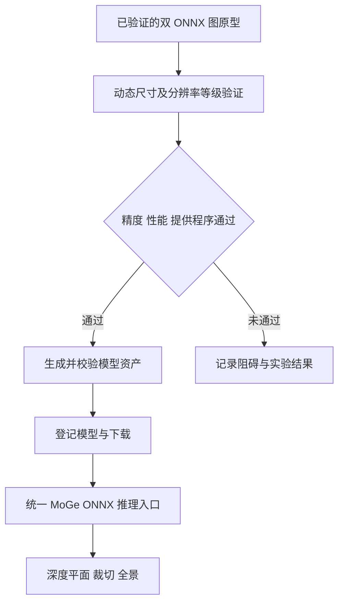

## Context

项目现有几何推理使用 ONNX Runtime，Windows 使用 DirectML，其他平台使用默认 Runtime。MoGe 3 的稀疏细化已在项目外改写为标准 ONNX 索引、聚合和矩阵运算，完整三次细化已实际运行。

实现使用上游提交 `74fbce054ebed49800de42d0ad0e83495065719a`，骨干与细化分别导出为 ONNX 图。骨干支持动态输入和 token 数，细化支持动态点数。在 RTX 5070 Ti 上，1200–3600 tokens 的完整动态推理约需 4.86–17.11 秒，平均深度相对误差约 0.002%，二值 Mask 完全一致。参考比较关闭 FlexGEMM 独立的 TF32 开关。Windows DirectML 与 Linux CPU 均已通过真实 Job 验证，详细结果见 [验收记录](validation.md)。

实验脚本与日志位于项目外 `C:/Users/icrdr/AppData/Local/Temp/anyimage-moge3-trial/`。正式转换位于 `tools/models/moge3_export.py`，模型准备和运行使用项目已有的资产机制。

## Goals

以最小改动将完整 MoGe 3 接入 MoGe 2 的现有工程流程，沿用输入准备、参数、下载、会话管理和几何产物契约。

## Decisions

### 动态尺寸与分辨率等级作为接入门槛

正式模型接收现有输入准备流程产生的图片尺寸及宽高比，沿用现有 resolution_level 到 token 数的控制方式，输出尺寸对应分析图片。256×192 / 1200 tokens 是原型测试配置，正式推理需通过动态形状及可变 token 数验证，同一组模型资产在任务间接受不同配置。

沿用已验证的两个图边界：骨干输出初始坐标、编码特征、法线、Mask 和尺度；细化图输出 log-depth 增量。MoGe 3 模块内部使用 NumPy 生成体素邻域并执行三轮调度，学习网络计算全部由 ONNX Runtime 执行，几何恢复复用现有后处理能力。逐层对比用于验证动态化后的数值一致性。

正式 Runtime 使用标准 ONNX 图和现有执行提供程序，完整执行三次细化。原型中主要网络计算由 DirectML 执行，部分索引与计数节点由 ONNX Runtime CPU 执行；正式验收继续记录实际执行路径。

### 最小工程改动

沿用现有图像准备、最大分析尺寸、分辨率等级、设备选择、Job 参数和产物。新模型特有的图集合、索引生成及迭代封装在 `models/onnx_moge3.py`；已有推理调用点只增加必要的模型分派。

复用现有模型下载与会话生命周期，通用编排名称仅在职责确实扩展时局部调整并一次更新真实调用者。Operator、Blender 响应和节点资产继续消费现有契约。正式运行依赖保持现有 ONNX 和后处理体系，离线转换依赖独立管理。

### 精度和性能验证

比较同权重、相同输入与分辨率等级的原始三次细化结果和 ONNX 结果。先用 FP32 验证语义，再评估 FP16。实验需在导出前声明验收容差，记录有效区域深度与点图误差、法线角误差、内参偏差、Mask 一致性及每次细化误差，不得根据结果事后放宽。

样本包含室内、细小物体、室外、不同宽高比及全景透视视图；覆盖低/高分辨率等级、自动 FOV 与固定 90 度 FOV。记录转换耗时、ONNX 文件大小、会话启动、热推理耗时及峰值内存/显存。Windows 验证 CPU 和 DirectML 的完整执行情况及实际算子回退；其他平台需分别验证，不沿用 PyTorch 的 CUDA 平台限制。

### 验证后的正式接入

转换工具放在 `tools/models`，依赖固定版本或上游提交；最终登记所有图文件及 external data 的大小和哈希，完整下载后标记就绪。镜像发布后才登记对应来源。生产推理只读取已准备的 ONNX 资产。

新增模型沿用现有几何模型枚举，保留已有模型键和默认值；仅调整识别新模型所必需的元数据与筛选。输出使用现有 CPU NumPy 数组和相机内参约定。全景传入 90 度 FOV，保持 Mask 与源有效性、Alpha 合成以及径向距离融合契约。

缓存按模型、设备和图集合识别，连续帧及视图复用会话，切换模型和关闭时释放资源。取消与失败沿用现有 Job 事务。

## Risks / Trade-offs

- 动态体素分箱可能放大浮点数值差异 → 对相同 FP32 配置按预定容差比较。
- 高分辨率等级增加计算量与内存 → 已记录 CPU/DirectML 性能及峰值占用，继续沿用现有分辨率等级控制。
- 多图执行会增加 CPU/GPU 数据搬运 → 测量完整流水线耗时并据此决定图边界。
- 提供程序算子覆盖不同 → Windows DirectML 与 Linux CPU 已验收，macOS 仍需实机验证。

## Migration Plan

先基于已完成原型验证动态尺寸、分辨率等级、精度与性能，再完成转换工具和模型登记。沿用现有设置与默认模型，只增加新模型选择及必要分派。实施更新相关测试，检查依赖与打包内容一致性。
