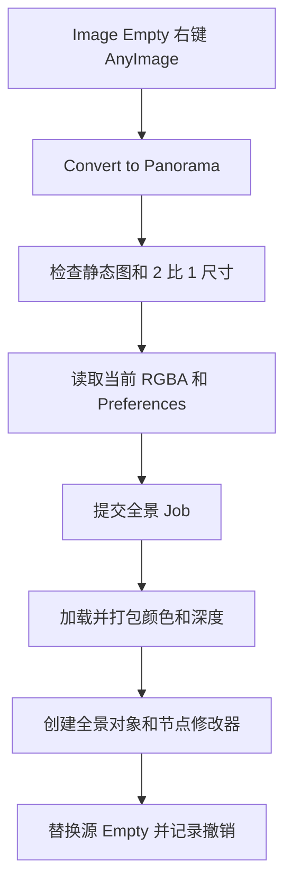
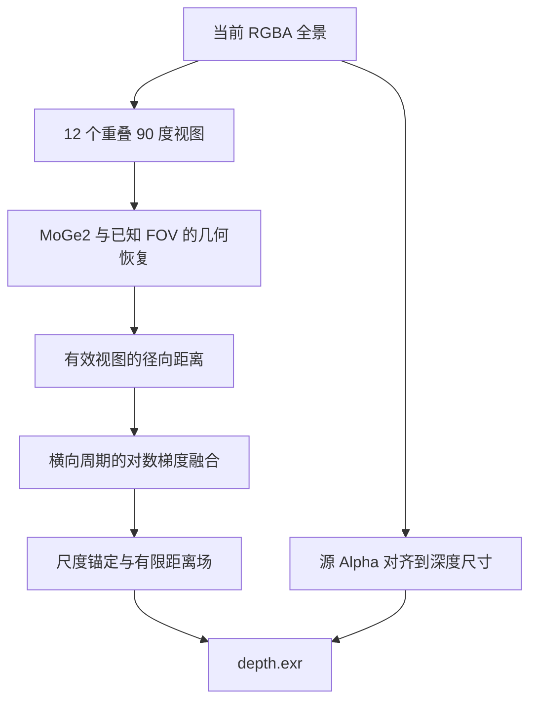
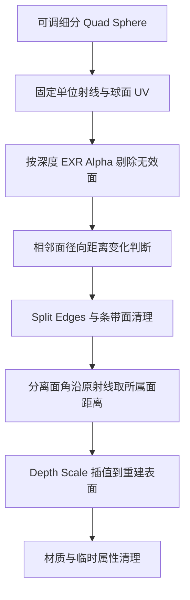

## Context

独立原型验证了 12 个透视视图的 MoGe2 推理、距离融合和 Quad Sphere。正式转换沿用 Image Empty 的异步转换流程。用户明确选择通过现有 Remove Background 预先处理背景，转换消费当前图片和 Alpha。

## Goals / Non-Goals

本次范围是静态 2:1 等距柱状全景的菜单转换、正式节点资产和 Split Threshold。沿用原型的 Subdivide、Depth Scale 和单张深度图片约定。

## Decisions

### 入口与对象生命周期

新增 `operators/convert_to_panorama/`，`operators.py` 定义 `ConvertToPanorama` 与 `GeneratePanorama`，`object.py` 创建结果，`__init__.py` 导出注册清单。公开入口为 `anyimage.convert_to_panorama`，Job 为 `generate-panorama-geometry`。复用 `common` 的输入暂存、材质、深度加载、修改器赋值和对象收尾函数。

模型、推理级别和分析尺寸从 Preferences 读取，Job 参数为普通字典。Blender 数据只在主线程读取输入和处理响应。新对象中心对应原 Empty 原点，继承其世界变换；局部 +Z 为全景上方，U=0 朝向 +X，U 增加沿 +Y 转动。生成成功后替换源对象并激活结果；失败、取消或源对象已失效时清理本次临时资源。图片显示偏移只属于平面预览，球面方向由完整图片 UV 定义。

### 后端与数据协议

`server/jobs/panorama.py` 负责任务调度，`server/geometry/panorama.py` 负责投影与融合。将已知 FOV 接入已有 ONNX 后处理和模型会话生命周期，普通图片继续使用焦距估计。保留原分辨率颜色；视图分析尺寸遵循输入上限，首版目标视图为 512×512，融合网格最长边上限 512 且保持 2:1。Subdivide 独立控制最终网格密度。

源 Alpha 对齐、黑底模型输入及可见区域排除采用原型已验证的流程。全透明视图跳过推理，部分视图无效时继续融合其余有效观测；全局无有效几何时报错。逐视图及融合前后检查取消，释放模型资源。

| 字段 | 文件 | 内容 |
| --- | --- | --- |
| 颜色文件 | `image.0001.png` | 当前 RGBA，保留源 Alpha |
| `depth` | `depth.exr` | float32 RGB 重复保存径向距离，A 为融合 Mask × 源 Alpha |
| `depth_metadata` | `depth.json` | `projection: equirectangular`、`image_size`、`reference_distance` |

`reference_distance` 为满足 Alpha 阈值的有限正径向距离中位数，用于 Split Threshold 的尺度归一化。全景元数据按投影类型单独读取；复用现有 EXR 写入及 Non-Color、CHANNEL_PACKED、Pack 配置。颜色由材质采样，几何节点只有一个深度图片输入。

### Quad Sphere 与 Split Threshold

新增资产 `O Image Panorama`。Quad Sphere 与球面校正子组的构建定义归入本仓库节点构建模块，参考已检查的 `O Quad Sphere`，运行时从 `O_AnyImage.blend` 加载。面数为 `6 × 4^Subdivide`，默认 Subdivide=7；Depth Scale 默认 1，范围 0–1；Validity Threshold 默认 0.9；Split Threshold 默认 0，范围 0–1。深度图片、材质和参考距离作为数据输入。

提取并复用 `tools/nodes/common/depth_surface.py` 中的相邻面采样、内边判断、Split Edges、面角归属和条带面清理。共用逻辑消费明确的深度字段、基础面中心和归一化比例；Depth Plane 的调用同步适配，保持已有求值结果。

对全景，令相邻面距离为 rA/rB，单位球面上的面中心为 cA/cB，参考距离为 R。沿用现有 2.5 系数，以 `abs(rA-rB) / R × Split Threshold > 2.5 × distance(cA,cB)` 选择有两个邻面的内边。阈值为 0 时直接保留通过有效性剔除的原网格；阈值增大时选择更多断层边。

选中断层附近的面角使用其所属面的距离，未选中的顶点保持原采样；所有点沿原始球面射线定位。最终半径为 `1 + Depth Scale × (目标距离 - 1)`。条带面清理遵循当前 Depth Plane 的同一拓扑快照规则。

全景面中心采样由面中心方向重新计算 UV，横向循环采样；材质面角 UV 独立处理经度分支和极点。这样左右接缝与普通内边参与同样的判断。分裂后保留原射线及面角 UV，末尾清理专用临时属性。

### 验证与交付

正式模块从原型迁移有效算法及测试，运行时依赖正式模块与打包资产。此次实现运行相关单元测试、完整回归测试和独立 Blender 求值检查。节点资产更新走现有离线资产流程；扩展包及文档构建属于另行发布操作。

## Risks / Trade-offs

- 径向距离与平面 Z 深度的比较尺度不同 → 用参考距离归一化，并测试相同形状整体缩放后的分裂选择一致。
- 全景接缝和极点的 UV 有多种等价表示 → 用方向生成采样坐标，并验证接缝两侧的等价深度断层。
- 共享分裂代码近期增加了条带清理 → 保留现有 Depth Plane 回归结果，并覆盖全景分裂后孤立条带、Alpha 边缘和连续斜面。
- 天空及遮挡导致预测缺失 → 以当前源图 Alpha 和融合 Mask 确定有效几何，允许通过现有 Remove Background 预先处理。
