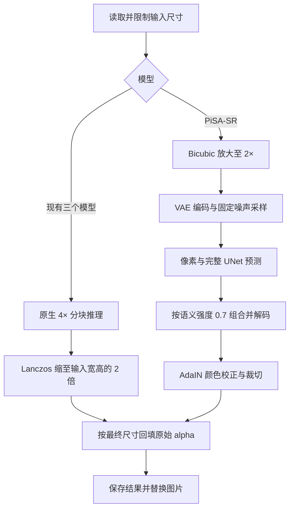

## Context

当前 `onnx_upscale.py` 用 256 像素 tile 执行三个 4× 模型，`models/upscale.py` 负责输入尺寸限制和 alpha 回填，`ModelManager` 缓存单个 Upscale Session。Operator 的倍率和提示均为 4×。

本地实验位于 `build/upscale-explore/pisa-research/`。已验证固定 512×512 的 PiSA-SR FP16 ONNX 全流程在 DirectML 上出图，0.7 预设对应像素强度 1.0、语义强度 0.7、空提示词和 seed 42。两套 UNet 常驻时，512 输出约 1.57–2.37 秒；默认强度 1.0 的单 UNet 速度不代表 0.7。分块和跨设备部署尚待验证。

## Goals / Non-Goals

**Goals:** 四个选项统一 2× 输出；复现已选定的 PiSA-SR 0.7 观感；通过已有 ONNX 运行时服务图片和逐帧任务。

**Non-Goals:** 本次范围限定为固定预设与既有 Upscale 操作，强度滑杆、提示词编辑和视频时序增强属于独立能力。

## Decisions

### 1. 最终倍率与模型原生倍率分别定义

公共结果倍率为 2，旧 ONNX 图的 shape 校验仍为原生 4。先实现完整 4× 拼接后一次 Lanczos 缩小，作为明确的像素基线；避免先逐 tile 缩小引入新的滤波接缝。最终尺寸相对于 `limit_image()` 之后的输入，沿用 Operator 对输入长边的既有限制。

保留三个模型的 key、原生名称和默认选择，说明文字明确最终输出 2×。新增 key `PISA_SR`、显示名 `PiSA-SR`，说明固定细节强度 0.7；生产和 Debug 复用相同输出入口。

### 2. 固定 0.7 的定义与实验一致

使用同一采样 latent 计算 `pixel + 0.7 * (full - pixel)`，再按已验证的公式解码。空提示词 embedding 与 timestep 固定在资产中，seed 固定为 42；采样算法、精度和噪声布局通过测试锁定。保留实验中的 Bicubic 输入插值、VAE scaling、输出量化和 AdaIN 颜色校正。

该强度是在预测结果上插值。将 LoRA 权重乘以 0.7 或插值两套 UNet 权重，不能视为等价的单 UNet 优化；任何这样的优化必须另行通过效果对照。

### 3. PiSA-SR 使用独立适配器与多文件资产

新增 `server/models/onnx_pisa_sr.py` 承担 VAE、UNet、采样及分块。`ModelManager` 按模型类型创建单 Session 或 PiSA-SR 管线，并统一缓存 key、释放和状态展示。Session 创建和运行复用 `onnx_runtime.py`，补齐 DirectML 所需的 sequential execution 与禁用 memory pattern 配置。

资产以 encoder、decoder、pixel UNet、full UNet 为明确文件集合，通过既有 catalog 下载与完整性校验。实验包约 3.63 GB，发布清单必须使用最终导出文件的尺寸和 SHA256。导出工具固定 PiSA 源码 commit、基础模型 revision、LoRA 校验值和导出环境；训练依赖仅用于离线工具。实验目录仅作为参考，不作为运行时路径。

### 4. 分阶段执行限制模型常驻

优先采用按阶段处理全部 tile 的调度：编码并把 latent 存入主机内存，运行像素 UNet 保存预测，释放该 Session 后运行完整 UNet并组合，最后解码。GPU 上同一时刻只常驻一套 UNet；切换在整图阶段边界发生。大图中间数组可落入任务临时目录，结束或取消后清理。

此方案以降低显存峰值为优先，代价是阶段加载成本；实施时同时测冷启动、连续图片和多帧耗时。任务结束按实际 Session 最后使用点释放临时推理内存，资源错误使整个 PiSA 管线缓存失效，Clear Models 释放全部组件。

### 5. 固定尺寸 ONNX 通过重叠分块覆盖任意输入

以已验证的 512×512 输出 tile 为初始部署尺寸，采用重叠区域加权融合，边缘填充后裁回精确的 2× 尺寸。噪声按整图 latent 坐标生成并切片，重叠区域共享噪声；AdaIN 在拼接完成后按整图执行。单 tile 情况保持实验基线，多 tile 的重叠宽度通过接缝对照确定并固化为内部常量。

alpha 从受尺寸限制的源图直接 Lanczos 放大到最终 2×，独立于生成模型；透明 RGB 的处理沿用现有输入语义，并加入半透明边缘目视验收。多帧逐帧处理并复用固定噪声规则，支持取消；生成纹理的时序稳定性列入验收观察。

## Risks / Trade-offs

- [分块改变生成纹理或形成接缝] → 对两张实验样图及跨 tile 的纹理、渐变、透明边缘做完整图与局部对照；接缝未通过时继续调整分块方案。
- [分阶段 Session 加载拖慢连续任务] → 记录端到端冷暖耗时、峰值显存和主机内存；不将单 UNet 默认模式的数字作为 0.7 性能承诺。
- [FP16 图在 CPU/CoreML 上兼容性未知] → 实测项目支持的设备路径；需要时导出匹配的精度资产，并在 catalog 中表达准确支持范围。不可运行的设备返回明确原因。
- [新细节改变原始图案或引起逐帧闪动] → 保留已有模型选择，验收脸部、文字、纹理和短序列样例，界面说明生成型细节补充。
- [多 GB 权重分发与依赖来源] → 发布前核对基础模型和 PiSA 权重的分发条款，登记固定来源及最终文件校验信息。

## Migration Plan

先准备与验证 PiSA 资产及分块管线，再接入 catalog、模型管理器和界面，统一最终 2× 结果并运行测试。现有用户保存的模型 key 继续有效，后续执行采用 2×；已有图片产物无需迁移。回退时同步回退模型选项和推理入口，已下载资产可由已有缓存管理处理。

## Open Questions

实施实验需确定分块重叠宽度、阶段加载的可接受耗时，以及 CPU/CoreML 的实际精度与支持范围。这些验证不改变 0.7 和最终 2× 的产品约定。
