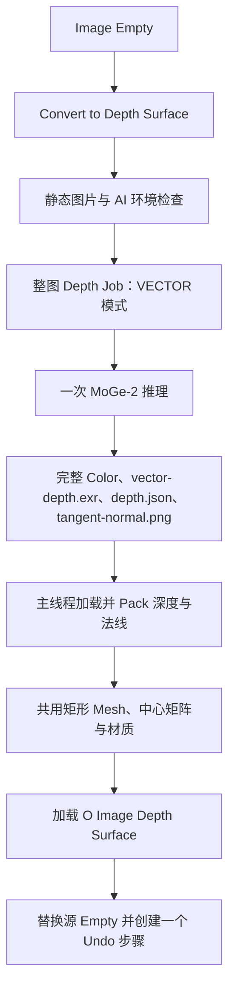
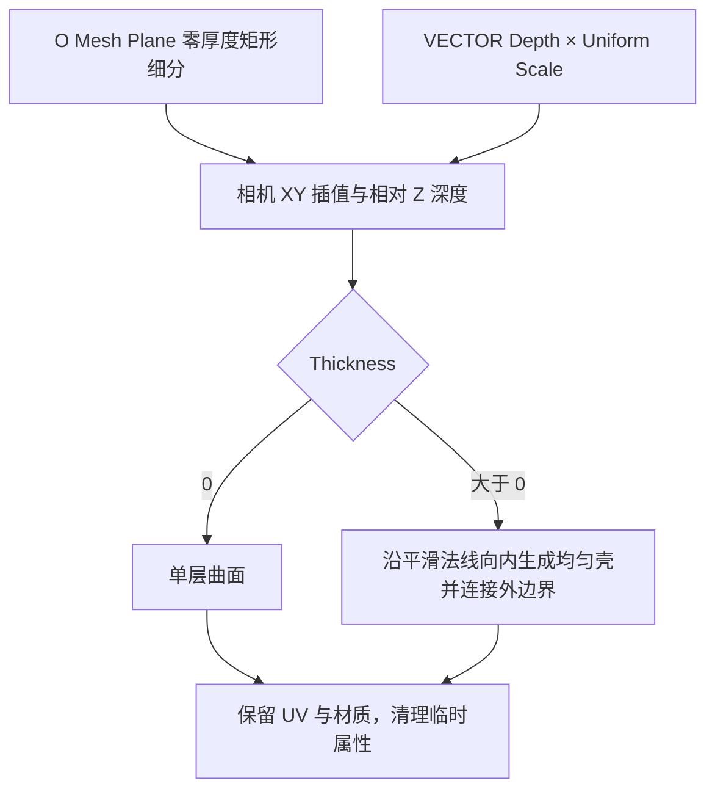

## Context

普通 Plane 的 `create_mesh_plane_mesh()` 创建中心四边形和完整 UV，`O Mesh Plane` 负责矩形细分。现有 Depth Plane 使用固定底面的浮雕置换；Depth Cutout 的曲面分支使用相机 XYZ 投影。整图 Job 已通过通用 Artifact 层执行一次 MoGe-2 推理，该层支持 VECTOR Depth。

Cutout 的双击入口集中在 `SelectCutoutSelection.invoke()`、`full_image` Property 和 WorkspaceTool keymap。工作区中的 Cutout Shape 重组仍在进行，本提案以当前文件中的实际实现为基线。

## Goals / Non-Goals

本次目标是建立独立的整图 Depth Surface 转换，并让 Cutout 通过套索提交区域。Depth Surface 的用户控制固定为 Subdivide、Thickness、Depth Scale、Reference Depth、Normal Smooth。

## Decisions

### 入口与命名

采用 `ConvertToDepthSurface`、`anyimage.convert_to_depth_surface`、界面文字 **Convert to Depth Surface** 和资产名 `O Image Depth Surface`，表达输出是相机投影曲面。菜单中的顺序为 Plane、Depth Plane、Depth Surface，现有 Depth Plane 继续承担固定底面浮雕。

Cutout 直接使用共享拖动 keymap，删除双击整图绑定、`full_image` 声明和完整矩形 Selection 构造代码；`invoke()` 仅记录 Pie Event 后启动共享手势。清理因此失去用途的 import 和测试夹具。

### 整图生成主链

在现有整图 Job 上增加明确的深度产物选择，Depth Plane 使用 Z，Depth Surface 使用 VECTOR；两者均从一次预测生成 Tangent Normal。Blender 侧将转换类型随请求保存至响应阶段，据此选择节点组和结果标识。复用 `common` 的图片加载、深度尺度、材质与对象替换函数；Server 只引用自身目录内的共享 Artifact 层。

### 基础网格与节点接口

Depth Surface 使用 `create_mesh_plane_mesh()` 和 `build_mesh_plane_matrix()`，保持整张图片的矩形边界、中心原点、UV 和材质槽。节点内部调用 `O Mesh Plane`，以 Thickness 0 生成基础曲面；同一 Subdivide 下，它与普通 Plane 的零厚度网格具有相同顶点、面连接与 UV。Alpha 参与材质显示，模型 Validity 用于数据有效性处理，几何始终覆盖完整矩形。

| 输入 | 默认值 | 语义 |
| --- | --- | --- |
| Subdivide | 6，范围 0–10 | 沿用 O Mesh Plane 的细分 |
| Thickness | 0，最小 0 | 均匀曲面壳厚度，DISTANCE |
| Depth Scale | 1，最小 0 | 平面到相机曲面的缩放，可大于 1 |
| Normal Smooth | 50，范围 0–50 | 厚度方向的法线平滑次数，放在 Options |
| Reference Depth | Metadata reference_depth × Uniform Scale | 局部深度基准，DISTANCE，放在 Options |

Geometry 为结构输入；Depth Image 与 Uniform Scale 为隐藏数据输入。所有修改器输入使用 SINGLE。

### 投影与厚度

沿用 Depth Cutout 的 VECTOR Depth 坐标约定：将采样相机 XYZ 乘以 Uniform Scale，翻转 Y 得到局部 XY，局部 Z 为 `(Reference Depth − scaled_camera_z) × Depth Scale`。局部 XY 从基础矩形位置按 Depth Scale 插值到缩放后的相机 XY；0 为原平面，1 为完整投影，大于 1 为外推。Reference Depth 使用与采样相同的局部单位。

提取现有曲面分支中可复用的投影、均匀厚度节点构建函数，按业务职责集中在共用构建模块；新组只组合自身需要的步骤。零厚度保持单层矩形拓扑，正厚度保留投影正面、沿内侧扩展背面并连接四周。厚度采用正面 POINT 法线，按 Normal Smooth 迭代次数进行邻域平滑后归一化，使对应正背面顶点之间的距离等于 Thickness。

### 验证边界

以合成相机 XYZ 纹理验证投影和坐标方向，用相同 Subdivide 的普通 Plane 对照基础拓扑与 UV；使用非方图、偏移 Image Empty、旋转缩放矩阵验证定位。检查五项可见参数、隐藏数据输入、SINGLE、材质槽和临时属性清理。

节点布局按实际 Blender 绘制尺寸检查总览和局部，几何主链连续、计算支线就近接入。实现阶段按项目总则只运行测试；资产构建、资产视觉验收和节点资产文档同步作为后续发布准备，当前提案不执行构建。

## Risks / Trade-offs

- 相机纹理的 Y 方向或中心对齐错误会使结果镜像、偏移 → 使用带非中心主点的合成相机数据验证，并保持与现有 Depth Cutout 相同的投影公式。
- 深度不连续处的矩形面会被拉伸 → 将连续矩形拓扑作为明确输出约定，用阶跃深度验证连接关系稳定。
- 新增类型和共享 Job 分支可能影响现有转换 → 检查注册与逆序注销、Z/VECTOR 产物选择、单次推理及 Undo 回归。
- 工作区同时调整 Cutout 节点 → 实施前核对当前构建函数和 Shape 设置，在现有修改基础上提取共用步骤。
