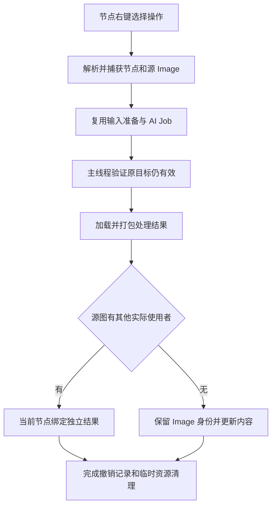

## Context

现有菜单挂载于对象右键菜单，两个 AI 操作通过 Empty 取得 Image 和播放设置。`common/image.py` 已提供输入准备、结果打包、Image 内容快照和恢复；现有共享判定专用于 Empty。动机见 proposal.md。

## Goals / Non-Goals

本设计围绕材质 Shader Editor 的 Image Texture 节点完成图片输入、异步目标定位和原位提交；Empty 的现有行为作为回归基线。

## Decisions

### 菜单按编辑器和当前节点确定目标

在 `NODE_MT_context_menu` 注册回调，以材质 Shader Editor、当前编辑树、活动 Image Texture 节点及有效 Image 为显示条件。支持进入材质节点组和固定材质后的编辑上下文，节点编辑器中的无效目标直接判为不可用。新增 `AnyImageTextureNodeMenu`，包含两个图片操作及现有 AI 设置入口；Upscale 标签使用目标图片尺寸。注册与逆序注销对称。

### 在 common 中集中处理图片编辑目标

新增职责明确的 `common/image_target.py`，统一取得源 Image、ImageUser、目标校验与结果提交分派。复用两个现有 Operator 和服务端 Job；将结果加载中对 `source_object.data` 的依赖改为显式 Image 参数，并同步修改真实调用点。Empty 特有的显示对齐和共享规则仍由现有提交函数负责，节点提交复用 Image 内容事务函数。

### 捕获提交时的节点身份

在主线程捕获编辑树、节点与源 Image 的运行期身份，以及节点 ImageUser 播放参数。响应在主线程使用捕获目标，校验节点仍属于原树且仍绑定源图；名称只用于提示，防止删除后同名重建误命中。运行期引用仅保存在本地任务状态，Job 请求使用路径、帧参数等普通字典数据。切换活动节点不改变目标；目标删除、源绑定变化或变为只读时报告错误并清理结果。

### 原位替换保留节点结构并隔离共享图片

节点独占 Image 时复用内容快照与恢复，保留 Image 身份、名称和 Fake User；存在其他实际 Image 使用者时，仅当前节点绑定新结果，保留原图。共享判定覆盖其他节点树、Empty 和其他数据使用者，忽略 Fake User、编辑器显示和本次临时持有；在响应提交时计算。该规则仅用于节点目标。

保持节点位置、插值、投影、扩展方式和连线。结果继承源色彩空间并使用现有 alpha 配置；去背景输出透明图片，材质的 Alpha 连线和渲染设置由用户已有材质决定。动画输入沿用现有处理帧数约定，起始帧和播放设置从节点 ImageUser 读取，结果序列以同样时间位置播放。

### 失败恢复和撤销采用完整提交边界

节点提交覆盖 Image 内容、绑定和 ImageUser 设置的快照、恢复与清理。沿用两个操作现有撤销入口，验证异步成功仅产生一个有效图片编辑撤销步骤，重做恢复结果且无需再次推理。

## Risks / Trade-offs

- [节点组被多个材质实例使用] → 编辑共享节点树内的节点会作用于所有该组实例，遵循 Blender 节点树共享语义；图片隔离以节点身份为边界。
- [共享判定遗漏其他 Image 使用者] → 结合实际数据引用校验，测试跨材质、跨节点组、Empty 及 Fake User 情况。
- [异步完成时上下文已变化] → 使用捕获的运行期身份并在提交前验证；覆盖改名、删除和重新绑定图片。
- [Image 内容原位修改的撤销与打包行为] → 使用真实 Blender 测试验证撤销重做、保存重开、动画和失败恢复。

## Migration Plan

先集中目标解析与图片结果加载，再接入菜单和节点提交，最后完成注册、回归及 Blender 验证。无需数据迁移；回退代码后，已有处理结果继续作为普通 Image 使用。
