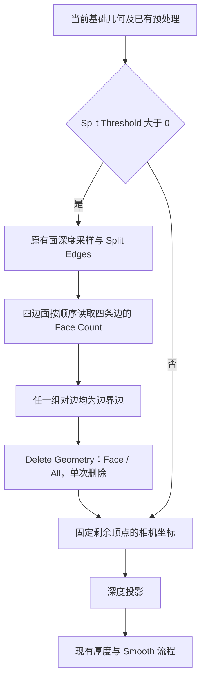

## Context

两个节点组共用 `split_depth_surface`，在变形前读取相邻面深度并拆边，随后固定相机坐标、投影和加厚。实验直接复制原资产，只插入单次 Delete Geometry；关闭实验开关时求值的顶点与面与原组完全一致。

实验四边网格结果：山景从 80,449 面删去 21,306 面，蜘蛛图 Depth Cutout 从 37,206 面删去 2,249 面。蜘蛛图三角网格的 74,412 面全部保留。两个实验均为 MoGe-2 Small、level 0、Split Threshold 0.5；面数取决于实验网格，正式测试验证拓扑性质。实验深度采用无损 EXR 打包，保存重开结果一致。

## Goals

在两个 Depth 节点组中共用确定性的单次条带删面逻辑，将 Split 控制放在主输入区 Smooth 前，并保留剩余表面的 UV、独立切口身份和加厚连接。

## Decisions

### 1. 在拆边分支内执行一次删除



共用实现放在 `tools/nodes/common/depth_surface.py`，将删除节点接在 Split Edges 输出与现有启用 Switch 的 True 输入之间。删除选择在该时刻的完整拆后几何上求值一次。

### 2. 按面角顺序识别边界对边

在 FACE 域用 Index → Corners of Face 获取当前面的一个起始角和面角数量。通过 Offset Corner in Face 的偏移 0、1、2、3，分别用 Edges of Corner 的 Next Edge Index 取得同方向的四条边；Evaluate at Index 在 EDGE 域读取 Mesh Edge Neighbors 的 Face Count。

令 `b_i = (FaceCount(edge_i) == 1)`，选择条件为：

```text
corner_count == 4 AND ((b0 AND b2) OR (b1 AND b3))
```

该结果与起始角和面绕序无关。一张面宽条带、三条边界边的条带末端、孤立四边面被选中；具有一条边界边或两条相邻边界边的普通面保留。边界计数严格等于 1，零邻面和非流形边不作为边界边参与匹配。

### 3. 正式接口只有 Split 控制

条带清理随 Split 正值分支固定启用。两个节点组仅有一个 `Split Threshold`，其 parent 为主输入区，顺序紧邻 `Smooth` 之前。维持 `FACTOR`、范围 0–1、默认 0 及现有阈值映射。

移动接口时检查构建顺序、局部 Group Input、修改器赋值与测试中的标识符或顺序依赖。组名保持正式名称；正式接口不引入实验开关。节点使用默认名称、局部连线和未使用输出隐藏规则。

### 4. 按输入拓扑验收

四边面按上述条件处理；三角面和其他多边面通过面角数量门控保留。Depth Cutout 的当前三角化输入仍可使用原 Split，清理阶段自然不选面。保持真实建网流程，不为匹配清理规则增加三角面合并或重拓扑。

### 5. 更新覆盖约束并验证厚度

将现有“Split 保留所有面”的测试改为“保留所有未命中条带条件的面”，并保留独立的纯拆边与零值旁路检查。厚度依据删面后几何建立边界；正厚度测试检查剩余区域闭合、切口区域独立和属性生命周期。

## Risks / Trade-offs

- 规则识别一张面宽的拓扑结构；真实窄结构、已被原 Split 过度拆分的远山也可能命中。不能据此承诺语义上的前景或远山完整保留。
- 两张面宽的条带及三角条带不受本规则处理，剩余边界仍受原网格分辨率限制。
- 单次求值避免清理不断向完整区域推进。首次删除后新暴露的候选面留待后续用户改变输入时重新求值，不能在同一次求值中反复删除。

## Delivery

本提案完成后实施源码与测试，保留工作区其他修改，执行全量测试并确认正常退出。依照项目规范，此实施任务不构建文档或产物。正式节点资产重建发布需要单独安排；源码实施完成不代表用户安装的节点资产已更新。
