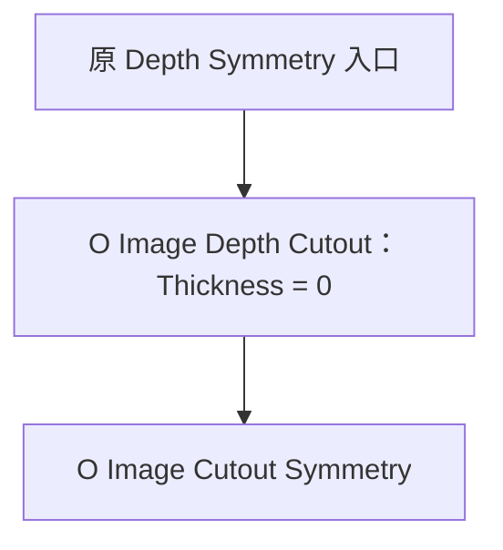

## Context

现有 Cutout 负责图像深度投影与 Balloon / Shell 成形；现有 Depth Symmetry 同时承担投影及对称。桌面独立实验已将后者的 Projected 后半段取出，接在原 Cutout 后面。

`C:/Users/icrdr/Desktop/anyimage/post-cutout-symmetry-20260914/comparison.json` 记录了两张图片、两种模式、补面开关的零厚度对比：八组顶点位置误差均为 0，面数量及带方向拓扑一致。非零厚度对比也验证了镜像和封闭直壁。该证据对应实验参数；本次精简平滑接口后还需验证匹配预处理条件下的一致性。

Shell 的 `build_normal_weight` 使用 `smoothstep(Shell Thickness / Reference Depth)` 混合法线。实验恐龙的 0.075 厚度与约 5.505 参考深度只留下约 0.055% 的平滑权重，解释了薄壳调节不明显。

## Goals / Non-Goals

目标是两个入口共用 Cutout 成形，独立对称节点负责后续镜像与补面，并让薄壳法线平滑有效。本轮实现范围为节点资产、创建流程及对应验证；Cutout 继续使用 Balloon / Shell，深度推理流程保持现有实现。

## Decisions

### 1. 对称作为成形后的节点

使用资产名称 `O Image Cutout Symmetry`，将其改为几何处理节点。Depth Solid 使用 Cutout；Depth Symmetry 使用以下顺序：

先完成 Balloon 或 Shell，再将结果整体交给对称节点。这与已验证实验一致，避免在 Cutout 内组合成形和镜像的模式分支。旧 Symmetry 的 Balloon 分支由上游 Cutout 的 Balloon 承担。

对称沿用原 Projected 的方向对齐、Z 向偏移、负侧面移除、镜像翻面及对应边界连接顺序。Shell 的内外表面都属于输入结果，分别保留其边界连接关系。负侧面移除沿用原面选择语义。

### 2. 简化接口与坐标约定

| 输入 | 行为 |
| --- | --- |
| Geometry | 接收 Cutout 已成形的几何 |
| Symmetry Direction | 复用原 Depth Direction 的方向对齐语义，默认 (0, 0, 1) |
| Depth Offset | 方向调整后沿对称轴偏移，默认 0 |
| Fill Sides | 连接前后对应边界，默认开启 |
| Fill Smooth | 仅控制新增侧壁的几何平滑次数，默认 2 |

始终保留镜像后的两侧。移除 Mode、图像及深度标定输入、Double Sided、Depth Axis、Smooth、Boundary Smooth、Smooth Weight、Uniform Scale。对称坐标系沿用原 Projected 的局部 XY 平面和 Z 轴；创建流程将上游 Cutout 初始化为与之匹配的 -Z 输出。接缝容差由输入几何尺度获得。

### 3. 补面平滑约束在新增侧壁内部

Fill Smooth 为 0 时直接使用原直壁补面。开启时，在对应前后边界间生成含中间环的侧壁条带，对中间顶点进行受限平滑，固定与原几何相接的两端；保持成对顶点关于对称平面对称。条带采样采用内部固定策略，不新增采样参数。

这使侧壁平滑具备可移动的内部顶点，并保持输入保留下来的面形状。只有改变着色法线不足以满足几何平滑要求。Fill Sides 关闭时跳过条带及平滑。复用 common 中的字段与平滑函数；不用 Capture Attribute，临时属性仅在确有跨几何保存需求时使用并清理。

### 4. 入口分配参数与零厚度基线

Cutout 节点资产的 Balloon 与 Shell 两种 Thickness 默认值均为 0，手动添加节点时也使用零厚度初态。Depth Solid 创建时按 Thickness 的 subtype 分别设置 Balloon 为 1、Shell 为 0.2；两个输入均初始化，切换模式时使用各自的创建值。手势对应模式沿用 Cutout 的 Balloon / Shell 选择约定。

Depth Symmetry 入口创建两个依次求值的 Geometry Nodes 修改器。深度图、参考深度和尺度交给 Cutout，原标定得到的方向交给 Symmetry。Cutout 使用两种 Thickness 的零默认值，切换模式也保持零厚度初态。

Depth Solid 与 Depth Symmetry 均请求并读取 `object_normal` 结果；对象创建时为深度 Cutout 材质指定 OBJECT，开启 `O Image Layer` 的 Object Space。

Depth Symmetry 创建时保留 Cutout 的参数默认值，包括 Depth Split、Boundary Smooth、Smooth 与 Depth Axis；仅沿用通用的手势模式选择、清理阈值和图像标定输入。下述一致性测试所需的关闭分割/平滑条件只在测试中显式设置。

一致性验收使用同一输入网格、深度、参考值、尺度、方向和偏移；新链路关闭额外 Cutout 分割/平滑，旧 Projected 的 Smooth 与 Boundary Smooth 也设为 0，新 Fill Smooth 为 0。分别验证 Balloon/Shell 零厚度与 Fill Sides 开关。额外开启上游平滑后的结果由该上游处理决定。

### 5. Shell 使用完整的平滑厚度方向

Shell 使用在原正面点域求值、按 Normal Smooth 模糊并归一化的法线作为厚度偏移方向，不再以厚度与参考深度之比衰减。厚度仅控制偏移距离；零厚度输出保持原正面。Balloon 保留现有厚度相关权重。

Normal Smooth 平滑的是壳体挤出方向，原始深度正面的几何平滑仍由 Cutout 的 Smooth 控制。测试覆盖实际较薄厚度及较大参考深度，避免只测试厚壳而遗漏衰减问题。

## Risks / Trade-offs

- 侧壁平滑可能收缩狭窄凹口或在复杂轮廓附近自交 → 固定接缝、保持镜像配对，使用现有两张样例检查小幅平滑效果；不将全局无自交作为任意参数的保证。
- 精简接口与旧图文件中的内嵌组不同 → 创建流程统一使用新资产接口，不自动重写用户已有对象；构建前保存基线测试资料，按新的参数分配更新节点测试。
- 同名资产及待归档旧提案可能描述不同职责 → 本变更作为后续修订；实现与归档时协调 `add-projected-depth-symmetry` 的最终规格，防止旧的单节点要求覆盖此设计。

## Migration Plan

先保留旧 Projected 的小型基线数据，再替换构建逻辑、接入双修改器入口并修正 Shell 法线。运行相关测试和 `uv run node-group build`，同步源码与资产。出现回归时成套恢复此次构建逻辑、入口参数和资产。

## Open Questions

无阻塞产品决策。侧壁条带的内部采样数量在实现时以现有样例验证，不增加公开控制项。
