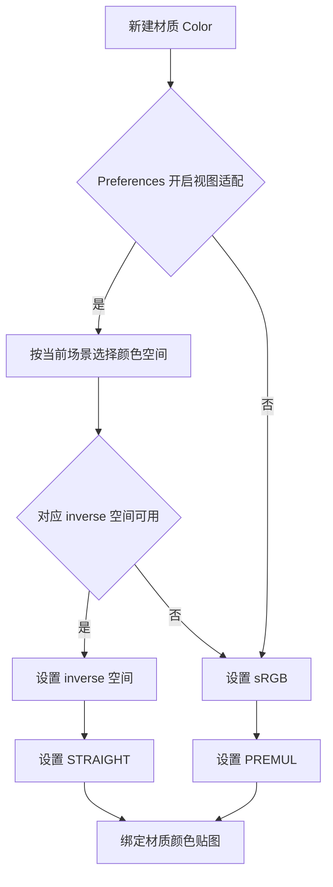

## Context

`common/material.py` 通过 `scene.view_settings.view_transform` 选择颜色空间，随后调用 `configure_color_alpha()` 固定设置 PREMUL。当前映射包含 ACES 1.3、ACES 2.0、AgX、Filmic 和 Khronos PBR Neutral；Standard 及未匹配视图返回 sRGB。剪贴板 Mesh 材质使用独立构建入口。

`common/image.py` 的 Alpha 配置服务于普通编辑结果。此次策略集中作用于材质 Color Image，并复用已有像素读取和恢复机制。

## Goals

- 提供一个全局着色偏好，作为材质颜色贴图适配状态的唯一控制来源。
- 保证实际 inverse 空间搭配 STRAIGHT，实际 sRGB 搭配 PREMUL。
- 保留 Color 的业务 RGB、Alpha、透明区域 RGB 和共享源图片。

## Decisions

### 偏好与生效时间

在 `AnyImagePreferences` 添加布尔属性 `adapt_material_to_view_transform`，UI 名称为 `Adapt to Scene View Transform`，放入独立 Shading 分组。默认值采用 `False`，让用户主动启用适配；这是本提案的默认选择。读取入口放在 `preferences.py`，通过 `addon_preferences()` 获取；偏好不可用时采用相同默认值。

新建材质时读取当前偏好，已创建的材质 Color Image 保留原配置。切换偏好只决定后续创建的材质贴图策略。创建操作、源图片状态和场景 View Transform 都只能参与贴图配置，不能改写适配开关。View Transform 用于开启适配时选择对应颜色空间，回退到 sRGB 后偏好仍保持开启。

### 颜色空间与 Alpha 一起决策

沿用 `VIEW_TRANSFORM_COLOR_SPACES` 中的准确名称。Standard、未匹配的 View Transform、缺失 scene 以及不支持的 inverse 空间统一使用 sRGB + PREMUL；这属于颜色空间解析结果，适配开关仍由 Preferences 保持。Alpha 模式以实际成功应用的颜色空间为准。如果连 sRGB 也无法设置，配置明确报错并保留该贴图之前的有效配置。

### 公共配置边界

在 `common/material.py` 集中配置材质 Color 的颜色空间和 Alpha。公共材质与剪贴板 Mesh 材质创建入口调用同一配置函数，在 Blender 主线程处理，颜色空间映射采用创建时当前场景的 View Transform。审查 Plane、Depth Plane、Cutout 调用链，保证加载、复制或 Pack 步骤保持偏好决定的配置。

材质专属配置函数负责设置 STRAIGHT 或 PREMUL；普通图片编辑继续使用现有 `configure_color_alpha()`。复用 `common` 中的像素读取函数处理数据保留。

颜色空间和 Alpha 都属于 Image 数据块属性。配置作用于本次新建材质专用的 Color Image；当源图还被 Empty、普通图片编辑或已有材质引用时，先复制并仅绑定本次新建材质的 Color 节点。复用 `image_pixels()` 读取业务像素，对 generated、dirty、packed 和文件来源验证两项设置先后变化后的内容保留。

### 与已有 Alpha 变更的协调

活动变更 `enable-image-alpha-blending-and-premul` 中 `Mesh Color images use PREMUL independently of data textures` 的材质规则由本变更细化为颜色空间配对策略。实施时调整对应材质断言，归档时保证最终主规格采用此规则。普通编辑结果默认 PREMUL、Empty Alpha Blending、Depth 与 Normal 数据解释继续按各自规格执行。

## Risks / Trade-offs

- inverse + STRAIGHT 的边缘优势来自用户观察，需使用实际半透明边缘在 Blender 中复核；属性断言只能验证策略落地。
- Image 颜色空间或 Alpha 切换可能改变像素读取解释，需覆盖 Pack、保存重载以及重新作为编辑源的行为。
- 新建材质使用共享源图片时，需要隔离本次 Color 配置，保障已有材质及图片的其他用途。

## Validation

测试偏好默认值、UI、注册与逆序注销；覆盖各视图映射、关闭状态、Standard 和 inverse 不可用的回退，并断言创建及回退前后偏好值保持一致。对 Plane、Depth Plane、Cutout、剪贴板材质验证切换偏好后已有 Color 保持原值、新建 Color 使用当前设置及共享图片隔离。回归验证 Empty、普通编辑结果、Depth、Normal 和非目标材质保持原值。对 byte、float、generated、dirty、packed 材质图片验证业务 RGB/Alpha 保留及保存重载；在实际 Blender 中比较半透明边缘并记录结果。

实施完成后运行 `uv run pytest`。本次实施仅修改实现和测试。
