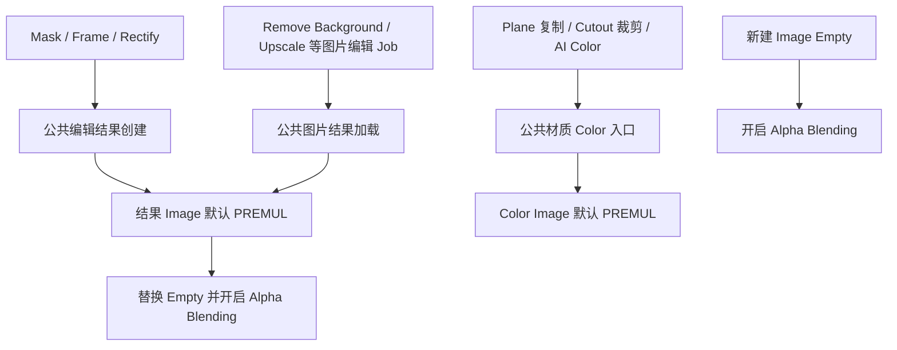
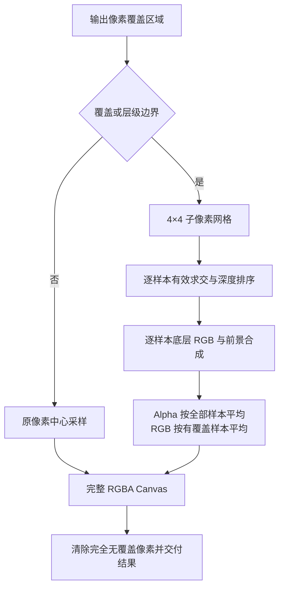

## Context

用户已确认 Empty 的 Alpha Blending 有效，并要求继续采用 Premultiplied。当前 `create_image_edit_result()` 设置 STRAIGHT，Job Color 加载设置 CHANNEL_PACKED，Plane 复制和 Cutout 裁剪图片继承源模式。材质 Color 与 Alpha 已分别连接，材质使用 DITHERED。

本次采用 Blender `PREMUL` 解释模式作为用户指定的默认策略。它涉及读写和采样解释，并非纯粹的显示开关；业务像素依然需要保留独立 RGB，包括 Alpha 为零时的颜色。

## Goals / Non-Goals

**Goals:**

- AnyImage 新建及编辑结果 Empty 开启连续 Alpha 混合。
- 编辑结果与 Mesh Color 图片统一默认 PREMUL。
- 保留 Mask Add 的颜色恢复、Frame 底层 RGB 和现有 Alpha 计算。
- 保持共享源保护、撤销和失败恢复语义。
- Frame 投射边界同时平滑 RGB 与 Alpha，保持内部细节及既有输出尺寸。

**Non-Goals:**

交付范围为图片呈现默认值、必要的数据读写保护及 Frame 像素边界采样。Depth、Normal、节点资产、Mesh 几何和 Server 算法沿用既有约定；普通用户图片在未参与操作时保持原设置。

## Decisions

### 1. 先验证模式切换，再调整公共入口

先用真实 Blender 构造包含非零隐藏 RGB 和 Alpha 0、0.25、0.5、1 的小图片，对 GENERATED byte buffer、浮点源及加载的 RGBA PNG 验证：模式切换前后读取、Pack、PNG 字节、临时 blend 保存重开和再次编辑。

PREMUL 由用户明确要求，因此本次不是把最终持久化 RGB 数值统一乘 Alpha。业务编辑与导出仍需得到和现有算法一致的 RGB/Alpha。具体设置顺序由真实 Blender 测试决定；如需在入口短暂切换解释模式以保留像素，须保证恢复最终 PREMUL，且仅发生在当前操作拥有的结果 Image 上。

用户自行验证后明确要求直接落地 PREMUL。模式设置在操作拥有的 Color 结果上，不增加双图片存储。业务读取 PREMUL 图片时临时使用 STRAIGHT 解释取得原始 RGB，并立即恢复最终 PREMUL；这只改变读取解释，不修改 Image 像素。完整浮点重载、序列逐帧和实际视口验证单独列为未完成验收。

### 2. Empty 混合在成功提交时设置

`replace_empty_image()` 成功提交结果时开启 `use_empty_image_alpha`；Frame 自定义恢复分支同步检查该设置。原 Image、混合开关和显示范围均纳入失败恢复。取消手势不修改源对象。

剪贴板创建 Image Empty 时直接开启同一开关。`color[3]`、显示深度、显示方向和 image_user 设置继续保留各自业务含义。

### 3. 图片模式在 Color 产物边界统一

公共 Color 创建、加载和材质配置复用 `common/image.py` 中职责明确的模式设置入口。避免在每个 Operator 重复赋值，或继续保留 STRAIGHT/CHANNEL_PACKED 的竞争性最终设置。只读像素计算仍可在临时数组中预乘；Rectify 保留原采样，Frame 按下节扩展几何边界采样，各样本沿用已确认的图层合成公式。

普通图片通过共享编辑 Job 加载入口落地时也采用 PREMUL，包括 Upscale；视频和序列沿用现有时间映射并验证多个帧的读取。剪贴板仅创建 Reference 时，本次只保证对象 Alpha Blending，图片模式在后续编辑或 Mesh Color 入口配置。

### 4. Mesh 配置的是 Image，而非节点独立模式

`create_image_material()` 为 Color 图片统一设置 PREMUL。Plane 使用既有复制图片，Cutout 使用既有裁剪结果，AI 分支使用新加载的 Color Image；不得通过修改原共享源图片间接影响未参与对象。若某个入口直接复用源图片，先沿用创建独立 Color 产物的规则再配置。

Normal 和 Depth 继续保留独立通道及 Non-Color 语义。保留 Color/Alpha 连线、Linear 插值和 DITHERED；材质构建后的颜色空间设置也纳入像素保留测试。

### 5. Frame 边界使用 4×4 子像素覆盖采样

输出像素覆盖的屏幕区域与源投射边界或深度层级交界相交时，在像素内使用均匀 4×4 网格的中心点采样。边界判定基于像素覆盖区域与几何边界，不能仅以像素中心命中作为条件；透视跨观察平面的情况复用现有有效求交规则。覆盖和顺序稳定的内部像素保持原中心双线性采样，以保留对齐图片的内部细节。

每个子样本独立计算有效覆盖和深度排序，再执行当前底层 RGB 打底、前景按 Alpha 叠加及独立 Alpha 合成。完全没有源覆盖的样本 Alpha 为零；最终 Alpha 为 16 个子样本 Alpha 的算术平均。RGB 为有几何覆盖样本的合成 RGB 等权平均，权重与源 Alpha 无关。没有任何覆盖时保持透明黑色，避免 Mask Add 显露不存在的源外颜色。

两图重叠边界处，每个样本都有底图时，RGB 自然按前图几何覆盖比例混入底图；恢复 Alpha 后仍保留该过渡。单图外缘的无源样本只降低覆盖 Alpha，不以黑色压暗有效 RGB。源投射之外更远处没有可恢复内容，继续保持透明黑色。

按现有行块处理，可分批累积子样本，避免分配宽高各放大四倍的整图缓冲。4×4 是内部固定采样策略，不增加用户选项；评估耗时和峰值内存，边界优化必须与参考逐样本结果一致。

## Risks / Trade-offs

- [PREMUL 解释与当前像素数值约定不同] → 先验证实际 Blender byte/float、PNG 读写和重复编辑，记录差异而非只断言枚举值。
- [Alpha Blending 出现层间排序现象] → 验证 Empty 重叠与场景遮挡，保留对象深度策略，并记录已知显示限制。
- [改变 Image 模式影响共享使用者] → 配置操作拥有的结果或 Color 副本，测试未参与共享对象的模式和像素。
- [白色已混入 Frame RGB] → 保留用户确认的 RGB 合成规则；PREMUL 策略不承诺消除所有来源的白边。
- [边界判定漏掉细窄投射] → 覆盖测试包含中心未命中但子样本命中的倾斜条带及跨观察平面投射。
- [抗锯齿增加耗时或使内部变糊] → 只对几何边界启用多样本，按块累积，测试内部对齐细节与典型最大分辨率耗时/内存。

## Migration Plan

先通过真实 Blender 像素保留验证，再实现公共默认值与集成测试。现有场景不做加载时批量修改，后续编辑成功或生成 Mesh Color 时应用默认值。只运行测试与 OpenSpec 校验，不构建产物或同步修改产品文档。

## Open Questions

业务默认值已确定；PREMUL 与现有像素读写的匹配方式以第一组 Blender 验证作为实施门槛。
