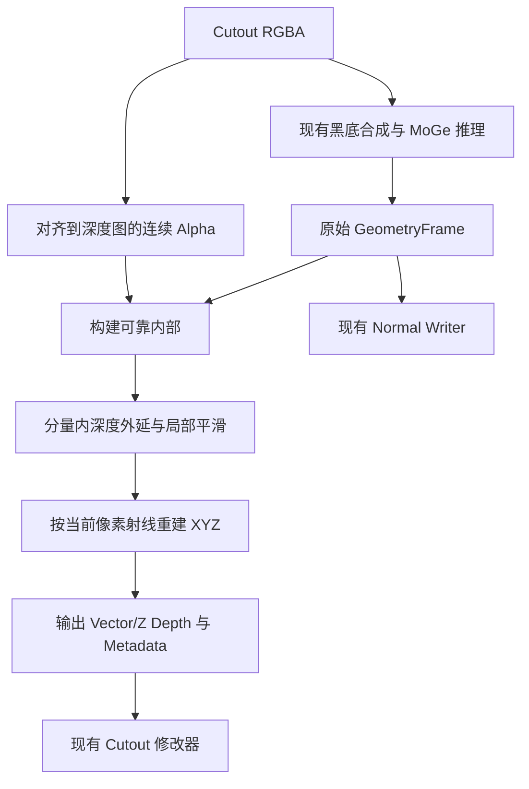

## Context

Cutout 的矩形 RGBA 经黑底合成后进入 MoGe，Vector Depth 保存相机 XYZ，节点按 UV 线性采样。边缘 Alpha 可用于保留毛发，但其深度可能属于背景。

本次实验使用 BEN2、MoGe-2 ViT-S Level 5，固定猫（585×643）和人物（234×222）的同一份预测。Alpha ≥ 0.95、内缩 2 px、最近点外延、σ=0.8 px 局部平滑明显减少拖尾。替换深度的可见像素分别约 4.4% 与 9.6%；可靠内部保持原值。8 px 内缩替换人物约 27% 的可见区域，形状变化明显。

实验采用独立投影网格。完整 Blender 的线性采样、平滑、厚度、拉伸剔除及 Normal Map 组合需要在实施阶段验收。实验记录位于 `C:/Users/icrdr/.codex/visualizations/2026/09/05/01a071bc-9eae-7f91-8791-816aa621fd8a/`，其中 `depth_experiment.py` 保存推理入口，`analyze_depth.py` 保存对比算法，`metrics.json` 保存结果；该目录是本次本地证据，自动测试使用可重建的合成数据。

## Goals

保留 Alpha 0.1 的可见轮廓，以可靠内部深度补齐边缘，并保持相机投影与 Cutout 产物单位一致。

## Decisions

### 深度修复入口

在 `server/geometry/edge_depth.py` 集中处理普通数组和 GeometryFrame。`generate_moge2_artifacts()` 增加内部显式选项，由 Cutout Job 在生成深度时开启。Depth Surface 与 Depth Balloon 分别输出修复后的 Vector Depth、Z Depth，并使用对应 Metadata。Normal Writer 继续消费原始预测；普通 Depth Plane 和仅生成 Normal 的路径维持现有入口行为。

### 可见域与可靠域

- 连续 Alpha 使用与现有 `_alpha_mask()` 相同的最近邻尺寸对齐；可见域为 Alpha ≥ 0.1。
- 可靠候选为 Alpha ≥ 0.95、模型 Validity > 0、深度有限且为正。
- 在深度图输出像素单位下，保留到候选域外欧氏距离大于 2 px 的可靠核心；图片矩形边界按边缘延续处理，避免把贴边主体当作透明边缘内缩。
- 全不透明源图直接使用原始 Frame。所有参数先固定在服务端实现中。

### 外延与回退

可见域按 8 连通分量处理，每个分量只使用自身的可靠核心作为供体。没有内缩核心时使用该分量内未内缩的可靠候选；连候选也没有时保留该分量的原始预测。这样细小或半透明分量具有确定的结果。

对有供体的分量，以最近可靠像素的标量深度补齐非核心区域。透明背景在可见域外扩 4 px 内接收最近可修复分量的延伸值，覆盖平滑核与线性采样所需的邻域；其他可见分量的值由自身规则决定。局部计算边界须保留滤波所需的 padding。

外延结果用 σ=0.8 px、半径 3 px 的 Gaussian 核平滑，仅写回补齐区域；可靠核心逐值保留。分量内平滑使用本分量的外延场，避免滤波读入其他分量深度。未处理区域保留原值。

### 投影与产物一致性

使用 Frame 的像素单位内参和当前像素中心，由修复后的 Z 重建相机 X、Y。复用服务端现有深度反投影函数时，须显式处理其归一化内参约定。核心位置保留原始 XYZ，防止不必要的浮点变化。

修复后的 Frame 保留原模型 Validity；修复不会把模型有效性改写为预测置信度。Metadata 使用修复后的 Depth、原模型 Validity 和现有参考 Alpha Mask 计算，确保参考深度与导出贴图一致。颜色 Alpha、UV 与 Selection Mask 继续由现有路径管理。

### 数值依赖

复用 SciPy 的距离变换、连通分量和 Gaussian 滤波。实施时选择同时支持开发 Python 3.11、服务端 Python 3.12 及其 NumPy 约束的版本，并同步运行环境声明、开发依赖与锁文件。处理按分量局部范围执行，验证 2048 长边输入的时间和峰值内存。

## Risks / Trade-offs

- 高 Alpha 不等同于正确深度 → 保留 2 px 内缩，并用真实深度场检查残余污染。
- 最近供体在同一分量内可能跨越前后表面 → 保持小内缩、仅局部平滑，并验收耳朵、衣领和手部交界。
- 半透明孤立分量没有可靠供体时仍可能后缩 → 保留原始预测，测试回退的有限值和确定性。
- 固定像素宽度在不同输入尺寸下覆盖比例不同 → 以深度图像素明确单位，验证两张原图及缩放输入；进一步调整参数须有新增证据。
- 原始 Normal Map 与修复几何在边缘可能不一致 → 分别验收 Normal 开关下的边缘着色，记录残余问题。
- 边缘跳变减小只证明拉伸改善，并不等同于真实三维深度准确 → 同时核对可见域、正面投影和侧视外观。

## Migration Plan

新任务在模型产物导出阶段应用修复，已有 Blender 对象通过重新生成 Cutout 获得结果。实施完成后运行相关测试和完整 pytest，再对现有节点资产执行两张实图验收。
