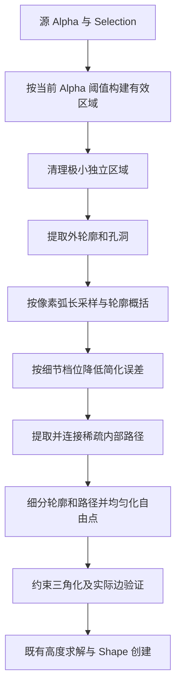

## Context

当前平面网格由 Alpha 轮廓、均匀内部点和 Blender CDT 构成，Balloon 消费内部高度。Mesh Detail 的源像素间距以及世界坐标度量已有约定。本提案基于四张已抠图样本的独立实验，测量与验证边界见 [实验基准](experiment.md)；实验脚本使用开发 Python，正式 Blender 环境需要独立验证。

## Goals / Non-Goals

以较少顶点表达低密度轮廓与细长结构，提高高密度的实际轮廓贴合度，维持内部连通和尺寸过渡，并降低首次生成耗时。

## Decisions

### 0. Fine Outline 默认开启，两种算法独立选择

Scene 的 `cutout_fine_outline` 与 Operator 的 `fine_outline` 共用默认 True 的属性定义，界面位于 Mesh Detail 之后。菜单捕获设置，本地创建与 AI 返回均使用该快照。关闭时使用原始轮廓平滑与均匀采样，开启时使用以下精细流程。算法选择适用于全部 Shape。

密集蕨叶允许用户选择原算法获得更强概括和更短等待；精细模式仍完整验证约束，失败明确报错。两种模式分别测试，记录复杂输入的实际开销。

### 1. 轮廓精度与网格间距共同受 Mesh Detail 控制

Low / Medium / High / Ultra 的内部目标间距为 32 / 16 / 8 / 4 源像素；实验轮廓 RDP 容差分别为 2.5 / 1.25 / 0.625 / 0.5 像素。Medium 以上先按约 1 像素弧长重采样，再以 0.8 像素尺度轻微平滑像素阶梯。容差针对平滑后的轮廓，最终验收针对源 Alpha，二者分别记录。

高密度从源轮廓重新近似，再限制最长边。轮廓有效性检查覆盖穿越相交、孔洞包含关系和面积；平滑或简化破坏拓扑时，逐次减半处理强度，最后使用源轮廓。像素轮廓原有的顶点接触允许保留，内部约束路径仍须严格远离边界。细桥与内部支撑在最终网格中验证。

像素误差、面积阈值和内部间距在源像素坐标中定义，再通过既有变换转换为世界坐标。触及现有网格分辨率上限时，采用受限的有效间距推导精度档位，防止轮廓无限加密绕过开销限制。

### 2. 极小碎片按独立区域面积处理

实验默认过滤四邻域面积小于 16 源像素的独立区域，保留最大前景区域。与主体相连的细腿按所在区域整体保留；孔洞属于轮廓拓扑。清理仅作用于几何有效区域，材质 Alpha 与用户图片沿用原数据。全透明输入走现有无有效 Selection 的提示。

### 3. 连续内部路径作为三角化约束

从边界约束三角网格的内部边中点和三角形中心构造有效路径图。局部宽度参与选择需要支撑的细部，结构尺度由图像范围决定。选定分支通过一次多源 Dijkstra 与连接候选的最小生成森林补连，再概括为稀疏折线；过短末梢剪枝须保留必要的端部支撑。

线段有效性使用端点内外判定、边界相交及线段最小间距，复用预计算边界数组。对共线接触、孔洞和近零距离使用一致容差。补连搜索采用整个细部有效子图，取消局部最大路径长度限制；实验以到边界距离不超过结构尺度的 0.75 倍限定补连区域，让宽阔中央区域由普通点支撑。该宽度边界仍须通过变宽关节回归，不能被当作所有图像上的连通保证。

简化后每段都必须在轮廓内部。CDT 后通过输入约束映射查找实际网格边，通过原始顶点映射验证每条约束两端间的实际边连通和内部顶点身份，避免 float32 输出坐标使大像素坐标下的短边长度误差触发误报。所有保留细长分支需覆盖端部与关节，不能只验证已经成功选中的少数线段。Alpha 本身断开的区域保持各自独立。

轮廓精度改变时，内部路径坐标可以调整；分支覆盖和连通性是跨档位契约，不要求四档顶点和边完全相同。

### 4. 自由点均匀化按收敛停止

沿用三角格点作为普通内部点种子；固定边界和结构路径，释放其余点。只采样目标积分网格需要的位置，限制到分量包围盒；通过最近邻归属和分组求和计算质心，最多 12 轮。至少 4 轮后，位移 RMS 小于目标间距的 1% 可停止。通过邻面尺寸比和内部最近邻距离离散度验证停止条件。

轮廓与结构线按目标间距细分。最终网格中，端点均在边界的内部边共享一个新增中点，受影响三角形以内部中心点细分；全边界三角形也补入中心点。这消除内部的零高度截断，保持相邻面的公共边一致。极细部沿稀疏路径保留内部支撑。

### 5. 优化计算并限定复用边界

按半径分组建立中轴圆的空间索引，查询时从大半径向小半径筛选，保持宽度估计结果一致。轮廓射线和距离数组在一次分量处理内复用。布点与结构准备分为普通数组接口，复用结果须与重新计算一致。

每次创建依据当前输入和精度重新准备结构；分量内复用距离、射线和宽度索引，创建结束释放。当前交互一次创建一个 Shape，因此直接使用操作局部数据。

首次生成、已准备结构的重建、Blender 对象更新分别计时。实验复用计时不包含输入检查和结构准备，因此不能当作首次生成或跨档位 UI 延迟。

### 6. 正式运行时依赖作为接入门槛

客户端使用 SciPy 的标记、距离变换与 KDTree，NumPy 的轮廓简化及 Blender CDT。距离脊圆用于估计局部宽度，连续内部路径仍由约束图构建。轮廓简化保留 scikit-image 0.25.2 的独立 NumPy 实现及 BSD 许可证。

客户端声明 SciPy 1.15.3；NumPy 使用 Blender 自带版本，由打包器按 Python 目标版本解析兼容范围并排除 NumPy wheel。锁文件和本地 Manifest 同步。此前六图四档实验的轮廓边界一致，保留内部支撑和连通性检查。

## Risks / Trade-offs

- 细桥经平滑或简化消失 → 以源有效域检查连通关系，降低处理强度；将单像素桥、弯折和孔洞列入测试。
- 路径连接增加宽区域内部线 → 验收普通点均匀性、总点数和邻面尺寸，保留稀疏折线概括。
- 小独立区域具有内容语义 → 将清理限定为极小面积，保留最大区域，保持材质原 Alpha；记录几何过滤数量。
- 高密度轮廓复杂度增加 → 批处理与空间索引，按分量限制工作集；测量 2K / 4K 输入及网格上限。
- 四张实图不足以保证所有细部 → 合成图覆盖弯折、窄桥、多个孔洞、独立岛和边界接触；失败不得静默丢弃约束。
- [十图扩展实验](experiment-cases.md) 中蕨叶 Low / Ultra 达到约 6 / 23.6 秒，羽毛高密度仍有支撑间断 → 把密集多级分枝和局部零高度边列为实施验收反例，定位候选图数量与边界查询开销。
- 开发 Python 测时不能代表 Blender 全流程 → 正式接入前分别完成数值阶段和对象/节点阶段验收。

## Migration Plan

依次完成运行时可行性、独立几何回归、双模式接入和 Blender 验收。精细轮廓作为默认模式，原算法作为用户主动选择的概括模式。用户现有 Shape、像素间距和世界变换语义沿用原约定。
