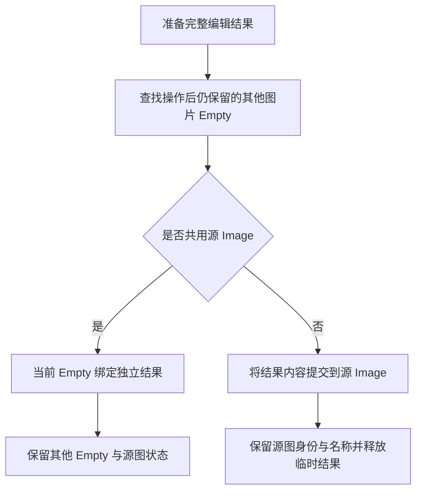

## Context

`create_image_edit_result()` 和 Job 编辑结果加载入口先准备结果 Image，`replace_empty_image()` 再替换物体引用。当前仅在旧 Image 没有真实用户且没有 Fake User 时删除旧图并恢复源名。Frame 在替换活动物体之后删除合并源物体，随后再次清理图片。

## Goals

- 以其他 Empty Image 的真实引用决定结果是否独立。
- 共享编辑保护其他 Empty 的数据、显示和动画状态。
- 单独使用时保留源 Image 身份和完整名称。
- 统一结果提交、失败恢复与临时数据清理。

## Decisions

### 1. 按文件中的物体引用判断共享

在 `common/image.py` 复用 `is_image_empty()`，遍历 `bpy.data.objects`，检查当前物体以外是否存在 `data` 等于源 Image 的图片 Empty。比较 Blender 数据块身份；找到首个匹配即可结束。隐藏、未在当前 View Layer 显示、其他场景中的对象均参与判断。同一物体链接到多个集合仍是一个对象。

扫描在主线程最终提交时执行，使异步 Job 运行期间新增的共享物体也得到保护。Frame 提供本次成功后将删除的源物体集合，判断时排除这些物体。

`Image.users` 仅继续承担无引用数据清理等生命周期判断。Fake User 是保存设置，材质引用是图片消费者，两者均不代表另一个 Empty Image。

### 2. 结果先准备，按共享关系提交

共享分支沿用结果 Image 的创建、打包与 Blender 唯一名称规则，仅改变当前物体绑定。单独使用分支将准备好的结果内容写入源 Image，保留源名称和 Fake User 设置，统一入口返回最终实际使用的 Image。临时结果不作为额外的最终图片保留。

提交需覆盖像素尺寸、颜色空间、Alpha、Packed 内容、文件路径及图片类型；静态像素结果与动画 Job 结果按各自的数据表示处理。继续复用现有像素和动画辅助函数。调用方使用返回的最终 Image，避免保留已释放的临时结果引用。

AnyImage 材质贴图使用独立的 `_color.png` 等数据。用户手动引用源 Image 时，其引用关系保持原样；单独使用分支原位更新产生的内容变化按普通数据共享处理，不额外遍历或迁移材质引用。

### 3. Frame 使用提交后的存活物体集合

Frame 以活动物体为编辑目标，其他本次合并源物体按既有语义删除。只有合并之外仍保留的 Empty 共用活动源图时才分离。提交成功之后删除合并源物体，再清理其确实没有用户的旧图；活动结果名称由统一提交入口负责。

### 4. 提交具有失败恢复边界

完整结果准备好后才修改源数据。共享分支保留现有物体绑定、显示位置和动画设置恢复；原位分支还需保留可恢复的源内容、尺寸、编码及打包状态，直到提交成功。恢复数据应复用现有图片读取与加载能力，在成功和失败时均释放临时资源。取消编辑时不进入提交。

## Risks / Trade-offs

- [原位写入需要同时维护像素、Packed 数据与动画来源] → 通过真实 Blender 数据测试覆盖静态图片、尺寸变化、序列结果及保存重开，验证结果内容实际持久化。
- [中途失败留下部分写入] → 对内容写入和物体显示配置分别注入失败，验证源图及物体状态恢复。
- [Frame 的待删除物体导致错误分离] → 测试所有共享者均被合并、合并外仍有共享者两种情况。
- [已有未归档图片命名规格包含总用户数语义] → 本 change 明确 Empty 共享判定；归档整合时以本规则统一相关要求。

## Migration Plan

1. 增加真实 Blender 引用关系与结果提交回归用例。
2. 修改公共提交入口，并核对所有本地编辑与 Job 调用方的返回值和清理职责。
3. 整合 Frame 存活物体判断，运行相关测试和完整测试。

## Open Questions

无产品规则待确认；原位提交对静态与动画 Image 的具体写入步骤通过实现阶段的真实 Blender 回归验证。
