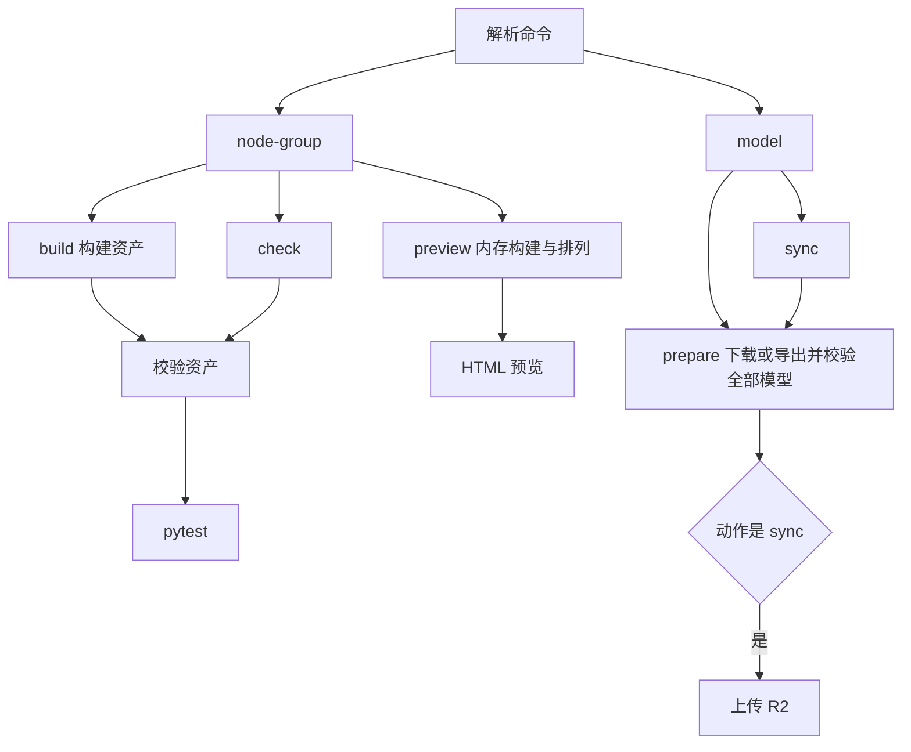

## Context

参见 proposal.md。现有节点入口依次调用 Blender 构建、资产校验及 pytest，预览模块已有 HTML 导出能力。模型入口统一准备模型并按选项上传，包含现成文件下载、普通 ONNX 转换及 PiSA-SR 独立环境转换。

## Goals

命令入口负责参数解析与流程调度，业务模块负责产物；复用现有 Blender 启动、模型准备与校验实现。

## Decisions

- 在现有两个 cli.py 使用 argparse 子命令，脚本入口为 `node-group` 和 `model`。Python 包继续使用表示业务集合的 `tools/nodes`、`tools/models`。
- `node-group build` 保持构建、资产校验、全量 pytest 的顺序；`check` 复用后两步。两者支持 `--blender` 和现有 `--skip-tests`，后者只跳过 pytest。任一步失败立即以非零状态退出。
- `preview` 复用 Blender 启动流程及现有预览导出器，默认写入系统临时目录的独立 HTML，输出绝对路径，再由父进程打开浏览器。支持 `--blender`、`--output PATH`、`--no-open`、`--fragment`；fragment 模式仅输出片段且不自动打开。文件保留供查看，资产文件保持原样。
- 模型子命令为 `prepare` 和 `sync`。`prepare` 替代 `--prepare-only`，统一下载现成 ONNX 或准备源权重并导出，包含 PiSA-SR；按既有目录输出，复用已校验的缓存及独立转换环境。`sync` 复用全部准备成功后上传的流程。
- PiSA-SR 在模型目录下的临时目录导出整组文件，全部通过目录清单校验后再更新正式产物，临时目录随流程退出清理。
- 使用延迟导入，使帮助与参数错误可以在未加载 Blender、Torch 和导出环境时返回。无动作时显示帮助并成功退出，非法动作或参数非零退出。

## Risks / Trade-offs

- CLI 改名影响本地脚本调用 → 删除旧入口并验证新的安装脚本映射，实施时报告命令迁移。
- Blender 参数与预览参数共用进程命令行 → 显式传递业务参数，测试参数隔离与失败传播。
- 模型导出成本较高 → 保留大小及 SHA-256 校验后的缓存复用；自动测试使用隔离文件和替代执行器验证路由。

## Migration Plan

更新入口及子命令后执行 `uv sync` 刷新本地脚本，运行相关测试、帮助命令及节点构建链验证。保留工作区既有修改。
