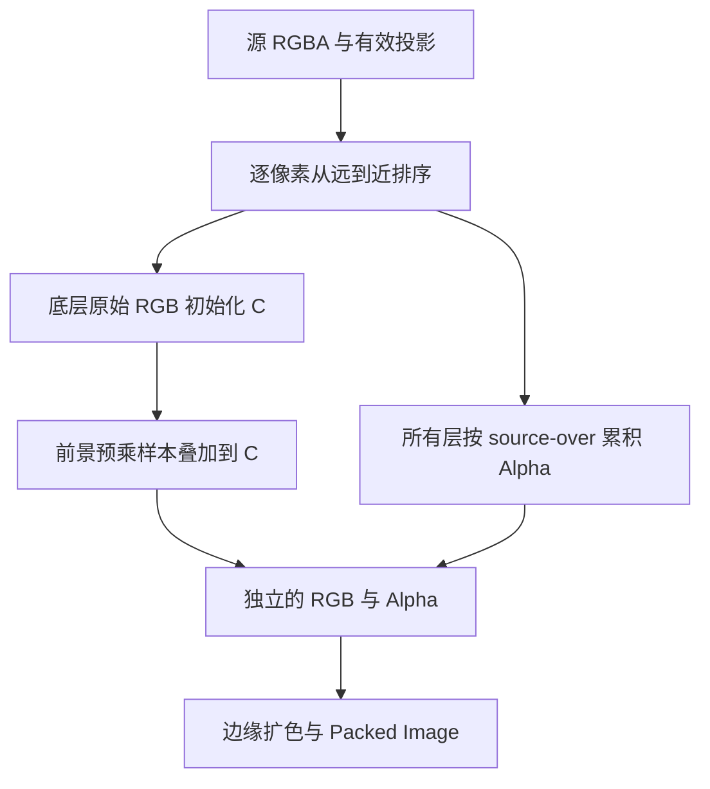

## Context

Frame 使用逐像素有效投影和稳定深度顺序。结果 RGB 需要保存前景到最底层原色的完整渐变，以便 Mask Add 恢复 Alpha 后仍能自然显示。

## Goals / Non-Goals

**Goals:**

- 最底层原始 RGB 打底，前景按自身 Alpha 混合。
- Alpha 独立沿用现有 source-over 与数值判定。
- 复用当前投影、排序、分块采样和 Packed Image 生命周期。

**Non-Goals:**

交付范围为 Frame 的 RGB 合成及测试；Mask、Rectify 与输出 Canvas 延续既有规则。

## Decisions

### 1. 逐像素确定底层

复用 frame_source_coordinates 有效性和现有 order，第一个有效样本为底层。相同深度 active 在最上层，其余源沿用名称顺序。正交负深度、透视有效前方交点和局部覆盖按现有规则处理。

### 2. RGB 与 Alpha 独立累积

底层 RGB 使用未乘 Alpha 的双线性采样初始化。每个更近的前景使用预乘后插值的 P 与 A，执行 C = P + C × (1 - A)。底层自身不再叠加一次。

Alpha 从零开始，对包含底层的每一层执行 A_out = A_layer + A_out × (1 - A_layer)。最终 RGB 不除以该 Alpha。

单源只有底层，保留其原始 RGB 采样。多源中前景的透明黑色邻居通过预乘采样排除；半透明前景持续混入底图白色，而不是等 Alpha 为零才切换颜色。

### 3. 源外扩色使用最终颜色

将合成颜色乘以最终 Alpha 交给现有 straight_rgba 处理 Alpha 数值判定与一圈扩色，再在全部有效覆盖位置写回合成颜色。这样源外扩色来自新的合成 RGB，源内透明色也得以保留。

## Risks / Trade-offs

- [底层重复叠加导致变暗] → RGB 从第二层开始叠加，Alpha 从第一层开始。
- [透明前景的黑背景污染插值] → 前景坚持预乘后插值，测试黑色透明邻居与白色底图。
- [恢复 Alpha 前的半透明显示也会改变] → RGB 已融合底色，Alpha 仍单独控制可见性；这是本次确认的颜色语义。
- [已合并图片无法找回分层信息] → 用户须用原始分层图片重新执行 Frame。
