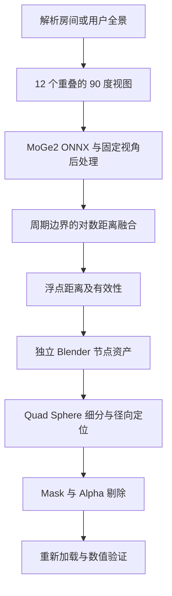

## Context

本地具备 MoGe2 ONNX 模型和 Blender 4.5。试验以独立脚本运行，使用合成房间的解析距离作为几何真值。

## Goals / Non-Goals

目标是验证完整全景的距离融合、几何节点径向变形与接缝。试验范围限定为 `experiments/panorama_surface` 和本变更目录。

## Decisions

- 融合参考官方梯度域算法，使用 SciPy 稀疏求解；通过全局对数距离偏移恢复输入预测的整体尺度。
- Quad Sphere 从用户指定的 O_Essentials_GeometryNodes.blend1 离线载入并打包进试验文件，Segments 为 2^Subdivide + 1。
- 球面方向生成采样 UV；材质 UV 在面角域处理经度接缝及极点。
- 深度导出将 Mask × 源图 Alpha 写入 depth.exr 的 Alpha；几何节点只读取深度图片。
- Depth Scale 在单位球与预测距离间插值；深度 EXR 的 Alpha 低于阈值时，通过点域布尔字段删除面。
- 真实照片先使用 BEN2 去除天空，透明区域在视图几何恢复及融合阶段排除；最后按源图 Alpha 写入深度有效性。
- 节点组通过独立离线脚本构建到试验 `.blend`；验证阶段重新加载该文件。
- 合成真值与 AI 输出分别检查，区分投影实现误差和模型预测误差。

## Risks / Trade-offs

- 合成图与真实照片分布不同 → AI 结果只作为流程验证，几何正确性以解析真值验证。
- 梯度融合没有绝对尺度约束 → 输出明确采用预测尺度锚定，记录相对误差。
- 遮挡处连接可能产生长面 → 通过真实照片试验观察可见表面连接质量。
