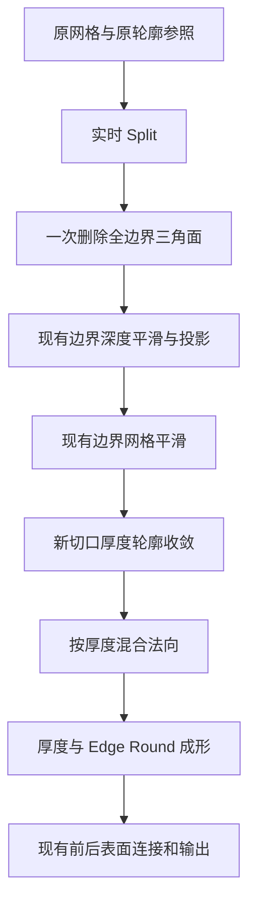

## Context

本设计对应 proposal 中的 Cutout 切口行为，基于当前工作区已有的边界深度平滑。实图实验位于 `.tmp/skull-mask-check`；正式测试使用可重建的合成几何，实图用于视觉验收。

采用 `split_round_trial.py` 的 DELETE 分支中的三角面删除与厚度轮廓计算作为边界处理参考，平滑沿用当前公共实现；采用 `live_contact_comparison.py` 中独立的厚度关联法向混合逻辑。最新共点修复虽然降低了拓扑异常计数，用户截图中的视觉接触仍然存在，因此该实验不能作为视觉问题已解决的依据。

## Goals / Non-Goals

**Goals:** 保留参数实时求值，改善新切口的平滑、厚度与圆润过渡，并使薄厚度下的法向平滑影响连续趋零。

**Non-Goals:** 按用户决定，暂缓共点／共线修复与空间接触消除；不引入 Valid Only、Validity Threshold 或实验用 Repair Contacts 控件。

## Decisions

### 求值顺序

### 边界三角面清理

在 Split 输出的当前拓扑上，以 Point 域边界标记转换至 Face 域，选出三个顶点全部位于边界的三角面，一次删除后再投影和平滑。使用一次清理保留实验中已经认可的形状，避免递归删除持续侵蚀轮廓。

清理后使用现有 Boundary Smooth。`Boundary Smooth = 0` 直接跳过平滑，保留既有深度平滑控制语义。验收时比较清理后、平滑前后的面朝向，确认已观察到的锯齿翻面问题得到改善。

### 新切口的厚度与圆润过渡

在清理后的网格上识别新边界，使用明确的原几何参照保护原 Alpha 轮廓。实验通过 UV 空间最近点采样原边界标记；正式实现需覆盖新旧边界交接处，确保内部切口不会误判为原轮廓。

沿新边界计算 UV 距离 `d`，过渡宽度 `w = 0.025 + 0.035 * Edge Round`；保留比例 `r = sqrt(clamp(d / w, 0, 1))`。新边界取零，保护点取一，更新厚度轮廓为 `o_balloon * r`。没有新边界时直接保留原轮廓字段，避免空目标距离产生错误衰减。

在现有厚度、中心面与圆润计算之前更新轮廓，使新切口成为前后表面的零厚度交汇线。复用现有前后表面成形链，并验证最终交汇处实际厚度，不能只检查 `o_balloon` 数值。Edge Round 增大时过渡带加宽，内部厚度逐渐恢复；原轮廓保持现有规则。

`o_balloon` 是现有 Point 域 FLOAT 厚度协议，此处在当前前表面写入、Selection 为全部点，由后续厚度和圆润消费者读取。其余字段优先直接连接；跨几何采样明确参照几何及域，保持 Capture Attribute 为零。实验诊断属性不进入正式资产。

### 厚度关联法向平滑

保留 Normal Smooth 迭代数，以厚度控制原法向与 Blur 结果的混合，再 Normalize：`normalize(mix(raw_normal, blurred_normal, smoothstep(0, 1, t)))`。

Balloon 模式 `t = Thickness`；Uniform 模式 `t = Thickness / max(Reference Depth, 1e-8)`。应用于前表面、中心面及膨胀方向的三处法向平滑消费位置，各自在原有源几何和域上求值。混合始终启用，保留用户 Normal Smooth 参数；厚度达到归一化值 1 后恢复完整 Blur 结果。薄厚度减弱的是平滑额外产生的方向偏差，不能据此承诺所有前后表面完全重合。

### 参数与资产

Split Threshold、Boundary Smooth、Thickness、Normal Smooth、Edge Round 保留现有接口与实时输入。清理与轮廓计算全部在节点求值阶段完成。正式资产使用项目现有布局与加载版本机制，按实施时基线更新版本。

实现完成后运行相关测试和 `uv run node-group build`，更新源码、测试、资产并独立加载验证。当前提案阶段只产出 OpenSpec 文件。

## Risks / Trade-offs

- 全边界三角面可能构成细小真实结构 → 用窄条、尖角与孔洞检查一次清理的形状代价。
- UV 距离过渡在不同长宽比和网格密度下外观不同 → 覆盖长宽图及多个 Mesh Detail，保持归一化 UV 语义。
- 拓扑计数正常仍可能有空间接触或交叉 → 本次验收以已确认的切口形状改善为目标，保留用户指出的共点问题记录。
