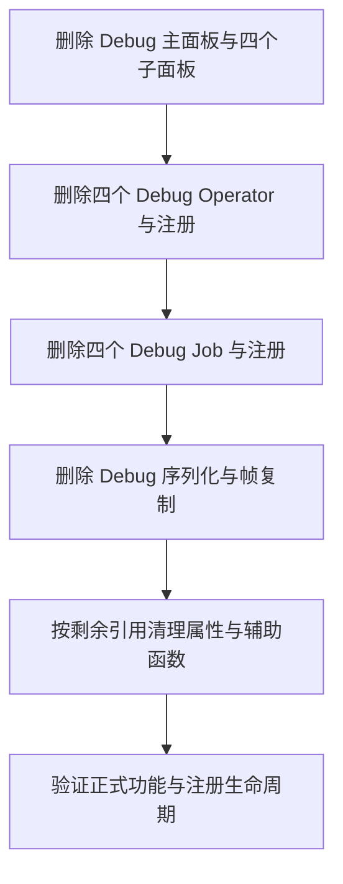

## Context

Debug 调用链跨越 Blender UI、Scene 参数、Operator、Server Job 和原始预测写出。`server/outputs/` 当前专用于 Debug；正式产物由 geometry 等模块生成。删除依据 `proposal.md` 的完整工作流边界进行，同时全面审查 tests、node_assets 和内部文档。

## Goals / Non-Goals

目标是清除 Debug 入口及其专用依赖，精简有效测试，使节点资产模块和内部文档的名称对应实际职责。实施范围包括代码、测试和用户明确要求整理的内部文档；节点图行为与接口保持稳定，按用户补充要求将 `O Mesh Plane` 统一为 `O Image Plane`。

## Decisions

### 按调用链删除

直接删除实现与注册，使源码和可调用接口保持一致。清理 `server/outputs/` 整个专用包、`copy_frames` 实现和 `media/__init__.py` 导出，避免留下失去调用方的模块。

### 共用代码按引用决定归属

| 对象 | 处理 |
| --- | --- |
| `DebugPanel` 与四个模型子面板、`draw_da3_input_settings` | 删除并清理 `panel.py` 导入 |
| `DebugDa3`、`DebugMoge2`、`DebugBen2`、`DebugUpscale` | 删除模块及所有注册项 |
| Scene 的 `input_path`、`background_input_path`、`model`、`device`、`process_res`、`process_res_method`、`moge_resolution_level`、`moge_model`、`ref_view_strategy` | 核对剩余调用后删除 Debug 专用声明 |
| Scene 的 `video_frames`、Cutout 和 Mask 参数 | 保留正式调用需要的属性 |
| `da3_parameters`、`model_enum_items`、`moge2_model_enum_items` | 核对引用后删除专用函数及孤立导入 |
| `moge2_parameters`、输入校验函数、偏好设置中的设备选择 | 保留正式调用使用的实现 |
| DA3 模型适配器、ONNX 推理、目录及缓存 | 当前调用方仅为 Debug，整条删除 |
| MoGe-2、BEN2、Upscale 模型适配器及模型目录 | 保留正式推理所需能力，Upscale 统一保留源 Alpha，删除专用开关 |

属性按所属类型检查；Operator 上同名的正式属性独立保留。MoGe-2 原始预测结构仍用于正式几何转换，保留其适配和数据校验。

### 测试随接口收缩

删除专用导出与 Debug 推理测试，将原本仅通过 Debug 覆盖的公共模型行为转到正式入口。更新 Blender 注册及逆序注销、Server Job 清单与打包清单测试，明确 Debug 接口和文件缺席；正式流程继续覆盖设备、模型选择、视频多帧及推理后的内存释放。

### 全面审查测试价值与归属

先逐文件记录实际验证的行为，再对每个用例决定保留、合并、重写或删除。保留能检测输出错误、协议破坏、数据丢失、取消与资源清理失败等实际问题的测试。删除失效功能测试、相同风险的重复断言，以及只复述实现细节且无法发现行为回归的测试；mock 和源码检查按其验证价值判断，不机械删去。

文件按稳定功能组织，类名和用例名描述实际行为及关键条件。已发现 `test_server_jobs.py` 混合媒体输入、下载、模型生命周期与 Job 输出，`test_blender_addon.py` 混合设备、运行时和 Operator 行为，应按职责拆分。`test_docs.py` 实际验证文档命令，应命名为对应命令职责。其他文件同样逐项审查，避免只处理这几个示例。共享 fixture 仅抽取确有复用的部分，测试通过情况不能代替覆盖价值判断。

### 节点资产按功能组织源码

梳理全部模块的构建对象、几何处理、布局和验证职责，形成现名到职责的映射，再确定重命名、合并或拆分。`build_depth_plane.py`、`build_cutout_modifiers.py` 等动作式文件名改为资产或业务分类命名，函数继续使用 `build_*` 表达构建动作。公共深度表面与布局模块依据实际调用范围命名，`node_graph.py` 和 `node_layout.py` 依据实际公共能力保留或细化。

一次更新模块导入、`tools/build_node.py` 的脚本列表、测试动态加载路径与文档路径，删除旧入口。将 `O Mesh Plane`、相关模块及函数统一命名为 `O Image Plane` / `image_plane`。使用项目配置的 Blender 修改现有 `.blend` 资产名称，比较保存前后全部节点组的接口、默认值、运算、连接和布局，验证功能一致。其他节点组名称保持稳定。

### 内部文档按最终实现重整

逐页核对总览、架构、Common、Runtime、产物、开发、节点资产和全部 Operator 说明。以当前源码中的注册、调用链、参数和产物协议为依据，合并重复说明，删除过期内容，按实际主题调整文件名与层次，并同步所有内部链接与 MkDocs 导航。

删除 Debug 专页及引用；节点资产页使用最终模块名及职责。实现流程用从上到下的 Mermaid 图，正文以中文正面说明当前职责。通过路径、导航、链接和源码交叉核对验收，不运行文档构建。

## Risks / Trade-offs

- [误删同名正式参数或公共模型函数] → 逐项核查调用方，并运行正式工作流回归测试。
- [注册表或包导出残留导致启动失败] → 验证扩展导入、注册与逆序注销、Server Job 清单和打包文件选择。
- [并行变更修改相同文件] → 实施时基于最新工作区逐项修改，保留其他变更的逻辑与测试。
- [旧脚本调用已删除 Debug 接口] → 调用方改用对应正式 Operator 或 Job；删除直接生效，不保留转发接口。
- [精简测试掩盖回归] → 按行为和风险核对精简前后覆盖，保留独有场景，最终运行完整测试。
- [节点模块重命名遗漏动态路径] → 核查构建启动器、脚本加载、测试和文档引用，并测试入口解析。
- [文档沿用旧描述导致再次偏离] → 每页对照最终源码核验，尤其是节点组名、socket、Job 参数和输出协议。
