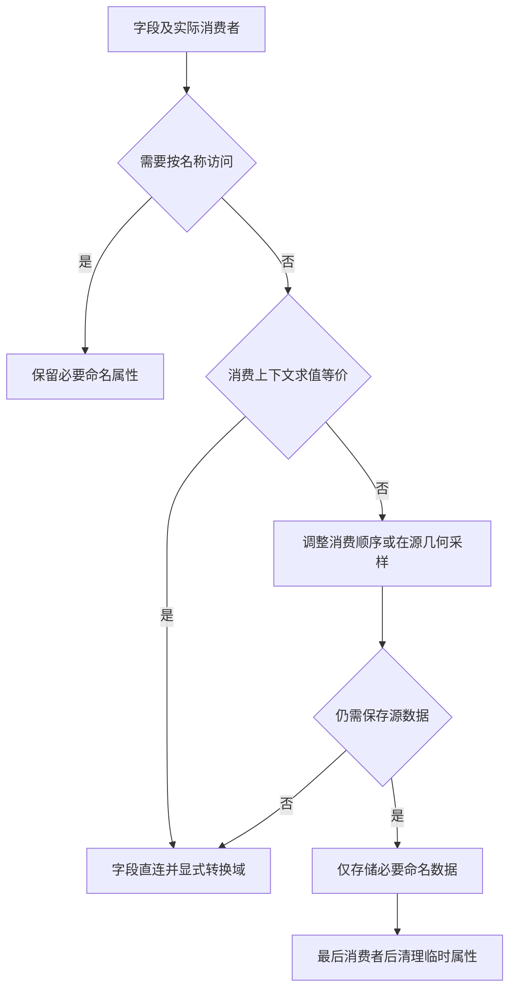

## Context

本次只读核对了当前构建源码和保存资产。以下为组内节点数量，嵌套引用单独追踪，实施前须重新确认基线。

| 几何节点组 | Capture | Store |
| --- | ---: | ---: |
| O Image Plane | 1 | 2 |
| O Image Depth Plane | 6 | 0 |
| O Image Relief Plane | 0 | 0 |
| O Image Cutout | 0 | 1 |
| O Image Depth Cutout | 8 | 3 |
| O Image Depth Balloon | 0 | 1 |
| O Image Depth Panorama | 6 | 1 |
| 合计 | 21 | 8 |

Depth Plane、Relief Plane 引用 Image Plane。三个材质组作为命名属性消费者纳入核查。工作区已有节点逻辑、测试和资产修改，基线采用实施开始时的实际工作区状态。

## Goals / Non-Goals

目标是全部几何组及其嵌套组 Capture 为零、字段消费关系清晰、存储具有实际必要性，源码、资产、规范与测试一致。保持公开接口、几何效果、UV、材质及用户输入属性行为；交付包括节点资产构建与测试。

## Decisions

### 字段在消费位置求值

Capture Attribute 在生产构建、嵌套组、保存资产和相关测试辅助图中均禁止使用。多个消费者、跨区域或连线较长不构成存值理由。Evaluate on Domain 用于域转换；它不固定几何版本。源几何采样必须明确源几何、域与索引对应关系，并同时评估布局和求值开销。

每处保留的 Store 记录名称、类型、域、Selection、写入阶段、实际读者和必要性。跨变形或拓扑变化仍需保存时，先减少携带的数据，再使用必要命名属性；不按现有 Capture 的字段清单逐项替换 Store。内部临时属性使用专用前缀，在最后消费者后清理；避免覆盖或删除已有用户属性，必要时通过名称冲突检查与更具体的命名解决。

### 按业务链拆解现有捕获

| 范围 | 当前用途 | 实施方向 |
| --- | --- | --- |
| boundary_smoothing、smoothing；三个深度组共 12 个 Capture | 原边界、影响范围、循环边界、源索引及最近边界映射 | 拓扑不变时直接消费 Boundary 和 Influence；Panorama 的闭合初始球面使用 False 表示原边界。其他原边界及固定映射逐项审查源几何采样或最小命名数据，保持原轮廓保护和循环映射语义 |
| depth_surface 的切分；3 个 Capture | Camera、Cut 跨 Split Edges 与删面传播 | 分开审查面采样与切分标记，在源几何计算或采样，保持 FACE、CORNER、POINT 转换顺序；实际需要传播的最少信息才存值 |
| depth_surface 的厚度；2 个 Capture | Position、Vertex、Normal 跨展平、挤出、合并、恢复 | 优先简化厚度构建顺序和源表面采样，保持独立重叠表面身份及零厚度行为；论证剩余源身份或数据的必要存储 |
| image_depth_cutout；2 个 Capture | center、front_normal、structure、inflation_normal、edge_weight、front_delta、thickness、normal | 前表面计算尽量在原消费几何完成，保留独立中心表面供采样；逐字段核对圆化和壳体消费者，合并可复用的源数据，保持 Balloon、Uniform 两分支行为 |
| material；2 个 Capture | Source 标记 Join 后待删除的输入网格 | 改为可明确验证的来源选择或材质传递流程，优先由几何数量及分支关系得到选择；验证空输入、多材质和生成几何保留 |
| 现有 8 次 Store | UVMap、o_normal_scale | 保留命名协议，审查重复写入合并机会，保持角 UV、正背面与侧壁掩码 |

表中替代路径是待求值验证的候选。对于跨拓扑数据，实施中以真实结果确认直接求值是否等价；结构可读性和语义一致性共同决定最终方案。Capture 为零是硬性条件。

### 规范和测试一起纠正

更新 AGENTS.md、docs/internals/node-assets.md 及实际受影响的当前内部说明。规范明确禁止 Capture，描述直连、显式域转换、源几何采样、必要命名存储及清理规则，流程图从上到下。旧变更文件保留历史记录，本提案作为后续实施依据。

资产清单测试同时检查构建定义与保存资产，递归遍历嵌套几何组并去重；断言 Capture 为零。删除 capture_fields 辅助函数及测试用法，替换 test_depth_relief_planes、test_boundary_smoothing 中强制 Capture 的断言。原测试只允许 UVMap、o_normal_scale 的 Store 名称白名单应按经审查的必要存储更新，不把数量下降作为行为正确的替代。

复用真实求值用例，覆盖域转换、非均匀深度、断层、原边界保护、平滑影响范围与固定映射、厚度、Balloon/Uniform、法线、UV、材质和用户属性。布局通过完整图检查区域关系、连线跨度、交叉、节点重叠和标题可读性；零重叠仅是其中一项。

## Risks / Trade-offs

- 直连改变求值几何或属性版本 → 使用非均匀输入和跨阶段场景对比实施前基线，明确每处采样域。
- 变形后最近邻映射漂移、重叠表面串值 → 优先稳定索引对应，验证循环平滑与独立重叠表面。
- 源几何采样增加连线或重复计算 → 结合逐组图审查及代表场景耗时选择简单方案；必要命名存储需逐项证明。
- 临时命名属性冲突或清理影响用户数据 → 明确名称与生命周期，测试输入用户属性保留及临时属性消失。
- 资产与源码不同步 → 执行 uv run node-group build，独立加载保存资产验证，再运行 uv run pytest 并确认正常退出。
