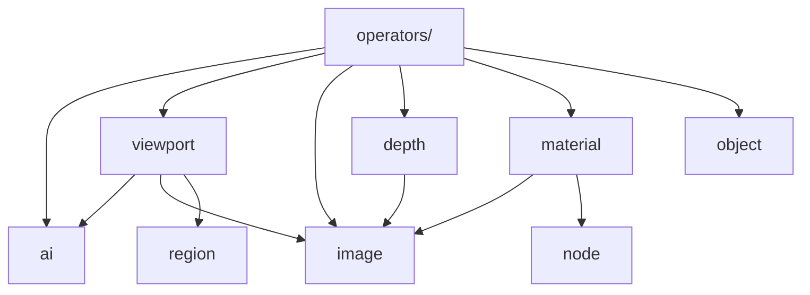

## Context

`src/anyimage/common/` 当前有七个模块，其中主要问题不是文件数量，而是少数函数位于不符合业务认知的位置：通用 AI UI 位于 `image_interaction.py`，`object.py` 中的大部分代码实际负责材质，多个文件名又使用宽泛的 `*_data` 或 `*_interaction` 后缀。

调用方直接从具体模块导入函数，`common/__init__.py` 不承担公共导出。迁移必须一次性更新所有调用方并删除旧路径，不增加转发模块或重导出。`server/` 仍保持独立，不能引用上级模块。

## Goals / Non-Goals

**Goals:**

- 使用少量、稳定的业务名词，使函数位置容易预测。
- 修正明显错位的 AI UI 与材质函数，同时避免为了追求形式纯粹而拆出大量小文件。
- 保持函数行为、Job 字典、Operator 行为与 Blender 数据结果不变。

**Non-Goals:**

- 不要求每个模块只有一种技术副作用；同一业务对象的读取、输入准备与结果应用可以集中存在。
- 不重写算法、调整 UI、改变公开 Blender 标识符或 Job 协议。
- 不增加 Facade、抽象基类、动态导入或 `common/__init__.py` 重导出。

## Decisions

### 1. 采用八个业务模块

目标目录如下：

| 模块 | 职责 | 来源与主要内容 |
| --- | --- | --- |
| `ai.py` | Blender 侧所有共享 AI 准备能力 | 合并 `ai_job.py` 全部函数，以及 `draw_ai_setup()`、`draw_ai_property()` |
| `image.py` | Blender Image 与 Image Empty 的完整生命周期 | 原 `image_data.py` 全部函数 |
| `region.py` | Region 值、序列化、栅格化与 Alpha 裁切 | 原 `image_region.py` 全部内容 |
| `viewport.py` | View3D 坐标投影、点击解析、工具设置、手势状态与 Overlay 绘制 | 原 `image_interaction.py` 除 AI UI 外的全部内容 |
| `depth.py` | Depth 产物导入、校验与尺度换算 | 原 `depth_data.py` 全部内容 |
| `material.py` | Image 材质节点树构建与配置 | 从 `object.py` 迁移 `material_color_space_name()`、`set_material_color_space()`、`material_node_group()`、`create_image_material()`、`set_displacement_only()` |
| `object.py` | Object 与 Modifier 的共享构建收尾 | 保留 `modifier_input_identifier()`、`set_modifier_input()`、`finalize_object_result()` 及其私有辅助函数 |
| `node.py` | 随扩展分发的 Node Group 资产加载 | 原 `node.py` 保持不变 |

这套分类以开发者查找路径为优先：想处理 AI、Image、Region、Viewport、Depth、Material、Object 或 Node 时，只需选择对应名词；所有不修改 Image 数据、只负责 View3D 输入与显示反馈的函数统一位于 `viewport.py`。

`image.py` 虽然体量较大，但其中函数共同覆盖 Blender Image 从读取、输入准备、结果导入到 Empty 替换的完整生命周期。拆成 `image_input`、`image_result`、`image_empty` 会迫使多数 Image Operator 同时依赖三至四个文件，增加导航成本，因此不采用。

`viewport.py` 保留交互上下文、二维预览几何和 Modal 手势。它们共同描述 View3D 中“如何点击、投影、绘制和完成手势”，且共享大量私有辅助函数；拆成 `viewport_draw`、`viewport_gesture` 和 `viewport_context` 对当前规模收益有限。

### 2. AI 能力使用单一入口

`ai.py` 同时容纳环境/模型检查、输入校验、参数组装和两项通用 UI 绘制函数。它们都是 Operator 在启动或呈现 AI 功能时使用的共享能力，调用方无需判断某项能力属于 Job、状态还是 UI 子分类。

备选方案是保留 `ai_job.py` 并新增 `ai_ui.py`。该方案能按技术层分离 UI，却会为两个很短的函数增加模块，并且不能满足“所有 AI 使用方容易找到”的首要目标，因此不采用。

### 3. 只对 Object 做一次有价值的拆分

`create_image_material()` 及其辅助函数构成独立、体量较大的材质构建单元，迁移到 `material.py` 后，`object.py` 自然剩下 Object 与其 Modifier 的构建收尾。Modifier 不再单独拆文件，因为只有两个公共入口，且全部由 Object 构建流程消费。

`node.py` 不改名为 `node_asset.py`：当前文件只负责 Node Group 资产加载，名称已经足够明确，改名不会改善边界。

### 4. 文件名简化，但函数名和行为保持不变

`image_data.py`、`image_region.py`、`image_interaction.py`、`depth_data.py` 分别迁移为 `image.py`、`region.py`、`viewport.py`、`depth.py`。迁移只修正模块名和导入，不顺带重命名函数或修改算法。

完成后直接删除被替代文件，不保留兼容转发；所有生产代码、测试和文档在同一变更中更新。

### 5. 依赖关系保持简单

`region.py` 保持与 Blender UI 无关；`image.py` 不反向依赖编辑、材质或 Object 构建；`common/__init__.py` 不隐藏函数来源。

## Risks / Trade-offs

- [直接删除旧路径会使遗漏导入立即失败] → 全仓库检查旧模块名并运行完整测试。
- [较大的 `image.py` 与 `viewport.py` 不是技术上最纯的分层] → 优先保证业务内聚与导航效率；只有出现第二个独立消费者群或显著循环依赖时再拆分。
- [机械移动可能夹带行为变化] → 保持函数体、签名和私有辅助函数，只修改导入与模块说明。
- [Material 移出后可能遗漏 Object 调用方] → 对 `create_image_material()` 和相关辅助函数执行全仓库引用检查并运行 Object 测试。

## Migration Plan

1. 将 `ai_job.py` 迁移为 `ai.py`，并从 `image_interaction.py` 接收通用 AI UI 函数。
2. 将四个宽泛文件名迁移为业务名称：`image.py`、`region.py`、`viewport.py`、`depth.py`。
3. 从 `object.py` 提取 `material.py`，保留 Object 与 Modifier 函数；`node.py` 保持原状。
4. 更新生产代码、测试和文档的直接导入，确认无旧路径引用后删除旧文件。
5. 运行完整测试验证行为不变。

本变更不涉及持久化数据迁移。若实现阶段需要回退，应整体回退该变更，而不是恢复兼容转发模块。
