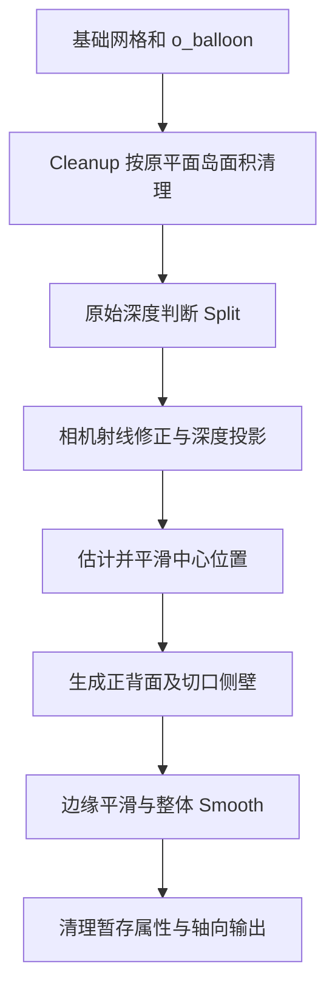

## Context

当前 `shape.py` 将四种形态映射为四个子组，再由 `O Image Cutout` 用 Shape 菜单选择。菜单统一传入 Normal Map 勾选值；`normal_mode_for_shape()` 仅在勾选时为 Depth Surface 选择 OBJECT，其余形态使用 TANGENT。

`build/cutout_surface_balloon/surface-balloon-smooth-back.blend` 已验证五张输入、15 个参数组合；背面算法、控制测试与实际节点布局可作为实施参考。当前工作区也已修正前置 Cleanup 和不依赖 Depth Scale 的 Split，实施从这些修正继续。

## Goals / Non-Goals

**Goals:** 四个明确的创建预设，三个独立修改器节点组，统一厚度语义，深度入口自动生成法线，保留已验证的几何质量。

**Non-Goals:** 本次范围限定在 Cutout 的创建、节点资产与材质连接；AI 模型、图像区域交互和其他工具沿用现有职责。

## Decisions

### 创建预设与节点资产分离

| 入口 / 内部标识 | 节点组 | 初始设置 |
| --- | --- | --- |
| Flat / FLAT | O Image Cutout | Balloon，Thickness 0 |
| Solid / SOLID | O Image Cutout | Balloon，Thickness 1 |
| Depth Solid / DEPTH_SOLID | O Image Depth Cutout | Balloon，Thickness 1 |
| Depth Balloon / DEPTH_BALLOON | O Image Depth Balloon | Thickness 1，Double Sided 开启 |

Solid 是新创建的默认预设，Pie 保持四个选择。Flat 和 Solid 使用同一基础网格属性与节点组，创建后通过厚度即可转换。预设名称用于菜单、对象命名与 Operator 协议；资产名称仅用于按名称加载。

三个节点组直接设置为修改器资产，各自输出最终几何。删除总 Shape 分支及 `O Image Surface`、`O Image Balloon`、`O Image Depth Surface` 旧资产。复用构建函数展开公共步骤，避免为了共享代码再建立总包装组。保留 `Inward Axis` 的几何与对象矩阵配对转换。

### 两种厚度方式

`O Image Cutout` 和 `O Image Depth Cutout` 使用 `Thickness Mode` 菜单，顺序为 Balloon、Uniform，默认 Balloon。Balloon 的 Thickness 是无量纲倍率，Uniform 的厚度是距离；输入显示与保存必须区分两种语义，距离 socket 使用 DISTANCE，倍率使用 NONE。具体 socket 组织在实现时按 Blender 修改器接口能力选择，验收必须确认用户能辨认单位，切换时不发生隐式单位换算。

普通 Cutout 的 Balloon 模式使用正背面 `±o_balloon × Thickness`；Uniform 使用当前 Surface 的等厚板片行为。两种方式在零厚度时均返回单层平面。全部预设都准备 `o_balloon`，即使以 Flat 创建也能直接增厚。

深度 Cutout 保留当前 Depth Surface 的采样、射线投影与 Split；Uniform 保留沿内向轴等厚的正背面。Balloon 采用实验中的平滑背面，两种方式零厚度均返回深度表面。

### 平滑背面进入正式构建

令 D 为投影后正面 Z，B 为 o_balloon。以 `C₀ = D − B` 初始化中心位置，固定原轮廓和 Split 切口上的值，仅对内部执行 256 次邻域平滑。Thickness 为 1 时目标背面为 `C − B`；一般厚度场为 `Thickness × max(D − C + B, 0.05 × B)`。比例下限用于限制深凹处反穿，原轮廓 B 为零时厚度仍归零，不引入 Rim Thickness。

复用原型中对轮廓耳三角形、内部零轮廓弦的补点方法，保证封闭轮廓不会产生零面积面。通过来源顶点和厚度层身份连接几何，Split 两侧保持独立；正面在边缘和整体平滑关闭时保持原始深度表面位置。

保留原型的 Edge Smooth 控制与抑制轮廓收缩的平滑过程，整体 Smooth 复用项目实现。临时属性使用 o_* 专用前缀并在输出前移除，保留 UVMap、o_balloon 和用户属性。默认参数及平滑成本用五张缓存输入复验。

### 每个节点组承担自己的公共处理

三个资产复用同一 Cleanup 构建函数，在塑形前按原平面岛总面积清理；UI 值继续乘 0.01 转为面积。Smooth 与轴向输出在各自塑形后执行。仅深度 Cutout 提供 Split；比较式为 `相邻面采样距离差 × Reference Depth × Depth Scale × Split > 面中心距离 × 平均射线距离 × 2.5`，Depth Scale 既缩放显示位移也缩放切边判据。

### 法线策略在 Operator 层统一解析

| 入口 | 勾选关闭 | 勾选开启 |
| --- | --- | --- |
| Flat | NONE | TANGENT |
| Solid | NONE | TANGENT |
| Depth Solid | OBJECT | OBJECT |
| Depth Balloon | TANGENT | TANGENT |

统一解析函数同时供 Job 构建和结果接收使用，保证直接调用 Operator 与 Pie 调用一致。深度入口的自动生成不会改写用户保存的勾选值。工具提示说明 Normal Map 仅控制 Flat / Solid；AI 未就绪时仍只提供两个本地入口，并忽略遗留的开启值。

复用现有法线结果加载、材质连接与轴向变换。Flat 与 Solid 共用节点后，法线的 Balloon 适配不得仅由创建时的预设名决定；按当前厚度方式和几何属性处理，验证 Flat 增厚后材质仍正确。Depth Solid 保留 OBJECT 法线的方向转换，Depth Balloon 保留 TANGENT 法线的适配。

Depth Solid 在 FACE 域保存正面法线权重 1，背面与侧壁为 0；材质读取该权重，使平滑背面使用几何法线。法线权重作为公开材质属性保留在输出网格中。

## Risks / Trade-offs

- 平滑中心场会弱化内部深度细节 → 正面保留原深度，背面用已验证的轮廓约束；通过合成曲面与五张实图同时验收。
- 迭代与闭合细分增加成本 → 使用固定初始迭代数，测量默认预设求值时间；字段就近存取，避免重复推理与重复求值。
- 同名 `O Image Cutout` 的资产职责改变 → 加载路径按新结构校验，避免复用已加载的旧 Shape 包装组；旧 .blend 中嵌入的数据保持原样，新创建对象使用新资产。源码不保留旧标识转发或迁移兼容层。
- 法线图随默认预设开启后的材质效果可能不同 → 分别验证两个深度入口的正背面着色及两个 Inward Axis。

## Migration Plan

按标识和默认值、节点构建、运行时加载与材质、验证的顺序实施。发布资产只保留三个 Cutout 节点组；同步删除旧构建和验证分支。需要回退时整体恢复源码与对应资产，避免新旧接口混装。

未归档的 `gate-cutout-ai-options`、`replace-depth-surface-stretch-with-split` 和 `standardize-cutout-z-axis` 涉及本次边界。未来归档时以本提案的入口名称、直接修改器架构、前置 Cleanup 和原始深度 Split 要求为准，同时保留 AI 门控与轴向约定；不回退当前工作区已完成的修复。

## Open Questions

无产品决策待确认。厚度输入的具体展示方式属于实施细节，须满足倍率与距离可辨认的验收要求。
