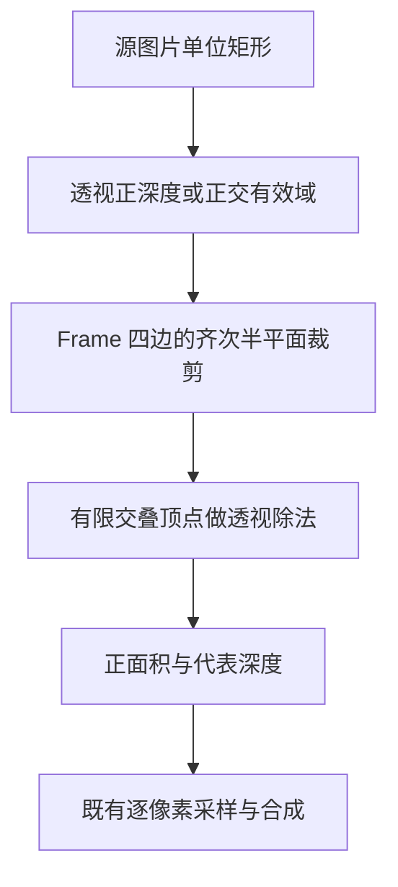
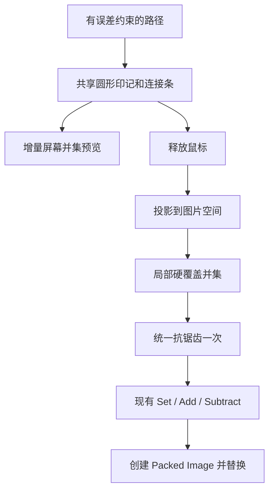

## Context

动机见 proposal.md。Frame、Mask、Rectify 与 Cutout 共享 Blender 侧 Image 和手势函数，业务像素使用 straight RGBA；结果 Image 默认 PREMUL。当前审查以 460 个测试和 56 个子测试通过的工作区为基线，额外探针揭示了普通测试未覆盖的源缓存副作用、透视边界误判和长笔画开销。

## Goals / Non-Goals

设计将数据读取、几何覆盖、呈现缓存与最终提交分开：源数据只读，覆盖只表达几何，预览按变化更新，结果在完成时一次提交。现有 Alpha 合成公式、透明 RGB、工具选择行为及 Cutout 轴向契约作为回归基线。

## Decisions

### 1. 像素读取以当前有效数据为准

`image_pixels()` 成为无副作用入口。GENERATED 或 dirty Image 直接读取当前像素缓存；干净图片按其实际编码取得业务 RGBA。需要以 STRAIGHT 解释已重载 Packed PNG 时，在独立、临时 Image 副本上完成解释并在 finally 中释放。模式切换只作用于临时数据；原 Image 的 mode、pixels、is_dirty、packed bytes、users 和共享对象引用保持原状。

先用真实 bpy 固定 byte/float、GENERATED/FILE、packed/unpacked、dirty/clean 和原生 PREMUL 浮点源的读数契约，再实现最小读取分支。业务结果继续使用用户确认的 PREMUL 默认值。临时数据只承担解码，不形成常驻缓存或新增持久属性；保存重开后仍读取相同业务 RGB/Alpha，透明 RGB 参与验证。

### 2. Frame 在源平面坐标中完成半平面裁剪

将 Frame 四边写为齐次投射分量的线性不等式，把透视正深度条件与这些边界共同作用于源图片单位矩形。仅对裁剪后的有限交叠点做透视除法，最后计算屏幕面积与代表深度。正交路径继续接受有限的非正深度。

公共半平面裁剪位于 `common/selection.py`，接受二维顶点和线性边界。Rectify 的图片矩形裁剪复用同一实现，Frame 保留自身投影与深度职责。退化、切边与无交叠判断统一采用尺度相关的数值判定。

### 3. Brush 路径简化约束整段原始采样

保留经过最小点距筛选的原始轨迹。简化每条候选线段时检查该段全部原始点到线段的距离，最大误差为 0.75 个 Viewport 像素；确认的前缀固定，当前尾段保留可更新状态。近共线判断只控制压缩，不能代替整段误差约束。

预览与提交消费同一简化路径及 `brush_footprint_polygons()` 图元。公共 Lasso 消费者使用相同误差契约；Polyline 已提交顶点按用户输入保留。原始轨迹和缓存均在取消或完成时释放。

### 4. Brush 完整覆盖先合并，最后抗锯齿

以所有投影图元的裁剪后联合 bounds 创建一次局部覆盖画布。图元先以硬覆盖合并，公共抗锯齿函数只处理最终并集一次，再得到一个 SelectionMask。这样内部图元边界不会变成半透明接缝，结果也不随相同几何的分段方式变化。

### 5. 预览缓存覆盖已提交前缀与活动尾段

屏幕扫描行采用固定原点。已确认路径前缀的图元、扫描行覆盖和外轮廓作为持久的操作内缓存；新增图元只更新其命中的局部扫描行，活动尾段改变时重算受影响范围及相邻轮廓连接。填充与虚线由同一覆盖缓存派生，使用一个版本标记。

静止重绘复用已有 GPU batch；路径变化时按受影响块更新批次。取消、完成与工具切换统一释放路径、覆盖和绘制缓存。性能验收同时记录 800/1600/3200 点耗时及新增段触及的计算范围，避免仅靠特定机器的毫秒阈值判断。

### 6. 提交入口与输出计算直接表达当前职责

- Mask 使用仅含 UNDO 的交互 Operator，移除 REGISTER 和 Operator draw；Scene 工具设置继续在 invoke 时冻结。
- Frame 直接写入已独立合成的 RGB/Alpha。保留 Alpha 的现有近零判定、源内透明 RGB 和源外 RGBA 全零，删除整图 blended_rgb 备份及后续预乘/反预乘/扩色回路。
- 删除 `scanline_fill_triangles()`、`preview_fill_triangles()` 转发入口，测试改为验证当前预览几何入口的行为。
- 删除只写不读的 `_region_size`，合并 `_fill_polygon`、`_outline_polygon` 的重复缓存标记。

## Risks / Trade-offs

- [不同 Blender 图像编码的 Alpha 解释不同] → 以真实 byte/float 和保存重开测试固定读取结果，验证原源脏状态与共享引用，临时副本总在 finally 释放。
- [接近观察平面的裁剪容易出现数值抵消] → 归一化半平面系数，覆盖焦距 1/1.7/2/4、30° 倾斜、极近前方、无交叠和正交负深度样例。
- [增量并集容易在尾段替换与自交处留下旧边界] → 与全量参考几何逐次对比，覆盖回折、重叠、长轨迹及模式颜色变化。
- [原始路径保留增加操作内内存] → 保留紧凑屏幕点，统一释放；读取源 RGBA 与图片级栅格化仍只在提交时发生。

## Migration Plan

先增加失败行为回归，再依次调整只读像素、公共裁剪、Brush 路径与覆盖、增量预览，最后清理旧入口并运行全量测试。全部改动采用当前接口的直接实现，无持久数据迁移；实施过程中保留本轮已有功能与测试。完成后归档本提案时，应与相关未归档功能规格核对同名业务约定。
