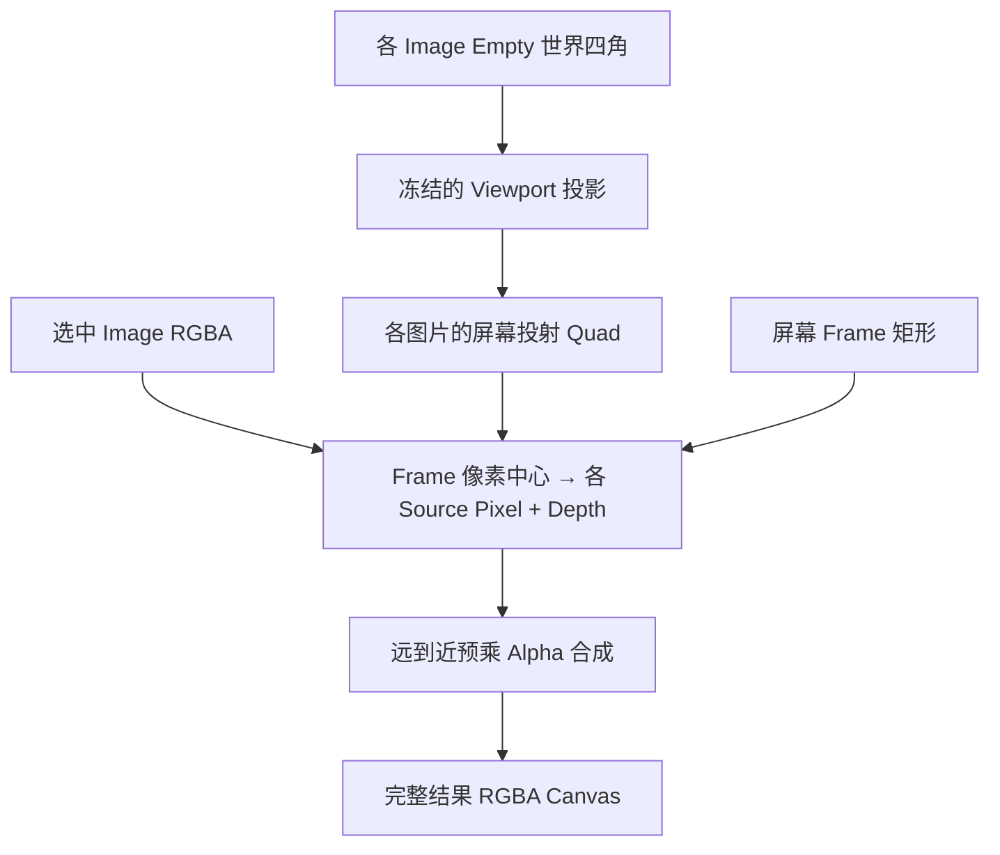

## Context

Crop Box 当前复用 `CropSelectionGesture`：屏幕矩形被投影到源 Image Empty 平面、栅格化为 Selection Mask、乘入源 Alpha，最后按可见 Alpha 紧裁并通过 `placement_bounds` 放回源平面。这个数据流天然不能表达扩大 Canvas，也不会把倾斜 Image Empty 在当前视角中的梯形外观冻结为新的矩形图片。

现有 Crop Perspective 已具备 Homography、预乘 Alpha 插值、输出分辨率限制和 Image 编辑结果创建能力，但它由用户指定源图片平面上的 Quad，再将 Quad 矫正为矩形。Frame 的输入恰好相反：用户直接指定 Viewport 中的目标矩形，系统需要把所有选中 Image Empty 在该视图中的投射采样、按深度合成进矩形，并把 active 对象转到视平面。

## Goals / Non-Goals

**Goals:**

- 用 Frame 完整替换 Crop Box，并让名称、公开 ID、文件边界、注册与文档一致。
- 允许用户从 Viewport 任意位置画出大于或小于源投射的结果 Canvas。
- 只重采样选中 Image 的 RGBA，按逐像素空间深度与 Alpha 合成并冻结当前视角下的几何透视外观。
- 以当前 Viewport 像素尺寸决定输出分辨率，以 active Image Empty 统一决定结果对象和视图深度。
- 让结果继续使用 active Blender Object，并在成功后删除其他参与合并的 Image Empty。
- 删除 Frame 不再需要的 Refine Selection、Invert 和 Keep Original 状态。
- 复用 Crop Perspective 已验证的投影数学、插值和资源上限。

**Non-Goals:**

- 不把 Frame 实现为 Viewport 截图；场景遮挡、Grid、Gizmo、Overlay、Color Management 和 Image Empty 的显示 tint 不烘焙进图片。
- 不改变 Crop Lasso、Crop Polyline 或 Crop Perspective 的图片处理结果和独立选项。
- 不保留 Crop Box Tool ID、Operator、Scene Property 或 Python 导出兼容层。
- 不支持视频、序列图片或执行后随视角继续变化的动态投射。
- 不改变 Server Job、依赖、节点组或 Blender 资产。

## Decisions

### 1. Frame 使用 Selection 作为输入集合，active Image Empty 作为唯一基准

Frame 启动时要求 active object 是 Selection 内的 still Image Empty，并收集所有选中的 still Image Empty 作为参与源。仅保留 active 状态但未被选中的 Image Empty 不构成输入；active 不是 Image Empty 时，即使 Selection 含有图片也以 warning 取消。选中的非 Image Empty 不参与操作；任一选中 Image Empty 是视频或序列时整体取消，避免只合并 Selection 的一部分。active 必须属于参与集合，并同时作为结果对象、Image 命名/colorspace 和视图深度基准。

矩形可以从 Region 内任意位置开始，使大 Canvas 的任意角都能落在所有源投射之外。Frame 完成时必须与 active 的屏幕投射相交；相比仅要求与任意参与对象相交，这能保证承担结果的 active 确实属于结果内容。

### 2. 在手势完成时冻结一次投影状态

Frame 完成矩形时记录 Region 尺寸、`RegionView3D` 投影/视图矩阵、全部参与对象的世界矩阵与 Image 尺寸，并用这一组状态完成采样、合成与结果放置。矩形四角使用 Region 像素坐标，顺序固定为左上、右上、右下、左下。

不保存一个可持续更新的投影关系。Frame 是一次不可逆的像素编辑；冻结状态也避免异步或重绘期间的 Viewport 变化造成图片内容和对象朝向来自不同视图。

### 3. 每个参与对象独立投影采样，再逐像素深度合成

对每个参与 Image Empty，先把四个本地图片角变换到世界空间，再投影到 Region，得到各自的 `source image pixels → screen` 投射 Quad。Frame 像素中心按矩形线性映射到 screen，再通过每个投射 Homography 的逆变换映射到对应源图片像素；落在该源图片范围外的样本视为透明。

同一输出像素取得全部有效样本后，根据观察射线到各源平面交点的距离从远到近排序，并以预乘 Alpha source-over 合成。这样两个倾斜平面发生交叉时，前后关系也可以随像素变化。深度相同时 active 样本最后合成，使 active 明确位于其他输入之上；其他完全同深度样本只需使用稳定对象顺序保证结果可复现。

等价的数据流为：

插值继续使用 Crop Perspective 的预乘 Alpha 双线性路径，避免透明边缘产生 RGB 色边。Homography 求解、分块采样和透明 RGB 扩展位于公共 Image 像素处理入口，由 Frame 与 Crop Perspective 共用；多源深度计算和合成留在 Frame 业务边界，不让 Perspective 承担 Selection 或对象生命周期语义。

Frame 与 active 投射 Quad 没有几何相交时以 warning 取消，防止在 active 替换语义下意外得到无基准内容的图片。非 active 投射可以位于 Frame 外，仍属于成功后被消费的参与输入。结果不调用 `crop_pixels_to_alpha()`，因此即使边缘或全部源像素本身透明，也不会改变用户所画 Canvas。

### 4. 输出分辨率使用当前 Viewport 像素

直接使用 Frame 在 Region 中的屏幕像素宽高作为输出尺寸，使结果等价于只渲染图片内容的 Viewport 局部 snapshot。结果保持 Frame 屏幕宽高比，宽高不超过当前 Region 对应维度，并按 Preferences 的 `max_frame_resolution` 再等比限制最长边。默认最大长边为 2048 px，公开范围为 64–8192 px。

这个尺寸不再受 active 图片分辨率、对象距离或透视缩放影响，因此远处对象和大范围 Frame 不会产生超出当前显示所需的巨大图片。整数取整造成的极小宽高比误差由结果 Image Empty 的实际像素宽高比统一承载。

### 4.1 透明边缘保留颜色扩展

投影采样和多图合成继续使用预乘 Alpha。转换回 Blender 使用的 straight RGBA 时，完全透明像素保持 Alpha 0，并让紧邻可见像素的一圈透明 RGB 使用相邻可见颜色。这样不改变透明 Canvas 或合成结果，但避免 Image Empty 的线性纹理过滤把外部 RGB 0 混入边缘而形成黑边。

### 5. 结果平面位于 active 对象原点的视图深度

使用冻结视图的右、上方向作为结果对象本地 `+X`、`+Y`，本地 `+Z` 指向观察者。以 active Image Empty 世界原点确定视图深度，在穿过该点且平行于视平面的平面上反投影 Frame 四角；其中心成为结果对象原点，宽高成为 Image Empty 的世界显示尺寸。

结果对象设置居中的 `empty_image_offset`，世界矩阵只表达 Frame 中心、视图朝向及 active 对象其余不参与图片平面尺寸的变换约定，显示大小由反投影矩形和结果像素宽高比共同确定。active Blender Object identity、名称、Collection、自定义属性和选择状态保留，Image 数据块通过公共 Image 编辑替换规则落地。

选择 active 原点深度而不是任一源平面与 Frame 中心射线的交点有两个理由：即使 Frame 中心落在 active 投射外也始终可定义；多源输入只有 active 提供明确且稳定的共同深度。代价是换视角后结果平面与各原倾斜平面不再重合，这是冻结投射的必然结果。

### 6. Frame 使用独立矩形 modal，不再进入 Selection 管线

删除 `box.py` 和 `CropImageSelection` 的 `BOX` 设置映射，新增 `frame.py` 承载 Frame WorkspaceTool、矩形 Overlay、投影采样和同步执行。公共矩形屏幕路径 helper 可以继续复用，但 Frame 不生成 `SelectionPath`、`SelectionMask`、Refine Job 或 `placement_bounds`。

`CropSelectionGesture` 继续服务 Crop Lasso、Crop Polyline 和 Cutout Lasso；删除只被旧 Crop Box 使用的 BOX gesture 分支，矩形路径 helper 改由 Frame 直接使用。Frame 在完成全部验证、采样、合成和结果 Image 创建之前不修改任何参与对象。

Frame、Crop Lasso 和 Cutout Lasso 的 WorkspaceTool keymap 使用 `CLICK_DRAG`，并显式绑定普通点击与 Shift 点击的 Viewport 对象选择。图片工具不启用 Blender fallback selection keymap，因此 Tool Settings 不出现容易与 Frame、Lasso 混淆的 `Drag: Select Box/Lasso` 设置。Frame 只有确认发生拖动后才收集 Selection 并进入矩形 modal。Polyline 与 Perspective 仍需单击录入点，其 Operator 自行执行对象点选；Shift 点击使用相同的显式追加选择绑定。

公共图片编辑源校验同时要求 active object 是 Image Empty 且属于当前 Selection。drag-only 工具在校验失败时直接 warning 并取消；Frame 的 poll 只限制 View3D 上下文，使无效 active 的拖动仍能进入 Operator 并得到明确提示，而不会静默失败。

### 7. 成功后由 active 承载结果并消费其他参与对象

结果 Image 完整创建并 Pack 后，先更新 active 对象的 Image、世界矩阵、offset 和显示尺寸，再删除其他参与合并的选中 Image Empty。选中的非 Image Empty 从未进入参与集合，因此不修改也不删除。其他对象仍引用某个源 Image 数据块时只删除参与 Object，不强制删除共享 Image；无用户且无 fake user 的输入 Image 按现有生命周期规则清理。

全部对象变更属于同一个 Blender Undo 操作。预计算或 Image 创建失败时直接清理临时资源；对象更新阶段异常时恢复 active 的 Image 与变换，并保留尚未删除的参与对象，避免部分合并状态。

### 8. 删除 Crop Box 状态并收紧 Crop Tool 入口

从 `AnyImageSettings`、设置同步/绘制映射和测试中删除 `crop_box_refine_selection`、`crop_box_invert`、`crop_box_keep_original`。Frame `draw_settings` 不绘制任何业务选项，keymap 只保留鼠标矩形操作，不注册字母快捷键。

注册顺序改为 Frame、Crop Lasso、Crop Polyline、Crop Perspective，`ActivateCropTool` 默认激活 `anyimage.frame`。按项目规则同步删除旧类、ID、文档描述和测试期望，不提供转发或迁移属性。

## Risks / Trade-offs

- [源平面接近与视线平行时 Homography 数值不稳定] → 在修改对象前验证投影点、凸性、矩阵条件数和有效输出尺寸；失败时给出用户可理解的提示并取消。
- [Frame 远大于 active 投射时透明区域较多] → 仍按 Viewport 像素、总像素上限和分块采样处理，范围外直接写透明 Alpha。
- [高 DPI 或超大 Viewport 仍可能产生较大图片] → 输出不超过 Region 像素尺寸，并由 Preferences 最大长边二次限制。
- [大量高分辨率参与图片增加采样时间和内存] → 按输出行分块逐源采样并直接累积预乘结果，不同时保留每个源的完整输出 Canvas。
- [完全共面的非 active 图片没有自然前后关系] → active 固定置顶，其余使用稳定对象顺序作为相同深度 tie-breaker；需要特定层级时由用户把目标设为 active 或拉开空间深度。
- [冻结后的结果换视角会与原倾斜平面明显不同] → 这是 Frame 的核心产品语义；文档明确它烘焙当前视角并生成 view-facing Image Empty。
- [Viewport 显示与原始 Image RGBA 受颜色管理影响而略有差异] → Frame 只处理图片数据和几何投射，不做屏幕截图；沿用源 Image colorspace 并排除显示 tint、遮挡和 Overlay。
- [删除 Crop Box Properties 后旧 `.blend` 仍包含未知保存数据] → Blender 忽略未注册的旧 ID Property；不读取、不迁移，也不影响其他 Crop Property。
- [替换过程中部分更新导致源对象损坏] → 先完整计算并创建、Pack 结果 Image，再一次性更新源对象；异常时恢复 Image 与矩阵并移除无用户的临时 Image。

## Migration Plan

实施时先提取 Frame 与 Crop Perspective 共用的 Homography/采样函数并保持 Perspective 测试通过，再加入 Frame 的多源投影、深度合成和事务式对象消费；随后切换注册、激活入口和属性，最后删除 Crop Box 文件、映射、测试与文档。代码与测试在同一版本发布，不需要数据迁移或节点资产重建。

回滚需要恢复 Crop Box 的工具、三个 Scene Property 和 Selection 路径。已经由 Frame 生成的普通 packed Image 与 Image Empty 不依赖运行时代码，回滚后仍可正常显示，但不会自动恢复操作前的倾斜平面或源图片。

## Open Questions

无。当前产品决策已经确定 Frame 合成所有选中的 still Image Empty，以 Viewport 决定分辨率，以 active 决定结果对象和视图深度，成功后删除其他参与对象。
