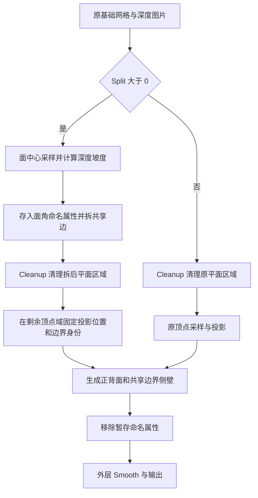

## Context

动机见 proposal.md。当前 `_build_depth_surface` 投影后执行 Stretch Limit 删几何，再进入分层厚度。外层 Cutout 在 Shape 前执行 Cleanup，在 Shape 后执行 Smooth。四种 Shape 共用基础网格，节点资产通过构建脚本生成并在运行时加载。

最新实验采用场景 Z 差除以实际面中心距离，六个物体共用节点组。用户确认内部阈值约 `5` 时效果较好，同时观察到有厚度时侧壁与正面脱开。已有“坐标有限、面数增加、平面厚度正确”的检查不足以证明封边成功。

## Goals

分离在 Depth Surface 分支内完成；厚度生成使用拆边后的同一份边界数据。零值关闭时沿用完整原始表面的采样和投影行为。验收覆盖节点组本体和真实 Cutout 外层处理链。

## Decisions

### 1. 用实际采样跨度计算深度坡度

令 `Cₐ、Cᵦ` 为变形前相邻面的中心，`Zₐ、Zᵦ` 为面中心 UV 采样得到的相机 Z，`U` 为正式 Uniform Scale，`D` 为 Depth Scale：

```text
g = abs(Zₐ - Zᵦ) × U × abs(D) / distance(Cₐ, Cᵦ)
```

基准中心与 `U × Z` 使用一致的对象局部距离单位。复用 `common.depth.depth_uniform_scale` 和现有参考深度计算，不增加新的 Mesh Detail 数据输入。对中心距离为零的退化邻接不选边，避免除零；数值保护采用与模型尺度一致的容差。

选择共享边上恰有两个邻面的情况。Corners of Edge → Face of Corner → Evaluate at Index 取得邻面字段。采用 Z 而非 XYZ 距离，避免把正常横向间距计入断层；采用实际中心跨度而非期望网格长度，避免轮廓附近的小三角形在 Low 下被过大的分母抑制。

### 2. 使用正向的 Split 控制

`Split` 位于内外两层接口的 Options，替代 Stretch Limit 的位置，`FACTOR`、`SINGLE`、范围 `0–1`、默认 `0`。

使用简单倒数换算：对于 `s > 0`，内部阈值 `T(s) = 2.5 / s`。节点直接比较 `g × s > 2.5`，零值自然关闭，避免零点除法。

| Split | 内部阈值 | 含义 |
|---|---:|---|
| 0 | 显式关闭 | 原表面保持连接 |
| 0.25 | 10 | 较少分离 |
| 0.5 | 5 | 用户认可的实验强度 |
| 0.75 | 3.333… | 更多分离 |
| 1 | 2.5 | 最大强度 |

常数 `2.5` 仅用于把内部阈值 `5` 放到滑块中点。关闭分支旁路新增面采样与拆边，但仍执行 Cleanup 和原始采样投影。

### 3. 固定切口两侧的数据，再生成厚度



带局部斜坡的三角阶跃样例已复现：原厚度流程直接使用面角字段时产生 64 条开口边，改为厚度前固定顶点字段后降为零。新增面角、侧面分离和重复挤出改变了面角到顶点的平均权重，使侧壁与盖面的坐标不同。

实现上在拆边后、厚度前固定最终顶点投影数据及边界身份，正面、背面、各段侧壁共同引用该数据。侧壁起点必须与正面边界一致，终点必须与背面边界一致，段间共享同一边界环；不得在新增侧面域重新平均原面深度。连接按同一分离区域的边界身份完成，防止全局 Merge by Distance 把原本独立的切口重新焊接。合并容差不能用来掩盖边界坐标不一致。

选边字段先在 EDGE 域求值，再转换到 POINT 域标记关联顶点。仅这些顶点采用拆后所属侧的平均 Z，并以 `原 XYZ × 所属侧 Z / 原 Z` 沿原相机射线重建；其他顶点保留原 XYZ。面中心 XYZ 不直接用于替换顶点位置，以免轮廓向面中心收缩。

保留现有分层厚度的用户语义和分段能力，修正其中的属性传播或连接环节。先复现开裂并检查面朝向、各段挤出方向、顶点域数据和边界配对，再确定最小修改。对定向正确的流形输入，每个加厚区域必须闭合；片段之间可以分离，片段内部不能露缝。

连接使用拆后原顶点编号与厚度层编号作为身份。生成侧壁后，暂时将这两个整数编码成合并坐标，使 Merge by Distance 只合并相同身份的副本，随后恢复捕获的真实表面位置与厚度偏移。编号按整数商、余数拆分以保持浮点表示精确；真实场景中的近距离与重合区域不影响连接身份。

跨区域暂存数据使用保留前缀 `o_depth_` 的 Store Named Attribute，在消费区域用 Named Attribute 就近读取。FACE 保存原面中心与相机采样，CORNER 保存所属侧采样与切口标记，POINT 保存最终相机坐标、表面位置、源顶点编号与厚度分段数。输出前用一个 Wildcard 模式的 Remove Named Attribute 匹配 `o_depth_*`，保持 UVMap 和用户属性。

### 4. 接入正式资产与外层流程

删除 Stretch Limit 接口及其专用边长捕获、删除和松散拓扑清理节点。Depth Surface 将 Cleanup 移到 Split Edges 后、投影和厚度前，按拆后 Mesh Island 的平面面积执行既有清理阈值；避免厚度与侧壁面积影响碎片判定。外层将 Cleanup 值传入此分支，不再对 Depth Surface 提前或重复清理。Split 为零时仍对原平面区域清理。其他三种 Shape 保持原清理位置，外层 Split 仅连接 Depth Surface。

多个物体复用同一组资产，图片与标定由各自修改器传入。验证 Smooth 作用于已正确连接的实体，既不重新缝合不同分离区域，也不暴露侧壁接缝。运行时仍按名称加载资产。

### 5. 按语义组织节点布局

按 AGENTS.md 整理资产中全部七个几何节点组。Depth Surface 的几何主链从左到右连续排列：面采样与判别、拆边、Cleanup、投影、厚度、输出。辅助字段放在使用位置附近，通过局部 Group Input 接入；隐藏未使用输出，保留节点默认 name 与标题，不用 label 替代节点类型。

主轴长度由处理阶段决定，字段计算按各自算式长度横向展开，同一目的的计算聚在主轴同一侧，独立用途可在两侧错落分布。支线可以跨越多个主链步骤的横向范围，同侧支线使用不同的距离和起点，并利用附近空位收紧末端连线；必要的向左引用直接连接，允许交叉，不使用 Reroute 绕行。参照 OmooNodes 的 `O Solidfy`、`O Project`、`O Smooth` 和 `O Tube`，使用局部输入与紧凑分支；完整参数已接线的简单运算可折叠。

大步骤之间保留明显空白，通过节点默认标题与分支形状辨认处理阶段，不放置 String 注解。计算分支可以向主轴起点左侧展开，暂存值通过命名属性传递。

主轴可适当宽松，支线内部间距明显小于不同部分之间的距离，用留白表达用途分组。Depth Plane 的深度偏移与厚度权重在同一侧汇合，Depth Surface 的选边判别构成紧凑的局部计算组。Join Geometry、Menu Switch、Combine XYZ 的独立同级分支末端排成一列、输出端对齐；菜单分支按输入顺序上下排列。供多个部分使用的共享上游留在公共位置。

Repeat 输入与输出围住厚度循环内部节点，内部流程保持从左到右，不让区域跨越无关主链或遮挡节点。Frame 仅包裹具有完整语义的区域。接口保持 Options/Data 的业务边界及 SINGLE 结构，长度参数使用 DISTANCE，Split 使用 FACTOR。

布局由构建脚本确定。结构验证覆盖节点实际尺寸的非重叠、接口顺序、未使用输出隐藏和区域配对；另在 Blender 节点编辑器检查可读缩放下的主链、长线、交叉和回折。自动拓扑分层或统一网格排布不能替代视觉验收。消除可避免的交叉，共享字段通过就近输入和必要的转接组织，避免为减少节点数而拉出横跨整个图的线。

## Risks / Trade-offs

- 深度坡度也响应连续陡坡 → 使用有界控制范围，以平面、斜坡、深度阶跃共同校验阈值含义。
- High 比 Low 捕获更多局部变化 → 用规则重采样的合成曲面检查尺度趋势，真实图片用边界位置和碎片形态比较，不以切边总数相等作为验收。
- 小三角形放大深度噪声 → 检查退化采样跨度、低噪声样本和最大档，不擅自增加改变几何的平滑预处理。
- 厚度侧壁开裂可能存在多个原因 → 将闭合拓扑、共享边界坐标、法线和真实渲染列为独立验证项。
- 全局焊接或外层平滑改变切口 → 用间隔小于原焊接容差的双片段覆盖回归。

## Migration Plan

新资产移除旧输入，无旧名转发或兼容控制。替换构建脚本、验证及测试后同步节点资产和必要的节点资产说明；不重写历史 OpenSpec 变更，不构建扩展发行包。已有文件中的旧节点数据由既有资产更新流程处理，不在本变更新增文件迁移机制。
