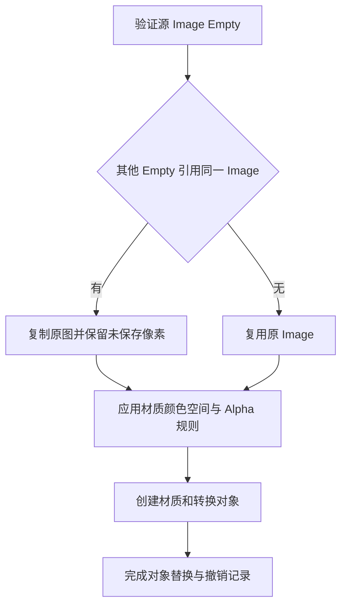

## Context

动机见 proposal.md。Plane 与 Panorama 复制源 Image，Depth / Relief 从 Job 颜色文件重新加载。`configure_material_color_image()` 还会按 Image users 再次复制。图片编辑工具已通过 `has_other_image_empty()` 判断同一 Image 数据块的其他 Empty 引用。

## Goals / Non-Goals

设计目标是把图像所有权选择集中在转换准备阶段，使材质配置、对象替换与错误恢复使用同一个确定的 Image。转换范围为 Plane、Depth Plane、Relief Plane 和 Panorama。

## Decisions

### 1. 复用统一的 Empty 引用判断

在主线程接收转换结果时，使用 `has_other_image_empty()` 检查整个 `bpy.data.objects`，排除正在转换的源对象。判断依据为 Image 数据块身份。

原 Image 名称、路径和内容来源保留；副本沿用原名并交给 Blender 消歧。复制数据块仍指向同一源文件，按既有资源生命周期保证 generated、dirty 和 packed 图像的内容可保存读取。

### 2. 所有权选择与材质配置分离

在 common 中提供四种转换共用的图像准备入口。材质配置函数原地配置已选定的 Image，并返回同一个实例。逐一检查 `create_image_material()` 的调用方，让需要独立结果的入口在配置前准备好 Image。

普通转换继续采用现有适配开关、inverse 色彩空间映射、sRGB 回退及对应 STRAIGHT / PREMUL 模式。Panorama 的 shadeless float / 非 sRGB 保留分支继续使用源图配置。切换设置时保留业务像素，包括透明区域 RGB 和未保存像素。

其他材质用户随复用 Image 接受配置变化；这落实与图片编辑工具一致的共享规则。相关转换测试以本变更规格为准，协调 `configure-material-view-adaptation` 中较宽的用户隔离预期。

### 3. 原图承担颜色来源

Depth / Relief 回调直接准备源 Image，Job 保留深度、法线和 metadata 产物。删除该调用链独占的 `load_color_result_image()`、`copy_color_images()` 及导出和测试引用。`color_data_name()` 是否保留由 Cutout 等实际调用决定。

Panorama Job 移除冗余 `image.0001.png` 保存和清理条目。原图与深度允许各自使用既有分辨率，颜色通过现有 UV 采样。Plane 继续从源 Empty 传递动画帧设置。

### 4. 转换包含失败恢复

修改复用 Image 前保存必要的颜色空间、Alpha、像素和相关状态；对象替换成功前发生异常时恢复。清理由本次操作创建的对象、网格、材质和 Image 副本负责，原 Image 始终保留。沿用并验证 Blender 的 Undo / Redo，使成功转换能够恢复 Empty 及原图设置。异步结果应用时重新验证源对象及其图像身份，源图已替换的结果应取消应用，避免颜色与深度来源不一致。

## Risks / Trade-offs

- [已有材质共享原图配置变化] → 作为明确的共享语义提供行为测试。
- [切换颜色空间导致 dirty / generated 像素重读] → 复用 common 像素保存逻辑，并验证透明 RGB、HDR 与保存重载。
- [材质创建失败后原图已被修改] → 将配置和对象创建纳入同一恢复范围，覆盖配置成功后发生异常的路径。
- [共享配置函数影响其他入口] → 审查所有材质调用点，验证 Cutout 与剪贴板材质行为。

## Migration Plan

按公共图像准备、转换接入、后端产物清理的顺序实施，再运行相关测试和全量测试。已有文件在用户再次转换时采用新规则。全部修改集中在源码与测试，可通过回退本次实现恢复原行为。
