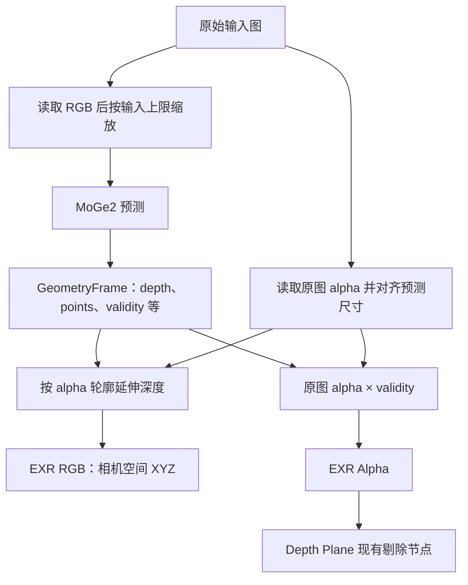

## Context

动机见 proposal.md。当前共享 Artifact 入口合成黑底；GeometryFrame 保存原始模型 mask；EXR 写入 XYZ 与 mask。补边按 alpha 分量组织，但用包含 mask 的来源集合计算内部距离，会把内部 mask 孔洞也纳入修补。Depth Plane 已支持读取 EXR Alpha，默认 Validity Threshold 为 0.9。

## Goals / Non-Goals

本设计将输入颜色、轮廓深度修补和输出有效性分别放在模型输入准备、深度处理、EXR 写入三个边界。实施范围为共享深度产物及消费者测试，节点结构和参数沿用当前实现。

## Decisions

### RGB 输入与 alpha 并行处理

`_limited_model_input` 先 `convert("RGB")` 再 `limit_image`，使缩放直接处理 RGB。原图 alpha 继续从业务输入图单独读取，使用现有 NEAREST 对齐预测尺寸。这里的原图是本次 Job 输入，包含 Remove BG 等已经完成的 alpha 编辑。

### alpha 决定修补范围，mask 筛选来源

在 `edge_depth.py` 中分别计算 alpha 轮廓区域与深度来源：可见分量沿用调用方 alpha_threshold；内部距离由 alpha 条件确定。保留现有内部 2 像素保护带、轮廓外 4 像素采样延伸及局部平滑。

来源同时满足 alpha 条件、原始 validity > 0.5、有限正深度，优先使用同一分量内部来源；细小分量沿用分量内来源回退。低 mask 仅影响来源资格，不扩大修补目标或侵蚀轮廓内部区域。alpha 全 1 时保持现有直接返回行为。

修改深度后按目标像素射线重建 XYZ，保持未修补区域原值。修补结果的 validity 仍为模型 mask。0.5 是来源筛选条件，Depth Plane 的 0.9 是最终几何筛选阈值，两者各自保持现有用途。

### 在 EXR 写入边界组合 alpha

`write_depth_texture` 显式接收已对齐的原图 alpha，检查尺寸并以 float32 写入 `alpha * frame.validity`。统一迁移调用点，参数必需。GeometryFrame 始终保留原始模型信号，供延伸、Normal 和 Metadata 使用。

XYZ 与有效性通道各自计算：补边只改变 XYZ，alpha 乘积只用于 EXR A。Metadata 继续使用原始模型有效性、可见区域和有限正深度计算参考深度。

### 消费者沿用职责

Depth Plane 的 Valid Only 读取组合后的 EXR Alpha，继续使用现有阈值、线性采样和面域规则。Cutout 曲面由自身轮廓生成并采样 XYZ。检查共享 EXR Alpha 的校准读取，保证 Cutout 和 Relief Plane 的有效样本筛选符合组合通道语义。

## Risks / Trade-offs

- 输入图的隐藏 RGB 可能已被清除 → 使用实际可用 RGB；用保留天空 RGB 的 Remove BG 输出验证输入一致性。
- 两个连续值相乘会降低边缘有效性，例如 0.95 × 0.95 = 0.9025 → 测试直接固定乘积与当前阈值的消费行为。
- alpha 延伸只能稳定轮廓附近的深度 → 用合成深度场验证边界与来源隔离；有原始风景图时再做模型对照，截图不作为预测正确性的证明。
- 工作区有其他进行中修改 → 以当前实现为基础，独立提交本提案文件，实施时保留已有修改。

## Migration Plan

依次修改 RGB 准备、alpha 延伸范围、EXR 写入及所有调用，运行针对性与全量测试并确认正常退出。重新执行 Job 获得新产物。仅回退本变更引入的修改即可恢复旧行为。
