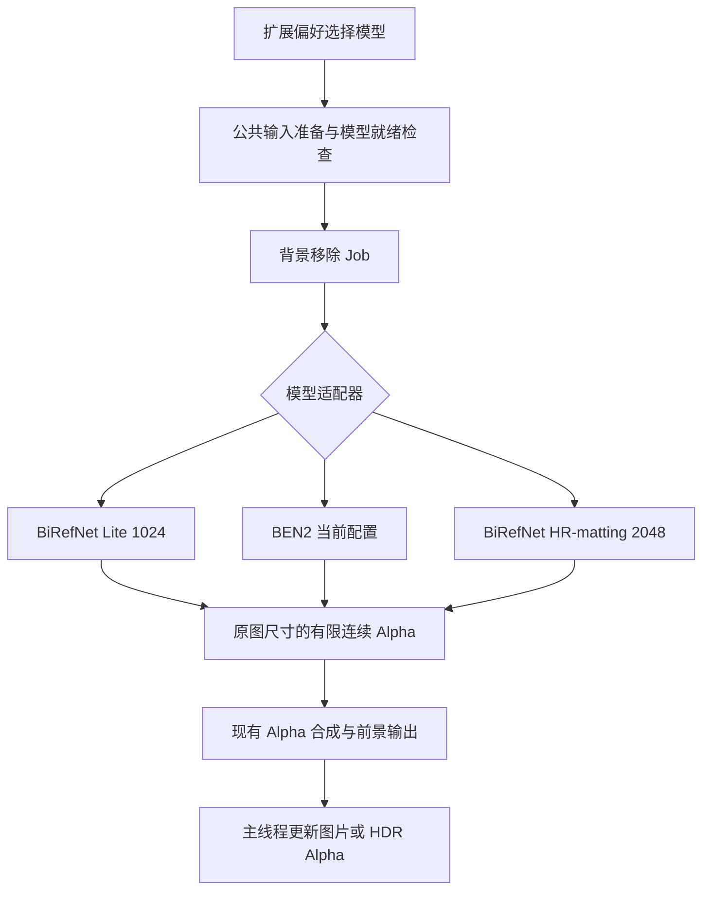
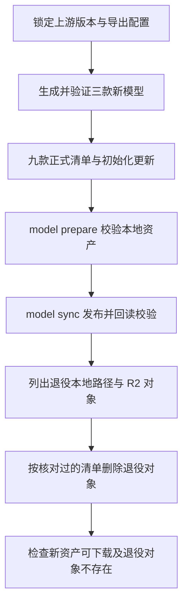

## Context

模型矩阵见 [proposal.md](proposal.md)。当前模型清单已有 MoGe-3，Upscale 已统一最终 2×，背景移除虽有偏好项，Operator 和缓存仍直接绑定 BEN2。`model prepare` / `model sync` 从清单生成文件集合，远端上传采用逐文件复制。

相关在途 change 包括 `add-moge3-model`、`add-pisa-sr-two-times-upscale`、`add-ben2-hdr-support` 和 `organize-tool-cli`。实施基于工作区实际调用链，承接其有效行为；模型成员和默认值以本提案为准。

## Goals

- 用同一模型清单驱动偏好、初始化、Job 参数、模型下载和镜像资产。
- 将各模型差异限制在适配器与少量推理配置中，复用现有图像准备、Alpha 合成、缓存和事务处理。
- 以可复现资产和 CPU / DirectML 真实推理验证完成接入，保持三档与资源需求的说明准确。

## Decisions

### HR-matting 设备决议（2026-09-10）
用户确认保留 HR-matting，暂时仅支持 CPU。2048 输入的 ONNX 在 CPU 上通过原始实现对照，DirectML 在最后解码阶段产生明显误差，多种分块导出未通过验证。正式版本采用已验证的原始 GridSample 导出结构，HR 选项标明 CPU，进度与会话缓存使用实际 CPU 设备。Lite 和 BEN2 继续使用所选设备。

### 1. 固定三类各三款，默认入口统一

模型键建议如下；已有保留模型沿用当前键：

| 分类 | 模型键，按界面顺序 | 默认 |
|---|---|---|
| Geometry | `MOGE2_VITS_NORMAL`、`MOGE2_VITB_NORMAL`、`MOGE3_VITL` | 第一项 |
| Upscale | `REALESRGAN_GENERAL_WDN_X4V3`、`REALESRGAN_X4PLUS`、`HAT_GAN_X4_SHARPER` | 第一项 |
| Background | `BIREFNET_LITE`、`BEN2_BASE`、`BIREFNET_HR_MATTING` | 第一项 |

界面显示用途与模型名：Depth 为快速/均衡/精细，Upscale 为快速/通用/精细，背景移除为快速/通用/精细抠图。说明展示真实模型特点，下载体积来自文件清单；档位名称不作为逐图质量保证。

扩展偏好读取入口集中在 `preferences.py`。初始化所需模型从三个类别的默认值派生；新安装只准备 MoGe-2 S、WDN 和 BiRefNet Lite。读取持久化选择时，保留有效键，类别外的键归一为该类别默认值。外部提交未知或退役模型键的 Job 明确失败，避免静默使用不同模型。

背景模型资源分类改为职责名称 `background`，同步修改生产者和消费者。依赖 BEN2 名称的公共常量、缓存接口和进度文案按实际职责重命名；BEN2 专用 ONNX 适配器继续明确命名。

### 2. 背景移除共享编排，按模型适配 Alpha

公共编排从 `models/ben2.py` 调整为背景移除职责模块。Lite 和 HR-matting 使用一个 BiRefNet 适配模块及各自配置，保留官方 RGB 归一化、输入尺寸、输出激活和缩放约定。BiRefNet 的概率 Alpha 按官方语义处理，避免套用 BEN2 的输出归一化造成半透明区域失真。

共享输出为原始分析图片尺寸的 `float32` Alpha，范围 `[0,1]`，保留连续透明度。静态前景、多帧前景和 HDR 的 Alpha-only 路径复用当前协议；原图颜色与已有 Alpha 的合成遵循现有行为。Blender 输入准备复用 `common`，Server 复用自身 `media` 和模型工具。

缓存按模型、目录及设备识别，会话在切换和关闭时释放。同模型多帧复用会话，取消和推理失败继续遵守现有 Job 清理流程。

BiRefNet 先在隔离导出环境固定上游版本、checkpoint、许可证和预处理，再确定可通过数值验证的存储精度。Lite 约 90 MB、HR-matting 约 444 MB 仅作为评估参考；正式大小和哈希以导出文件为准。默认 Lite 需在同一设备与样图上证明比 BEN2 更低的下载体积，且热推理耗时或峰值占用至少一项更低，并记录另一项和边缘效果。

### 3. HAT Sharper 使用压缩权重、FP32 运算

HAT 上游源码固定到 `1638a9a822581657811867bf670717f8371fc3e5`，使用官方 Sharper 检查点中的 `params_ema`。离线导出关闭常量折叠，以免预展开注意力偏置扩大文件；浮点权重存为 FP16，在原图运算前 Cast 回 FP32。输入输出保持 FP32，正式 Runtime 沿用 ONNX。

实验记录：

| 项目 | Sharper 实测 |
|---|---|
| 参数量 | 20,772,507 |
| FP32 ONNX | 87,221,721 bytes |
| 压缩权重 ONNX | 45,874,438 bytes |
| DirectML，RTX 5070 Ti，256×256 输入 | 热推理中位数约 0.563 秒 |
| 与 FP32 PyTorch 对照，4 张裁片 | 最大样本 MAE 0.000190，最大像素误差 0.007370 |
| 执行检查 | CPU 与 DirectML 通过；DirectML profile 的计算事件均在 GPU |

检查点 SHA-256：`5800b67136006eb8cab3b4ed7c8d73b6a195bb18e6cc709b674f9aa069c00271`。实验压缩模型 SHA-256：`032d8b03c704220a08d91465a822aca252c1d6e63db20c3cf23c5fb67f3d2366`。正式导出器规范化后重新记录产物哈希，并执行同样的精度校验。

参考：[本地验证报告](../../../.model-cache/hat-validation/report.md)、[官方 HAT](https://github.com/XPixelGroup/HAT)。本地报告位于忽略目录，上表和哈希作为 change 的持久验证摘要。

全 FP16 和已试的混合精度运算在 DirectML 中产生 NaN，因此选择已经验证的 FP32 运算方案。该选择优化磁盘和下载成本，运行内存按 FP32 计算评估。Sharpness 是用户已比较确认的视觉偏好，产品说明应表达细节增强，而非原始噪点保真。

### 4. Upscale 沿用 2×，HAT 使用独立分块参数

共享超分路径仍为：RGB 推理 4× → Lanczos 缩至 2× → 合成按现有规则缩放的原始 Alpha。多帧、输入尺寸上限、取消与错误处理保持同一流程。

HAT 采用固定 256×256 ONNX 输入，通过 padding 与分块支持任意合法图片尺寸。先以已测的 48 像素边距、160 像素有效步长作为正式候选；两个 Real-ESRGAN 保持各自当前配置。参数通过模型明确选择，共享拼接实现。

在 448×224 样图上，Sharper 的接缝梯度误差从边距 16 的 4.17 降到边距 48 的 1.44（8-bit 单位），代价是该图从 2 块增加到 6 块。实施时补充自然纹理跨缝、细线、奇数尺寸、小图和透明图片验证；可见接缝存在时先修正分块，验证通过后确定发布资产。

### 5. 从新模型发布推进退役资产清理

退役范围为 DA3 全部现存变体、`moge-2-vitl-normal-onnx`、`safmn-real-x4` 和 `pisa-sr`。DA3 从实际本地目录及远端对象清单识别，覆盖已知 BASE、SMALL 和发现的其他 DA3 变体。清理对应专用源码、导出器、构建登记、依赖和开发源权重缓存。

R2 逐文件上传不会自动清理旧对象。本次退役作为有明确对象清单的一次性迁移：保存删除前清单，确认完整前缀属于该模型，先验证新资源再删除并复查。`model sync` 继续按正式清单发布；其他远端对象维持原样。用户自行配置的模型缓存按显式列出的模型目录操作，用户图片与 Job 产物保持独立。

## Risks / Trade-offs

- Lite 已通过 CPU / DirectML 对照；HR 固定使用 CPU → 逐图误差、边缘效果和资源成本记录于本 change，设备限制明确显示在选项中。
- HAT 比当前 x4plus 更慢，较宽边距增加推理次数 → 默认继续使用 WDN，记录热推理与整图耗时，验证取消响应和资源释放。
- HR-matting 高分辨率 CPU 峰值工作集约 19.3 GB → 标明 CPU 与高资源成本，保留 Lite 和 BEN2 供日常使用。
- 多个相关 change 在工作区并行演进 → 开始实施时核对真实调用链和改动，保持 MoGe-3、HDR 与 2× 输出的行为覆盖；本提案只覆盖模型调整。
- 远端删除不可依赖重新同步自动恢复 → 发布前固定可复现来源、大小和哈希；清理失败时保留明确的未完成对象清单，修复后逐项继续。

## Migration Plan

先完成新模型资产验证，再统一模型选择和生产调用，最后发布并回读新镜像、清理退役模型。有效的已有模型偏好保留，退役选择归一到类别默认值；首次安装改用三个轻量默认模型。

实施运行相关行为测试和全量测试，确认正常退出，并检查退役引用、依赖与打包清单。验证记录写入本 change；用户文档构建和扩展打包保持独立于本次实施任务。
