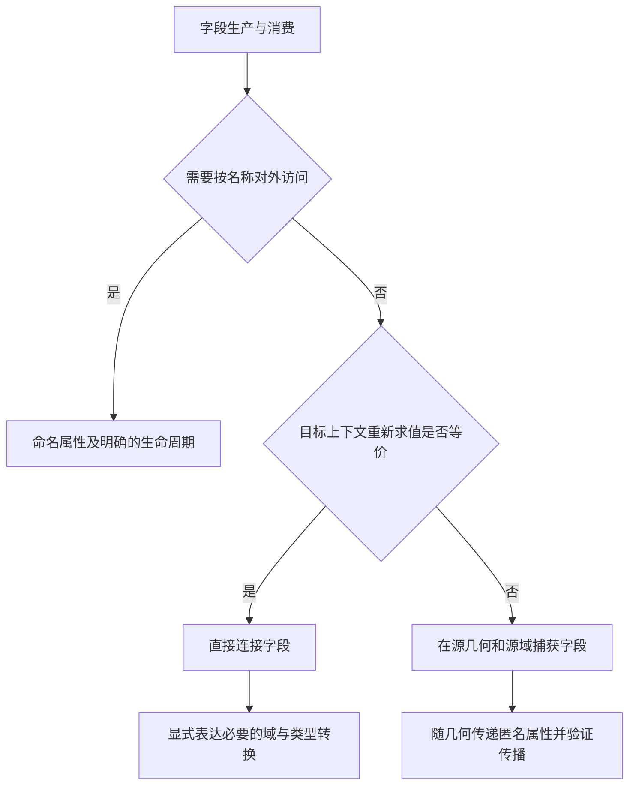

## Context

动机见 `proposal.md`。`tools/nodes/build.py` 构建七个几何节点组和三个材质节点组；材质组作为属性消费者纳入检查。现有测试包含真实 Blender 求值，也有通过临时属性或默认节点编号定位中间阶段的用例。

`docs/internals/node-assets.md` 当前按跨区域距离推荐命名属性。Depth Cutout 的 `_depth_volume` 同时依赖 `Store Named Attribute.005`、`Math.018` 等默认编号，并通过几何输入反查阶段。删除存储节点必须同步调整这些连接。

## Goals / Non-Goals

以等价几何、求值域、数据类型、属性版本和求值时机为验收边界，简化字段传递。修改器接口、几何结果及对外属性协议保持一致。

## Decisions

### 按实际消费者判断字段传递

以构建入口为清单，逐项记录 Store 的名称、类型、域、Selection、输入几何、读者及读取位置。重复写入同名属性按不同版本追踪，检查输入网格和材质中的外部读写；消费次数仅作为排查线索。

直连允许多个消费者。跨区域或连线较长交给布局处理。只要几何、域或输入属性版本变化会改变字段结果，即使只有一个消费者，也保留求值快照。Capture 必须接入产生该快照的几何链，并沿分支传播至消费者；确有按名称访问需求时才使用 Store Named Attribute。

### 已定位的调整清单

下表是源码核查结果；涉及上下文传播的候选必须通过 Blender 求值确认后落地。

| 范围 | 当前字段或链路 | 调整判断 |
| --- | --- | --- |
| 共用 Depth Surface；Depth Plane、Depth Cutout、Panorama | `o_depth_face_center`、`o_depth_face_camera` | 相邻面采样和分裂前计算优先直接连接；显式保持 FACE 求值，尤其保证图像在面中心采样后再用于角域，避免变成逐点采样的平均值 |
| 共用 Depth Surface | `o_depth_camera` | 当前结果写入 POINT 后只供紧接的投影字段使用，优先改为返回字段；保持 CORNER 到 POINT 的转换顺序 |
| 共用 Depth Surface | `o_depth_corner_camera`、`o_depth_cut_vertex` | 跨 Split Edges 和删面保存分裂前数据；保留快照，优先用匿名属性传递 |
| 共用厚度构建 | `o_depth_surface_position`、`o_depth_source_vertex`、`o_depth_surface_normal` | 跨展平、挤出、合并、恢复位置使用；保留源位置、身份和法线快照，验证匿名属性在所有分支上的传播 |
| Depth Cutout | 中心 seed 写入 `o_balloon_surface_center`，读取做 Blur，再覆盖同名属性 | seed 直接接 Blur；最终中心值跨壳体变形的快照独立保存，避免改变 Blur 权重和域 |
| Depth Cutout | `rim`、`center`、`thickness`、`edge_weight`、`front_delta`、`normal`、`structure`、`front_normal`、`inflation_normal` | 逐版本核对计算与壳体消费者；局部算术直连，源表面上的 Blur、Normal、边界与统计结果在变形前固定；Uniform 与 Balloon 分支都提供消费者所需数据 |
| Panorama | `o_panorama_direction`、`o_panorama_uv`、`o_panorama_distance`、`o_panorama_invalid` | 同时检查删面、分裂、极点和周期采样；等价上下文的 UV 与采样直连，需保留原球面数据的路径捕获；invalid 的 POINT 到 FACE 聚合需显式保留 |
| Image Plane | Grid、Cube 写入 `UVMap` | 输出 UV 是材质接口，保留命名属性及 CORNER 域 |
| Image Cutout、Depth Balloon、Depth Cutout | `o_balloon`、`o_normal_scale` | 核对 Shape 输入和材质消费者，保留命名协议、正背面掩码和域 |
| Relief Plane 及三个材质组 | UV 与材质属性读取 | 检查实际生产者及外部消费边界，保证现有着色与位移行为 |

不采用按读者数量自动消除 Store 的图优化器：域转换、同名覆盖和隐式字段上下文需要业务判断，直接修改构建函数更容易验证。

### 通过函数返回值连接阶段

共享构建函数按需要返回几何 socket 与字段 socket，调用方显式传递。Depth Cutout 直接获得投影表面、厚度构建和恢复位置等阶段引用，替换本次影响到的默认编号定位和节点输入反查。简单场景用普通返回值或元组；确需多个有名称的输出时用小型字典。

复用 `tools/nodes/common` 的现有辅助函数；仅在多个实际调用方共享同一操作时提取公共函数。完成调用方迁移后删除失去业务用途的存取辅助函数与临时属性清理节点。

### 规范修改内容

在 `AGENTS.md` 的 Blender 节点组规范加入简短原则，在 `docs/internals/node-assets.md` 替换现有三条字段入口和暂存规则：

- 字段默认直接连接，多个消费者可复用同一输出；以实际消费位置的几何、域、类型和输入属性版本验证等价性。
- 域转换使用 Evaluate on Domain 或明确域的采样节点表达；跨几何变化需要固定源值时使用 Capture Attribute，并明确捕获时机和传播路径。
- 命名属性用于需要按名称访问的数据协议；明确名称、数据类型、域、写入选择和消费者。内部临时命名属性使用专用 `o_*` 前缀，在最后消费者之后按该前缀清理，保留 UV 和外部协议属性。
- 布局通过区域内 Group Input、字段分支排列和必要的 Reroute 保持可读；新增存储须有数据生命周期依据。
- 构建阶段通过明确节点或 socket 引用接线。

### 验证与资产交付

先记录当前真实几何行为和各组存取节点数量，作为结果与简化规模的基线。数量只用于报告；测试以等价求值和必要数据边界为主。

复用并补充面域与角域不一致的非均匀深度、Split 开关、零厚度及正厚度、独立重叠表面、Balloon/Uniform 与法线平滑、Panorama 接缝与无效像素场景。对不再存在的临时属性测试，改为通过测试输出捕获待验证字段或检查最终网格，不为测试保留生产命名属性。

运行相关节点与材质测试，执行 `uv run node-group build`，完成保存后独立 Blender 加载验证，再运行 `uv run pytest` 并确认退出成功。检查重建资产的接口、布局、UV、材质属性及临时属性清理；源码、测试、规范和 `.blend` 资产作为一个完整变更交付。

## Risks / Trade-offs

- 字段直连推迟求值或改变域转换顺序 → 使用面内非均匀输入验证；保留明确的域转换和必要快照。
- 匿名属性跨分支、挤出或合并丢失 → 核对每条几何来源，并检查最终网格的顶点身份、封口和法线。
- 同名属性覆盖导致读取错误版本 → 拆出不同阶段的字段引用，明确消费者依赖的版本。
- 删除存储改变默认节点编号 → 同步替换受影响的隐式接线，检查最终真实连接。
- 直连使布局跨度增加或重复计算 → 使用现有排列器验证可读性；只有实际求值证据支持时引入捕获。
