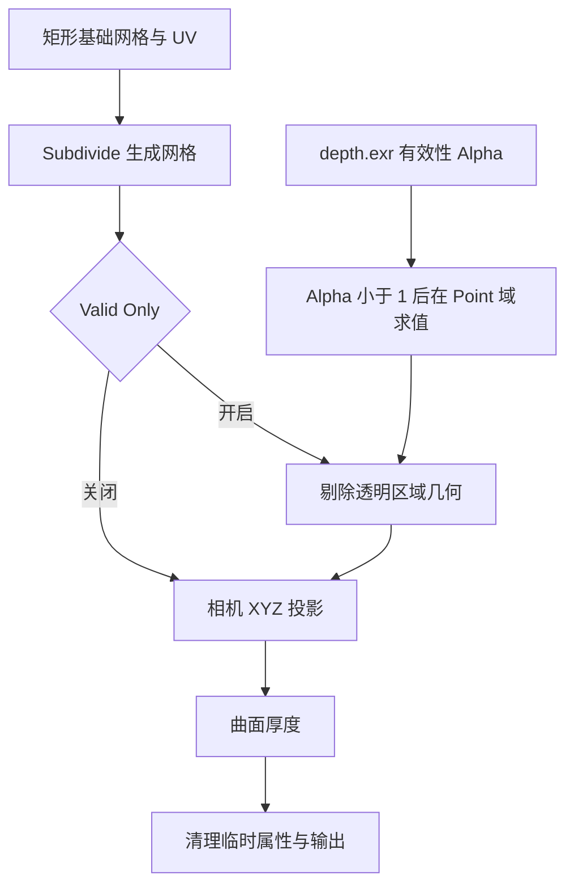

## Context

两个转换入口分别使用相机投影和浮雕节点组。Server 生成相机 XYZ 深度与对应空间的法线，客户端创建矩形基础网格并加载节点组。depth.exr 的 Alpha 存储模型有效性，作为 Valid Only 的判定依据。

工作区已有材质和转换代码修改，实施须以当前代码为基础保留这些行为。

## Goals

提供独立的 Depth Plane 与 Relief Plane 转换；Depth Plane 在节点内按深度有效性 Alpha 剔除几何，保留动态细分，并使用 Object Space 法线。

## Decisions

### 入口与节点资产

| 入口 | Operator | 节点组 | 形状 | 法线空间 |
| --- | --- | --- | --- | --- |
| Convert to Depth Plane | `anyimage.convert_to_depth_plane` | `O Image Depth Plane` | 相机投影曲面 | OBJECT |
| Convert to Relief Plane | `anyimage.convert_to_relief_plane` | `O Image Relief Plane` | 固定底面浮雕 | TANGENT |

两个节点组各自保留 Subdivide、Thickness、Depth Scale、Reference Depth 及所需数据输入。Depth Plane 额外保留 Normal Smooth，增加默认开启的 Valid Only。Relief Plane 延续原 Relief 的厚度与位移语义。移除 Mode 与 Camera Thickness 命名，各组使用自己的 Thickness。

两个 Operator 共用图片准备、Job 调度和产物加载函数，通过可序列化业务参数区分转换类型。后端沿用整图深度 Job，并根据转换类型生成对应的单份法线产物。新类型纳入注册和逆序注销。

### 节点内 Alpha 剔除

剔除读取depth.exr 的有效性 Alpha，并使用原图 UV。直接使用 Data 中已有的 Depth Image 输入。用户只控制 Valid Only 和已有 Subdivide；内部使用 Linear / Extend 深度采样，Separate Color 的 Alpha 接 Float / Less Than（B = 1），再经 Boolean / Point 的 Evaluate on Domain 接 Face / All 的 Delete Geometry。仅全部顶点有效性均小于 1 的面删除，混合边界面保留。

剔除在几何节点中每次求值，避免将轮廓烘焙为固定网格。Valid Only 关闭时，投影与厚度接收完整细分网格。节点处理保持 UV、原图构图和世界位置。

### 最终几何平滑

Depth Plane 在投影、厚度及临时属性清理后直接调用 `node_graph.expand_smooth()`，复用 Depth Cutout 的 Smooth 模块。主接口 Smooth 默认 0、范围 0–20；Options 中 Smooth Weight 默认 1、范围 0–1，subtype 为 FACTOR。其后执行平滑着色与输出。

### 法线产物与材质

Depth Plane 请求并读取 `object_normal`，通过 `create_image_material(..., normal_space="OBJECT")` 创建材质；Relief Plane 请求并读取 `tangent_normal`，使用 TANGENT。复用现有法线编码和材质入口，确认相机轴到对象局部轴的转换与曲面投影一致。

深度继续使用 `depth`、`depth_metadata` 协议，RGB 保存相机 XYZ，Alpha 保存有效性。

## Risks / Trade-offs

- Alpha 边界受网格密度影响 → 用有效性为 0、介于 0 和 1、混合边界和细窄结构验证参考图的宽松规则，并检查调整 Subdivide 后的实际结果。
- Object Normal 与局部投影坐标不一致会造成明暗反向 → 验证法线轴向、材质空间设置及对象旋转后的表现。
- 裁剪后的开口边界影响曲面厚度 → 在零厚度和正厚度下验证边界、UV 与几何求值。
- 节点资产接口发生破坏性变化 → 构建脚本、验证及测试按两个独立资产同步更新，删除合并模式的旧连接与引用。

## Migration Plan

实现顺序为入口与请求分流、法线产物绑定、节点组拆分、Alpha 剔除、验证与测试。沿用现有 Depth Plane 标识作为 Camera 入口，新增 Relief 标识，不增加旧模式兼容层。节点接口变化同步节点资产文档。

代码阶段运行测试；资产构建与 Blender 节点编辑器视觉验收作为后续资产更新阶段单独执行，交付时分别说明完成状态。

## Reference Graph

用户参考图已确认：Separate Color / Alpha → Less Than 1 → Evaluate on Domain（Boolean、Point）→ Delete Geometry（Face、All）。Valid Only 通过几何 Switch 控制此段，关闭时使用完整细分网格。节点资产构建和 Blender 检查已获用户授权。
