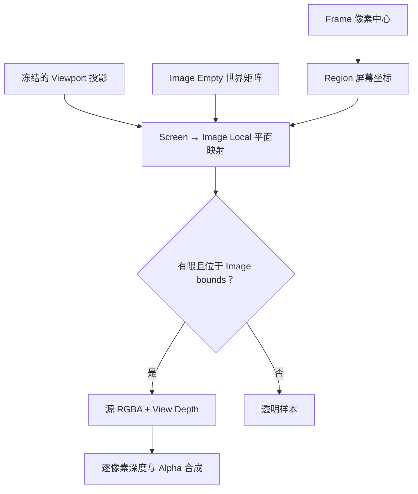

## Context

Frame 当前把每个 Image Empty 的四个本地角投影到 Region，要求结果是有限凸 Quad，再由 `screen_quad → source pixels` Homography 对输出像素采样。`_frame_source()` 还要求四个角的视图深度全部大于固定阈值，`composite_frame_pixels()` 则把深度不为正的样本设为透明。

这套表示只适用于完整图片位于透视观察原点前方的情况：

- 正交投影的屏幕坐标不因观察原点前后而产生透视奇点，但现有统一深度检查仍会拒绝它。
- 透视图片穿过观察原点时，完整图片投影会经过无穷远，不能表示成一个有限凸 Quad；然而 Frame 内的许多屏幕射线仍可能与图片前方部分形成稳定交点。
- 简单删除报错会把非凸、翻转或经过无穷远的角点继续交给 Quad Homography 与 SAT 重叠判断，无法保证采样正确。

Frame 仍然只烘焙 Image RGBA 与几何投射，不是 Viewport 截图，因此场景遮挡、Grid、Gizmo、Overlay、显示 tint 与 Color Management 不属于本变更。

## Goals / Non-Goals

**Goals:**

- 让正交视图中的 Frame 不受透视观察平面深度符号限制。
- 在透视视图中支持 Image Empty 部分跨越观察原点，只采样观察方向前方的有效部分。
- 使用同一套输出驱动求交模型计算源像素位置、样本有效性与逐像素深度。
- 保留无 active 几何交叠 warning，并使判断覆盖无界或被 Frame 截断的投射。
- 在 active 原点无法作为可见结果深度时，为结果 Image Empty 选择稳定、可解释的前方深度。

**Non-Goals:**

- 不捕获 Blender Viewport framebuffer，也不复刻其他对象遮挡或 Overlay。
- 不把透视观察方向后方的平面交点镜像到结果中。
- 不改变 Viewport `clip_start`、`clip_end` 或 Image Empty 自身显示规则。
- 不改变 Frame 的输出 Canvas、分辨率限制、插值、Alpha、选择集合和对象生命周期语义。

## Decisions

### 1. 以屏幕观察射线到图片平面的映射替代角点 Quad

对每个源对象，组合冻结的 Viewport 投影矩阵与对象世界矩阵，得到本地图片平面 `z = 0` 到 clip-space 的三阶 Projective Transform。Frame 输出像素中心先映射到 Region screen-space，再通过该变换的逆映射得到图片局部坐标，最后按 Image Empty bounds 换算为源像素坐标。

这与“从屏幕像素生成观察射线，再与图片平面求交”等价，但可以继续使用 NumPy 分块向量化，不需要为每个像素创建 Blender `Vector` 或调用几何 API。

逆映射的齐次分母接近零表示该屏幕射线与图片平面平行。该像素作为无效透明样本处理；只有整个有效投射无法稳定求解时才取消操作。容差按矩阵和齐次量级计算，不再使用固定世界单位的 `1e-8` 作为整张图片的有效性条件。

### 2. 投影模式分别定义样本有效性

正交视图的观察射线互相平行，视图深度的符号不构成投影奇点。局部交点有限、映射稳定且位于 Image Empty bounds 内时，样本有效；其带符号视图深度继续用于多个源之间的前后排序。

透视视图只接受视图深度严格位于观察方向前方的交点。图片跨越观察原点时，前方交点正常采样，后方交点和射线平行位置透明。深度比较继续在同一个屏幕像素的观察射线上进行，因此可保持多张倾斜图片逐像素变化的遮挡关系。

### 3. active 交叠使用可求交区域

Frame 成功条件仍要求 Frame 与 active Image Empty 有正面积几何交叠，但交叠对象改为“在当前投影模式下可稳定求交且位于 active 图片 bounds 内的区域”。它不依赖源图片四角形成有限凸 Quad，也不依赖源图片 Alpha。

实现使用齐次平面投影裁剪得到 active 的有效前方区域，再与 Frame 矩形裁剪并计算正面积。逐输出像素是否恰好命中 active 不作为唯一成功判断，避免极窄但有效的交叠因输出分辨率取整而被误判。

### 4. 结果深度优先保持 active 原点语义

正交视图继续使用穿过 active 对象世界原点的视平面放置结果，因为任意有限深度都能保持相同的正交屏幕覆盖。

透视视图中，active 原点位于观察方向前方时继续沿用其视图深度，保持既有结果位置。若 active 原点不在前方、但 active 图片与 Frame 存在有效前方交叠，则以该交叠区域的屏幕几何中心生成观察射线，并采用它与 active 图片平面的正深度作为结果平面深度。由此得到的 view-facing 结果仍严格覆盖 Frame，同时位于实际被烘焙内容的代表深度。

如果代表射线无法稳定求交，系统取消操作并保持输入不变，不使用任意常量或 Viewport clip 距离猜测结果位置。

### 5. 退化只淘汰受影响区域

单条射线平行、位于透视观察方向后方或映射到图片 bounds 外时，只让对应源样本透明。以下情况才取消整个操作：

- 源平面到 screen-space 的 Projective Transform 不可逆或非有限。
- Frame 与 active 的有效投射没有正面积交叠。
- active 的结果深度无法按既定规则稳定取得。
- 既有的 Frame 尺寸、图片数据或对象状态校验失败。

非 active 图片没有有效样本时可以继续作为透明参与源，并沿用 Frame 成功后消费全部参与 Image Empty 的既有语义。

## Risks / Trade-offs

- [跨观察原点的投射包含无穷远分界] → 使用输出驱动逆映射，按像素屏蔽齐次分母退化，不构造完整有限 Quad。
- [容差不当造成边界闪烁或误杀] → 使用与矩阵量级相关的齐次容差，并覆盖不同对象尺度与极近正深度测试。
- [active 原点在视后方时结果深度发生变化] → 仅在原点无法产生可见结果时使用有效交叠中心深度，正常情况保持既有语义。
- [有效交叠很窄而输出像素未命中] → 成功判断使用连续几何裁剪面积，不依赖离散采样结果。
- [正交视图中的带符号深度排序与现有正深度假设不同] → 明确拆分投影模式，并用前后对象、共面 active 和负深度样本测试验证排序。

## Migration Plan

实施时先建立独立的屏幕到图片平面映射和有效区域裁剪函数，再替换 Frame source descriptor 与合成采样，随后调整结果深度选择。保留现有普通透视、Alpha、多图排序、Frame Canvas 和对象替换测试作为回归基线，并加入新边界测试。

本变更不修改保存数据或公开 ID，不需要迁移。回滚只需恢复原 Quad 投影描述、四角正深度校验和 active 原点深度放置；已生成的 packed Image Empty 不依赖新运行时代码。

## Open Questions

无。产品语义确定为：正交视图按平行射线求交；透视视图烘焙观察方向前方的有效交点；active 原点无法提供可见结果深度时使用 active 有效交叠区域的代表深度。

