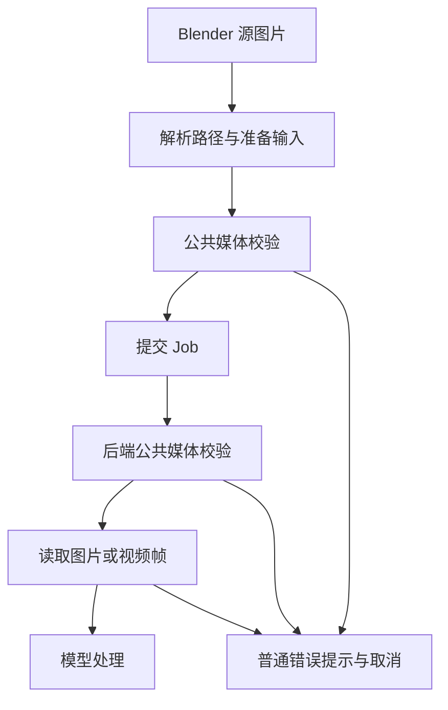

## Context

以当前工作区调用链为依据：

| 位置 | 发现 | 处理方向 |
| --- | --- | --- |
| `common/ai.py` | BEN2 专属扩展名与后端重复，Upscale 只检查路径存在 | 统一公共预检 |
| `server/media/input.py` | 扩展名提示混排；目录过滤后仅提示没有帧 | 按错误原因和媒体类别提示 |
| `server/models/ben2.py` | 单帧校验使用第三套提示 | 复用图片格式校验 |
| `common/image.py` | 路径文案限定 Image Empty；序列直接复制；packed 导出失败可能留下目录 | 使用 source 文案、复制前校验、准备失败释放资源 |
| Remove BG、Depth/Relief Plane | 内部 Operator 调用位于异常处理之外 | 捕获同步调用错误并取消 |
| `operators/ai_setup.py`、`invoke_ai_setup_if_needed()` | 下载、安装与设置入口嵌套调用 | 在公共准备入口和设置 Operator 内处理失败 |
| Panorama | 已捕获嵌套调用错误并清理 | 回归现有行为 |

BlendJob 的 `request()` 错误会被转换为 ERROR report 和 CANCELLED；Blender 的 `bpy.ops` 调用仍可能将该 report 抛为 RuntimeError。异步 Job 失败已有集中处理。前后端可以共享 `server` 内纯 Python 模块，已有 resolution 模块采用这一依赖方向；后端保持可独立加载。

## Goals / Non-Goals

统一 AI 输入校验、用户可读的错误原因、失败取消状态和临时输入生命周期。支持格式保持 JPG/JPEG/PNG/WEBP 与现有九种视频扩展名；各 Operator 继续表达自己的静态图、尺寸与比例限制。自动转码、扩展格式支持和 BlendJob 框架重构作为独立需求处理。

## Decisions

### 1. 公共媒体模块维护格式规则与提示

在 `server/media/input.py` 提供轻量路径/格式校验，按图片、视频或帧目录识别输入，图片模型使用相同规则的图片子集。模块加载和预检仅依赖标准库。

`common/ai.py` 的 `require_input_path()` 负责 Blender 路径解析并调用该规则；删除 BEN2 专属校验及扩展名常量。`prepare_input()` 在后端再次执行校验，应对独立 Job 请求和提交后源文件变化。前端和后端使用同一消息生成位置，比只在后端检查更早反馈，也避免复制列表。

### 2. 提示由原因决定，格式按类别列出

保留当前英文 UI 语言，示例模板：

- `Source image file does not exist: {path}` / `Source video file does not exist: {path}`。
- `Unsupported input format: {suffix}. Supported images: {images}. Supported videos: {videos}.` 扩展名排序且小写；无扩展名使用 `(no extension)`。
- `No supported image frames found in: {path}. Supported images: {images}.`。
- `Unable to read image: {path}` / `Unable to read video: {path}`，底层原因保留异常链供诊断。

只将路径检查、文件读取与解码边界的预期异常转换为输入提示，模型推理或资源错误保留实际原因。通用输入阶段保持图片与视频类别一致；BEN2 单帧模型内部使用图片子集提示。

### 3. 明确目录与 Blender 序列的差别

Blender SEQUENCE 在创建临时目录前验证源扩展名属于支持的图片格式，不支持时直接报格式错误。已识别的同名序列按原排序和帧区间处理。

通用目录仍仅选择支持格式的图片文件并忽略其他文件；预检与后端使用同一收集规则。全无有效图片时报告目录及支持图片格式。这一提案修复 Blender 序列被误报为空目录的问题，混合目录按筛选契约验收。

格式校验针对实际提交文件。packed 图片和像素裁剪输出使用现有 PNG 导出路径，普通文件继续使用原始文件；测试应明确两条路径的预期，避免把源名称当作实际编码。`IMAGE_NAME_SUFFIXES` 是命名识别列表，继续按命名职责维护。

### 4. 在拥有调用与资源的边界处理失败

Remove BG、Depth/Relief Plane、AI Environment 的嵌套 `bpy.ops` 调用捕获预期 RuntimeError；涉及输入准备的边界同时处理 OSError/ValueError。通过已有 report 出口返回 CANCELLED，规范 Blender 添加的首个 `Error: ` 前缀与尾部换行，保留实际原因。公共 AI setup 入口复用同一报错约定；异步 Job 仍由 BlendJob 管理。

临时输入在准备完成前由准备函数拥有；Job 成功接管后由 Job cleanup 拥有。准备失败、同步调用抛错、返回 CANCELLED 和异步失败分别验证释放责任。packed 导出失败应清理整个临时目录。清理只能触及本次操作创建的输入，不影响用户原文件和源图片引用。

优先在现有公共函数与直接调用处落实职责；复用消息格式化即可，保持各业务 Operator 的调用和资源归属可见。

## Risks / Trade-offs

- 前后端文件状态可能变化 → 后端复核并提供同一原因分类。
- 测试 mock 不会自动模拟 Blender report 抛错 → 单元测试注入 RuntimeError，补充真实 Blender 入口验证。
- 调用层次多可能重复 report → 以最终用户提示无重复前缀、无 Python traceback 为验收点，检查 Blender UI 实际输出。
- 解码错误与推理错误容易混淆 → 只在读取边界包装解码异常。
- 其他未归档变更修改相关入口 → 以实施时工作区为基线，保留 Undo、源图共享引用及 Panorama 行为。

## Migration Plan

依次落地公共校验、消费者接入、调用边界与清理，再运行相关及全量测试。删除旧 BEN2 校验入口并检查引用。变更不涉及持久数据迁移；必要时可整体回退本变更代码与测试。

## Open Questions

无实施前置问题。真实 Blender 下 report 的重复展示情况列为实施验收项。
