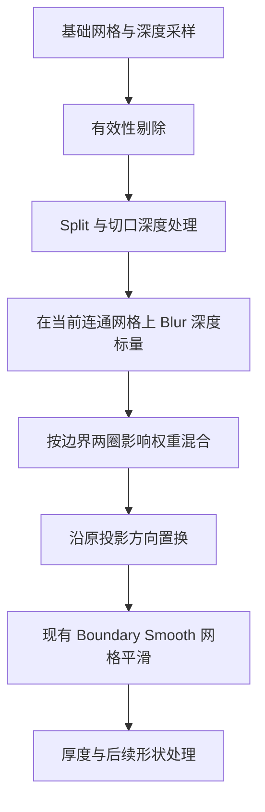

## Context

当前三个深度表面均在投影后执行 Boundary Smooth。Depth Cutout 保护原 Alpha 轮廓的三维位置，Depth Plane 平滑有效性剔除形成的新边界，Depth Panorama 平滑球面的实际开口。

独立实验复用了猫、幼虫和人物的已有深度数据。Cutout 的六个网格在 4、12 次深度 Blur 后明显减少尖刺；Depth Plane 在 Subdivide 4、6 和 Boundary Smooth 5、12 下也有改善。两轮实验均验证关闭还原、拓扑保持和厚度／Split 组合。全景尚需专项验证。

实验文件位于本机临时目录 `anyimage-boundary-depth-trial`：`boundary-smooth-comparison.blend`、`convert-boundary-comparison.blend` 及对应指标 JSON。正式回归测试使用可重建的合成数据；实图用于人工验收。

## Goals

- 三个已有 Boundary Smooth 的深度表面使用同一标量平滑规则和参数语义。
- 在边界窄带降低采样深度突变，保留内部数据及对应投影方向。
- 通过现有公共节点构建模块复用实现，并更新可直接加载的节点资产。

## Decisions

### 求值顺序

共享实现位于 `tools/nodes/common/boundary_smoothing.py`，输入深度标量和边界保护字段，输出平滑后的标量。字段在剔除和 Split 后、置换前的 Point 域求值，使已删区域及已分离表面按当前拓扑隔离。各组负责把标量接入自身的投影表达式。

### 参数与影响范围

`Boundary Smooth` 同时给深度 Blur 和现有网格平滑提供迭代数，默认 `5`、范围 `0–20`，保持已有 socket 标识。实验中的独立 `Boundary Depth Blur` 输入收敛为现有控制项。

深度 Blur 使用 `FLOAT`、固定 Weight `0.5`。令 `B` 为可处理的边界点字段，`P` 为保护字段：

- 在当前网格上对 `B` 执行 2 次、Weight `1` 的 Blur。
- 应用权重为 `max(B, blurred_B) * (1 - P)`，外边界完全应用，邻近两圈逐渐减弱。
- 原深度与平滑深度按该权重混合。
- 迭代数为 `0` 或权重为 `0` 时直接返回原采样值，保证关闭及影响范围外的精确保持。

深度计算和影响权重使用共享字段连接。`Smooth Weight` 延续现有网格平滑职责，深度 Blur 的固定 Weight 与独立实验一致。

### 三个节点组的边界与投影

| 节点组 | 深度 Blur 影响边界 | 标量与重建方式 |
| --- | --- | --- |
| O Image Depth Cutout | 原 Alpha 轮廓及内侧两圈，保护 Split 边 | 按当前残差分批自适应平滑相机 Z；按新旧 Z 比例缩放原相机点，再进入现有投影 |
| O Image Depth Plane | 有效性剔除及 Split 后的新边界；保护 UV 原矩形外框 | 平滑相机 Z；按原相机射线重建点，再进入现有投影 |
| O Image Depth Panorama | 球面有效性剔除及 Split 后产生的实际开口 | 平滑有效径向距离；保持球面方向，再进入 Depth Scale 的半径表达式 |

Cutout 原轮廓的深度可以变化，后续网格平滑继续使用现有原轮廓保护字段。这样保留图像投影轮廓，同时允许轮廓深度变平顺。Depth Plane 的矩形外框保护同时约束影响起点和最终权重。

Panorama 的经度接缝和极点依照真实球面拓扑求值；UV 接缝本身不形成平滑边界。径向距离的平滑只作用于有效采样，被 mask 判无效的面在 Depth Mask 关闭时整片落到 `Dome Radius`，不参与边界平均。

相机 Z 重建必须处理零值及不可用于比例计算的采样，直接保留对应原点值，保证结果有限。投影方向保持的断言放在深度平滑／置换阶段；后续网格平滑仍按既有规则移动顶点。

### 节点与资产组织

Depth Cutout 的自适应实现位于 `common/outline_smoothing.py`。公开 `Outline Depth Fix`（默认 16，0–200），每轮重新计算当前相机深度残差，`Boundary Smooth` 提供该轮固定权重 Blur 的步数。残差换算至模型单位后除以置换前、Split 清理后全部边长的中位数，固定通过 0.25–0.5 Smoothstep 得到权重，再乘原轮廓两圈影响范围；不对 Weight 做 Blur。批内 Weight 在 Repeat 输入几何上显式采样，原轮廓对应关系在平面源几何上求值。复用现有切分属性保护 Split 边及交点，不新增命名属性。Cutout 资产及运行时请求版本更新为 21。

公共函数以标量字段为复用边界，三个消费组分别完成相机与球面重建。使用显式域转换及明确源几何采样，所有几何组与嵌套组保持 Capture Attribute 为零。直接连接可复用字段；必要的现有临时命名协议在最后消费者后清理，保留用户属性。

实施时读取当前工作区基线，保留其他修改。完成源码与测试后运行 `uv run node-group build`，更新 `O_AnyImage.blend` 并独立加载验证接口、求值和节点布局。

三个消费组的资产版本统一设为 12，运行时通过 `load_node_group(..., asset_revision=12)` 请求。加载器保留当前文件中旧组及其现有使用者，为新建对象读取新版本；对应 Operator 回归覆盖旧组存在时的行为。

## Risks / Trade-offs

- 稀疏网格的两圈覆盖范围较宽，较高迭代数可能软化真实轮廓深度 → 保留默认值 5，并用 Subdivide 4、6 对比 5、12 的效果。
- 深度 Blur 与后置网格平滑叠加 → 分别检查置换阶段的射线保持、最终尖刺改善和整体形状，不把梯度下降单独视为几何更准确。
- 模型 validity 开口可能位于物体内部 → 使用内部孔洞、真实深度断层与孤立尖刺的合成用例，检查影响范围及不同连通表面的隔离。
- 球面方向和径向距离与相机 Z 语义不同 → Panorama 使用径向适配，覆盖经度接缝、极点、Depth Mask 两个分支后再交付。
