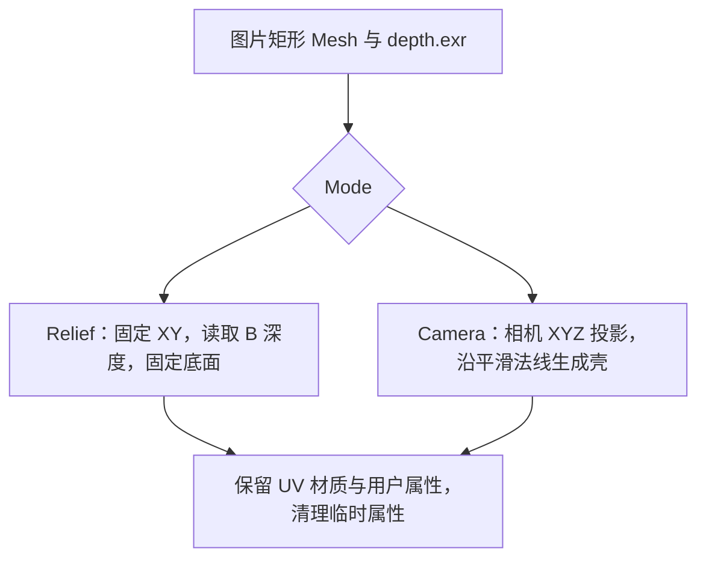
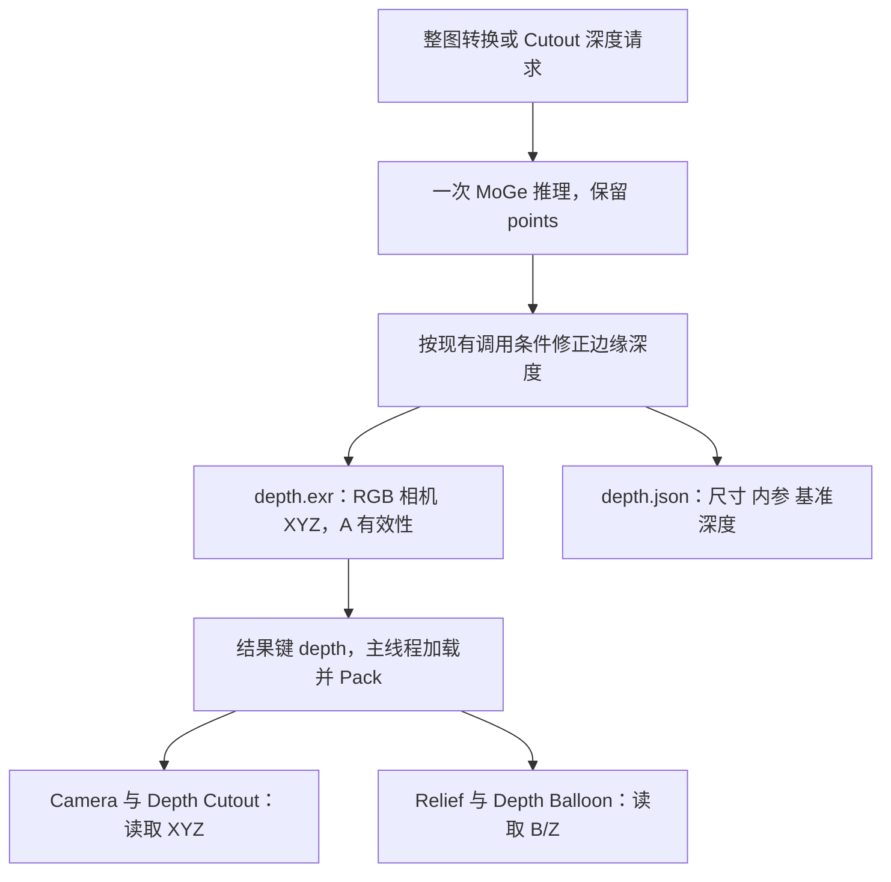

## Context

`build_depth_plane.py` 当前读取纹理 R 通道并生成固定底面浮雕；`build_depth_surface.py` 使用 XYZ 投影并沿平滑法线生成壳。Cutout 的 Depth Solid 请求 VECTOR，Depth Balloon 请求 Z，但 Balloon 节点和 `common/depth.py` 已读取 B/Z。Server 将两类产物写成相同规格的 RGBA float32 EXR。

本设计以当前工作区已实现的 `add-projected-depth-plane` 为基线，覆盖其中关于独立 Surface 入口与 Z/VECTOR 双产物的决定。

## Goals / Non-Goals

统一整图深度几何的交互入口和深度产物契约，保留两种形态及 Cutout 的现有几何效果。删除范围限定于独立 Z 文件输出及失去用途的分支；内部标量深度、标定元数据、Cutout 的形状参数继续承担原有职责。

## Decisions

### 一个入口与模式接口

保留 `ConvertToDepthPlane`、`anyimage.convert_to_depth_plane`、Convert to Depth Plane 和 `O Image Depth Plane`。删除独立 Surface 注册、菜单、类、结果类型映射和公开资产组。模式在修改器中选择，默认 Relief；模式切换只触发节点求值。

| 接口顺序 | 默认值与语义 |
| --- | --- |
| Geometry | 结构输入 |
| Mode | Relief / Camera，默认 Relief |
| Subdivide | 6，范围 0–10 |
| Thickness（Relief） | 0，最小 0，DISTANCE |
| Thickness（Camera） | 0，最小 0，DISTANCE |
| Depth Scale | 1，最小 0 |
| Options / Reference Depth | 元数据 reference_depth × Uniform Scale，DISTANCE |
| Options / Normal Smooth | 50，范围 0–50，仅影响 Camera 厚度方向 |
| Data / Uniform Scale | 隐藏，默认 1 |
| Data / Depth Image | 隐藏 |

输入统一 SINGLE。两个独立输入均显示 Thickness，依次控制 Relief 的基础厚度和 Camera 的向内壳厚度，默认均为 0 m；按不同 socket identifier 保存，切换模式保留各自数值。Normal Smooth 保留在 Options，并通过说明明确适用模式。

### 两条几何分支共用数据

Relief 沿用现有厚度、底面权重、侧面插值和负位移限制，只将标量采样改为 B/Z。Camera 沿用现有完整矩形细分与投影公式：令采样相机 XYZ 乘以 Uniform Scale 得到 C，局部 XY 从基础 XY 按 Depth Scale 插值到 `(C.x, -C.y)`，局部 Z 为 `(Reference Depth - C.z) × Depth Scale`。正 Thickness 保留正面，背面沿正面 POINT 法线按 Normal Smooth 迭代平滑并归一化后向内偏移。

共用投影和壳构建函数，两个分支由一个公开节点组组织。构建模块以职责命名；删除仅服务旧公开 Surface 组的构建和布局入口。节点资产始终按名称加载。

### 统一深度产物与请求

将深度产物选择收敛为布尔 `generate_depth`，默认 false；整图 Job 固定请求 true，Cutout 根据 Depth Solid / Depth Balloon 判断。替换 `depth_mode` 参数与 `depth_mode_for_shape`，生成法线的参数保持独立。只生成法线时仍可不保留 points。

写出函数统一为 `write_depth_texture`，沿用当前 vector 写出的 RGBA float32 数值、有效性和非有限值处理；文件名 `depth.exr`，返回键 `depth`。删除 Z 写出函数与旧结果键，直接更新全部调用和测试。所有需要深度的推理保留 XYZ，内部 `GeometryFrame.depth` 继续用于标量运算；元数据仍通过 `depth_metadata` 返回 `depth.json`。深度与法线继续来自同一次预测，保持各自现有边缘修正语义。

### 交付与验证

客户端、Server、节点构建及测试作为一次契约变更交付，不增加旧键、旧名称转发。已有 blend 内嵌旧组不主动迁移；需要新模式接口时重新转换源图片。归档时协调前序未归档规格，确保最终规格只保留统一入口和产物契约。

实现阶段更新脚本、验证、测试与节点资产文档并运行测试。资产更新阶段构建并验证 `O_AnyImage.blend`，对定义与保存资产使用同组几何用例，最后在 Blender 检查总览和局部实际绘制布局；视觉验收单独记录，不能由坐标检查代替。

## Risks / Trade-offs

- R 与 Z 在旧标量 EXR 中相同，普通灰度测试会掩盖读错通道 → 使用 X、Y、Z 明显不同的合成纹理覆盖全部消费者。
- Balloon 从仅保留 depth 改为保留 points，增加中间内存 → 验证单次推理、释放路径和正常生成；文件格式与通道数保持一致。
- 两种模式中 Thickness 的几何含义不同 → 明确接口说明，并测试切换保留值及两种模式各自的厚度行为。
- 新代码与旧节点资产混用可能造成接口错误 → 资产更新时同时检查菜单、注册、公开组清单及实际资产求值。
